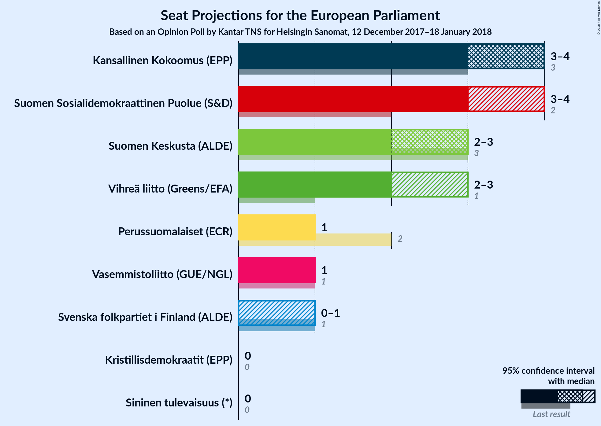
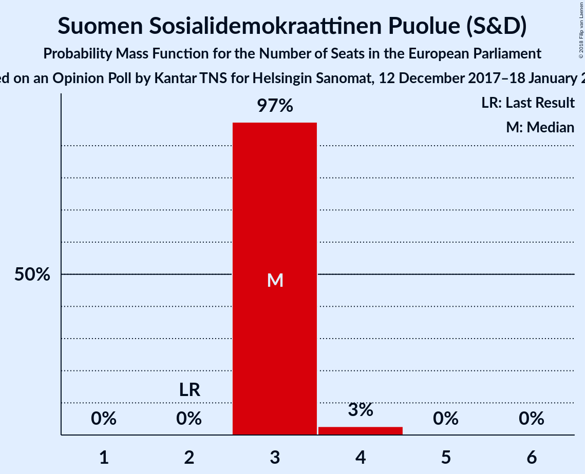
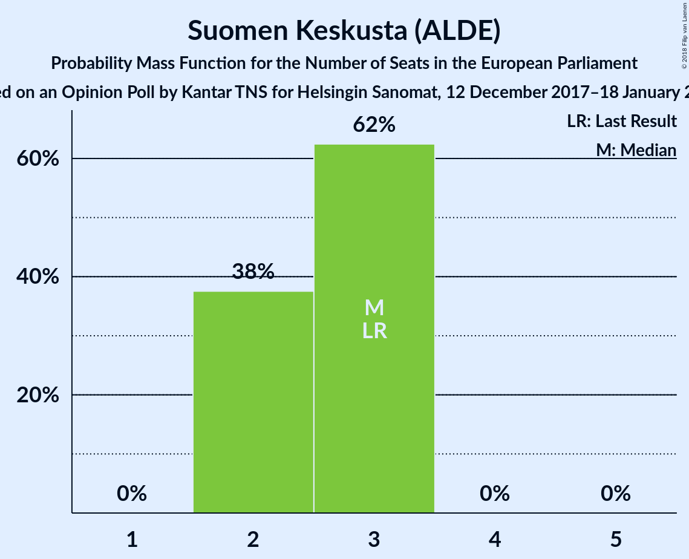
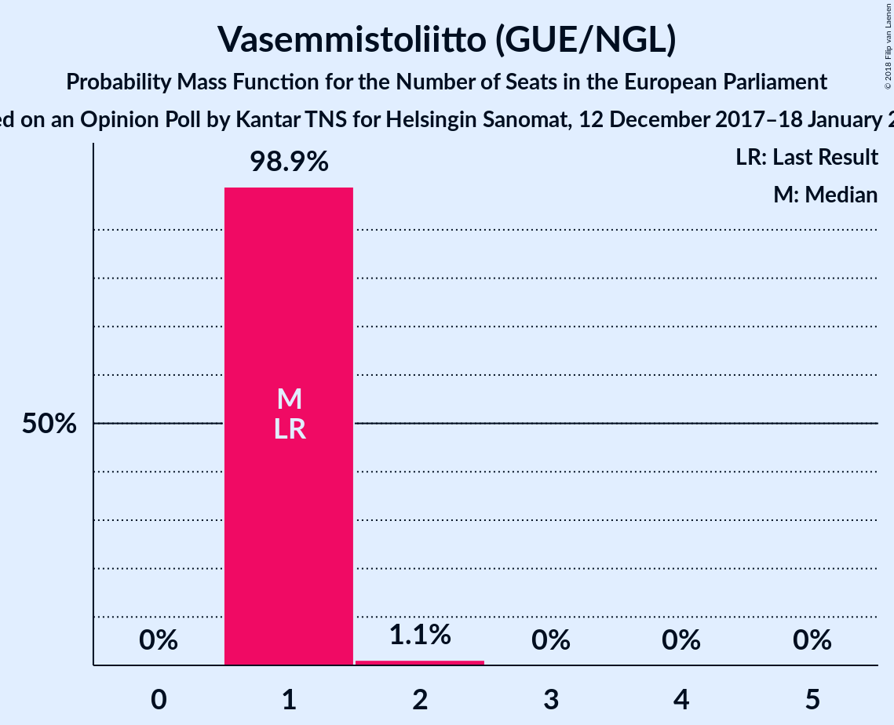
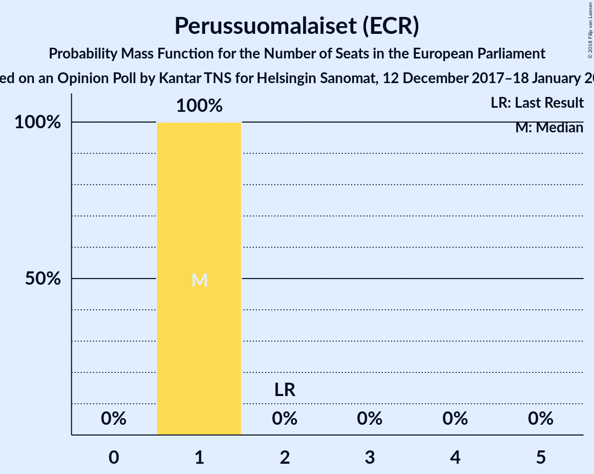
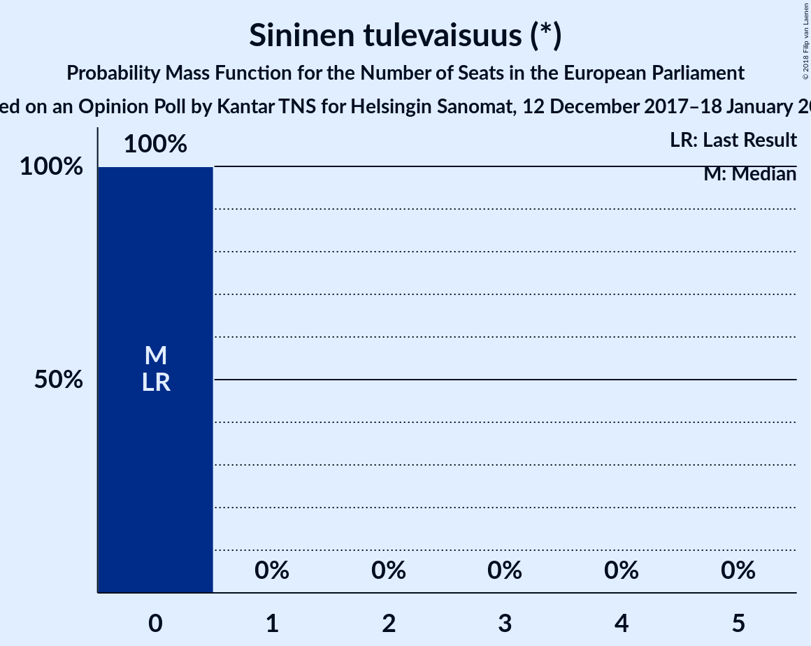
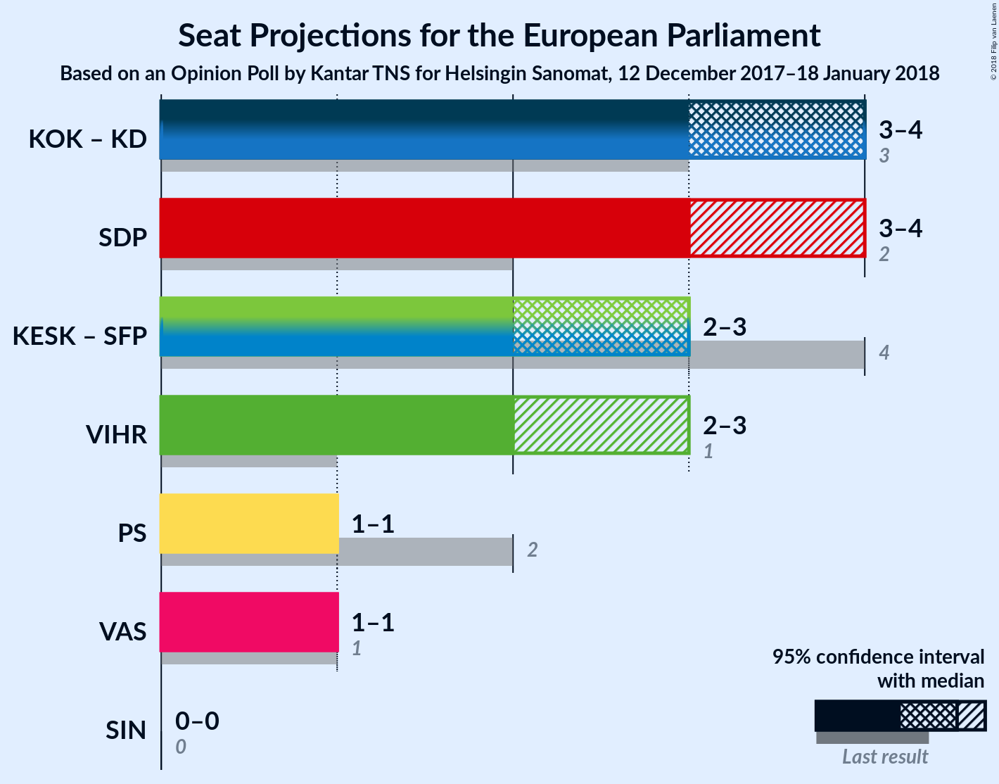

# Opinion Poll by Kantar TNS for Helsingin Sanomat, 12 December 2017–18 January 2018

<a href="#voting-intentions">Voting Intentions</a> | <a href="#seats">Seats</a> | <a href="#coalitions">Coalitions</a> | <a href="#technical-information">Technical Information</a>

## Voting Intentions

### Confidence Intervals

| Party | Last Result | Poll Result | 80% Confidence Interval | 90% Confidence Interval | 95% Confidence Interval | 99% Confidence Interval |
|:-----:|:-----------:|:-----------:|:-----------------------:|:-----------------------:|:-----------------------:|:-----------------------:|
| Kansallinen Kokoomus (EPP) | 22.6% | 21.9% | 20.8–23.0% |20.5–23.3% |20.3–23.6% |19.8–24.1% |
| Suomen Sosialidemokraattinen Puolue (S&D) | 12.3% | 19.0% | 18.0–20.1% |17.7–20.4% |17.5–20.6% |17.0–21.1% |
| Suomen Keskusta (ALDE) | 19.7% | 15.6% | 14.7–16.6% |14.4–16.9% |14.2–17.1% |13.8–17.6% |
| Vihreä liitto (Greens/EFA) | 9.3% | 15.5% | 14.6–16.5% |14.3–16.7% |14.1–17.0% |13.7–17.5% |
| Vasemmistoliitto (GUE/NGL) | 9.3% | 8.8% | 8.1–9.6% |7.9–9.8% |7.7–10.0% |7.4–10.4% |
| Perussuomalaiset (ECR) | 12.9% | 8.1% | 7.4–8.9% |7.2–9.1% |7.1–9.3% |6.8–9.6% |
| Svenska folkpartiet i Finland (ALDE) | 6.8% | 4.4% | 3.9–5.0% |3.7–5.1% |3.6–5.3% |3.4–5.6% |
| Kristillisdemokraatit (EPP) | 5.2% | 3.4% | 3.0–3.9% |2.8–4.1% |2.7–4.2% |2.5–4.5% |
| Sininen tulevaisuus (*) | 0.0% | 1.5% | 1.2–1.9% |1.1–2.0% |1.1–2.1% |1.0–2.3% |

*Note:* The poll result column reflects the actual value used in the calculations. Published results may vary slightly, and in addition be rounded to fewer digits.

## Seats

### Confidence Intervals

| Party | Last Result | Median | 80% Confidence Interval | 90% Confidence Interval | 95% Confidence Interval | 99% Confidence Interval |
|:-----:|:-----------:|:------:|:-----------------------:|:-----------------------:|:-----------------------:|:-----------------------:|
| <a href="#kansallinen-kokoomus-(epp)">Kansallinen Kokoomus (EPP)</a> | 3 | 4 | 3–4 |3–4 |3–4 |3–4 |
| <a href="#suomen-sosialidemokraattinen-puolue-(s&d)">Suomen Sosialidemokraattinen Puolue (S&D)</a> | 2 | 3 | 3–4 |3–4 |3–4 |3–4 |
| <a href="#suomen-keskusta-(alde)">Suomen Keskusta (ALDE)</a> | 3 | 3 | 2–3 |2–3 |2–3 |2–3 |
| <a href="#vihreä-liitto-(greens/efa)">Vihreä liitto (Greens/EFA)</a> | 1 | 2 | 2–3 |2–3 |2–3 |2–3 |
| <a href="#vasemmistoliitto-(gue/ngl)">Vasemmistoliitto (GUE/NGL)</a> | 1 | 1 | 1 |1 |1 |1–2 |
| <a href="#perussuomalaiset-(ecr)">Perussuomalaiset (ECR)</a> | 2 | 1 | 1 |1 |1 |1 |
| <a href="#svenska-folkpartiet-i-finland-(alde)">Svenska folkpartiet i Finland (ALDE)</a> | 1 | 0 | 0 |0 |0 |0–1 |
| <a href="#kristillisdemokraatit-(epp)">Kristillisdemokraatit (EPP)</a> | 0 | 0 | 0 |0 |0 |0 |
| <a href="#sininen-tulevaisuus-(*)">Sininen tulevaisuus (*)</a> | 0 | 0 | 0 |0 |0 |0 |

### Kansallinen Kokoomus (EPP)

*For a full overview of the results for this party, see the [Kansallinen Kokoomus (EPP)](party-kansallinenkokoomusepp.html) page.*

| Number of Seats | Probability | Accumulated | Special Marks |
|:---------------:|:-----------:|:-----------:|:-------------:|
| 3 | 43% | 100% | Last Result |
| 4 | 56% | 57% | Median |
| 5 | 0.1% | 0.1% |  |
| 6 | 0% | 0% |  |

### Suomen Sosialidemokraattinen Puolue (S&D)

*For a full overview of the results for this party, see the [Suomen Sosialidemokraattinen Puolue (S&D)](party-suomensosialidemokraattinenpuoluesd.html) page.*

| Number of Seats | Probability | Accumulated | Special Marks |
|:---------------:|:-----------:|:-----------:|:-------------:|
| 2 | 0% | 100% | Last Result |
| 3 | 59% | 100% | Median |
| 4 | 41% | 41% |  |
| 5 | 0% | 0% |  |

### Suomen Keskusta (ALDE)

*For a full overview of the results for this party, see the [Suomen Keskusta (ALDE)](party-suomenkeskustaalde.html) page.*

| Number of Seats | Probability | Accumulated | Special Marks |
|:---------------:|:-----------:|:-----------:|:-------------:|
| 2 | 43% | 100% |  |
| 3 | 57% | 57% | Last Result, Median |
| 4 | 0% | 0% |  |

### Vihreä liitto (Greens/EFA)

*For a full overview of the results for this party, see the [Vihreä liitto (Greens/EFA)](party-vihreäliittogreensefa.html) page.*

| Number of Seats | Probability | Accumulated | Special Marks |
|:---------------:|:-----------:|:-----------:|:-------------:|
| 1 | 0% | 100% | Last Result |
| 2 | 57% | 100% | Median |
| 3 | 43% | 43% |  |
| 4 | 0% | 0% |  |

### Vasemmistoliitto (GUE/NGL)

*For a full overview of the results for this party, see the [Vasemmistoliitto (GUE/NGL)](party-vasemmistoliittoguengl.html) page.*

| Number of Seats | Probability | Accumulated | Special Marks |
|:---------------:|:-----------:|:-----------:|:-------------:|
| 1 | 98.6% | 100% | Last Result, Median |
| 2 | 1.4% | 1.4% |  |
| 3 | 0% | 0% |  |

### Perussuomalaiset (ECR)

*For a full overview of the results for this party, see the [Perussuomalaiset (ECR)](party-perussuomalaisetecr.html) page.*

| Number of Seats | Probability | Accumulated | Special Marks |
|:---------------:|:-----------:|:-----------:|:-------------:|
| 1 | 100% | 100% | Median |
| 2 | 0% | 0% | Last Result |

### Svenska folkpartiet i Finland (ALDE)

*For a full overview of the results for this party, see the [Svenska folkpartiet i Finland (ALDE)](party-svenskafolkpartietifinlandalde.html) page.*

| Number of Seats | Probability | Accumulated | Special Marks |
|:---------------:|:-----------:|:-----------:|:-------------:|
| 0 | 99.1% | 100% | Median |
| 1 | 0.9% | 0.9% | Last Result |
| 2 | 0% | 0% |  |

### Kristillisdemokraatit (EPP)

*For a full overview of the results for this party, see the [Kristillisdemokraatit (EPP)](party-kristillisdemokraatitepp.html) page.*

| Number of Seats | Probability | Accumulated | Special Marks |
|:---------------:|:-----------:|:-----------:|:-------------:|
| 0 | 100% | 100% | Last Result, Median |

### Sininen tulevaisuus (*)

*For a full overview of the results for this party, see the [Sininen tulevaisuus (*)](party-sininentulevaisuus.html) page.*

| Number of Seats | Probability | Accumulated | Special Marks |
|:---------------:|:-----------:|:-----------:|:-------------:|
| 0 | 100% | 100% | Last Result, Median |

## Coalitions

### Confidence Intervals

| Coalition | Last Result | Median | Majority? | 80% Confidence Interval | 90% Confidence Interval | 95% Confidence Interval | 99% Confidence Interval |
|:---------:|:-----------:|:------:|:---------:|:-----------------------:|:-----------------------:|:-----------------------:|:-----------------------:|
| Kansallinen Kokoomus (EPP) – Kristillisdemokraatit (EPP) | 3 | 4 | 0% | 3–4 | 3–4 | 3–4 | 3–4 |
| Suomen Sosialidemokraattinen Puolue (S&D) | 2 | 3 | 0% | 3–4 | 3–4 | 3–4 | 3–4 |
| Suomen Keskusta (ALDE) – Svenska folkpartiet i Finland (ALDE) | 4 | 3 | 0% | 2–3 | 2–3 | 2–3 | 2–4 |
| Vihreä liitto (Greens/EFA) | 1 | 2 | 0% | 2–3 | 2–3 | 2–3 | 2–3 |
| Perussuomalaiset (ECR) | 2 | 1 | 0% | 1 | 1 | 1 | 1 |
| Vasemmistoliitto (GUE/NGL) | 1 | 1 | 0% | 1 | 1 | 1 | 1–2 |
| Sininen tulevaisuus (*) | 0 | 0 | 0% | 0 | 0 | 0 | 0 |

### Kansallinen Kokoomus (EPP) – Kristillisdemokraatit (EPP)

| Number of Seats | Probability | Accumulated | Special Marks |
|:---------------:|:-----------:|:-----------:|:-------------:|
| 3 | 43% | 100% | Last Result |
| 4 | 56% | 57% | Median |
| 5 | 0.1% | 0.1% |  |
| 6 | 0% | 0% |  |

### Suomen Sosialidemokraattinen Puolue (S&D)

| Number of Seats | Probability | Accumulated | Special Marks |
|:---------------:|:-----------:|:-----------:|:-------------:|
| 2 | 0% | 100% | Last Result |
| 3 | 59% | 100% | Median |
| 4 | 41% | 41% |  |
| 5 | 0% | 0% |  |

### Suomen Keskusta (ALDE) – Svenska folkpartiet i Finland (ALDE)

| Number of Seats | Probability | Accumulated | Special Marks |
|:---------------:|:-----------:|:-----------:|:-------------:|
| 2 | 43% | 100% |  |
| 3 | 56% | 57% | Median |
| 4 | 0.9% | 0.9% | Last Result |
| 5 | 0% | 0% |  |

### Vihreä liitto (Greens/EFA)

| Number of Seats | Probability | Accumulated | Special Marks |
|:---------------:|:-----------:|:-----------:|:-------------:|
| 1 | 0% | 100% | Last Result |
| 2 | 57% | 100% | Median |
| 3 | 43% | 43% |  |
| 4 | 0% | 0% |  |

### Perussuomalaiset (ECR)

| Number of Seats | Probability | Accumulated | Special Marks |
|:---------------:|:-----------:|:-----------:|:-------------:|
| 1 | 100% | 100% | Median |
| 2 | 0% | 0% | Last Result |

### Vasemmistoliitto (GUE/NGL)

| Number of Seats | Probability | Accumulated | Special Marks |
|:---------------:|:-----------:|:-----------:|:-------------:|
| 1 | 98.6% | 100% | Last Result, Median |
| 2 | 1.4% | 1.4% |  |
| 3 | 0% | 0% |  |

### Sininen tulevaisuus (*)

| Number of Seats | Probability | Accumulated | Special Marks |
|:---------------:|:-----------:|:-----------:|:-------------:|
| 0 | 100% | 100% | Last Result, Median |

## Technical Information

### Opinion Poll

+ **Polling firm:** Kantar TNS
+ **Commissioner(s):** Helsingin Sanomat
+ **Fieldwork period:** 12 December 2017–18 January 2018

### Calculations

+ **Sample size:** 2416
+ **Simulations done:** 1,024
+ **Error estimate:** 3.37%

