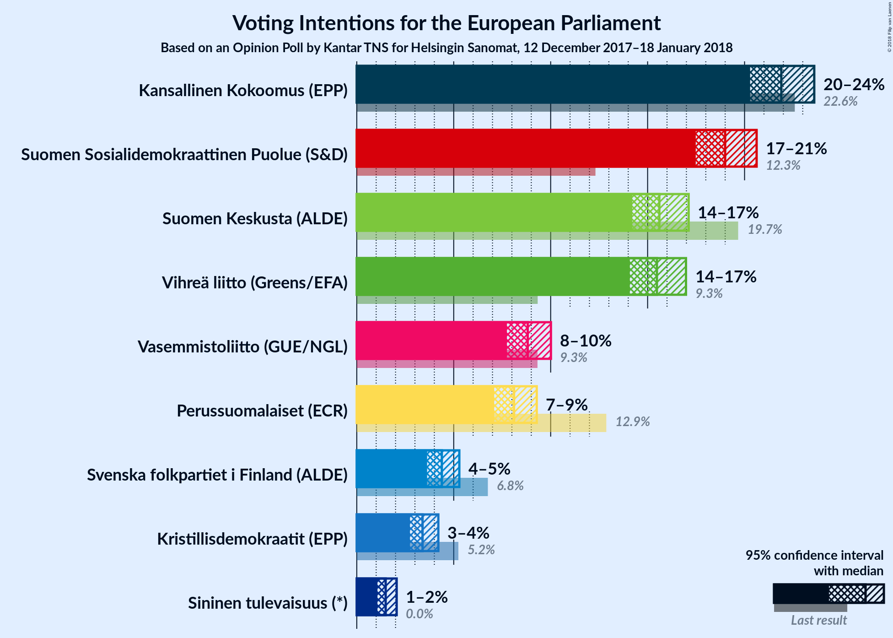

# Opinion Poll by Kantar TNS for Helsingin Sanomat, 12 December 2017–18 January 2018

<a href="#voting-intentions">Voting Intentions</a> | <a href="#seats">Seats</a> | <a href="#coalitions">Coalitions</a> | <a href="#technical-information">Technical Information</a>

## Voting Intentions

### Confidence Intervals

| Party | Last Result | Poll Result | 80% Confidence Interval | 90% Confidence Interval | 95% Confidence Interval | 99% Confidence Interval |
|:-----:|:-----------:|:-----------:|:-----------------------:|:-----------------------:|:-----------------------:|:-----------------------:|
| Kansallinen Kokoomus (EPP) | 22.6% | 21.9% | N/A |N/A |N/A |N/A |
| Suomen Sosialidemokraattinen Puolue (S&D) | 12.3% | 19.0% | N/A |N/A |N/A |N/A |
| Suomen Keskusta (ALDE) | 19.7% | 15.6% | N/A |N/A |N/A |N/A |
| Vihreä liitto (Greens/EFA) | 9.3% | 15.5% | N/A |N/A |N/A |N/A |
| Vasemmistoliitto (GUE/NGL) | 9.3% | 8.8% | N/A |N/A |N/A |N/A |
| Perussuomalaiset (ECR) | 12.9% | 8.1% | N/A |N/A |N/A |N/A |
| Svenska folkpartiet i Finland (ALDE) | 6.8% | 4.4% | N/A |N/A |N/A |N/A |
| Kristillisdemokraatit (EPP) | 5.2% | 3.4% | N/A |N/A |N/A |N/A |
| Sininen tulevaisuus (—) | 0.0% | 1.5% | N/A |N/A |N/A |N/A |

*Note:* The poll result column reflects the actual value used in the calculations. Published results may vary slightly, and in addition be rounded to fewer digits.

## Seats

### Confidence Intervals

| Party | Last Result | Median | 80% Confidence Interval | 90% Confidence Interval | 95% Confidence Interval | 99% Confidence Interval |
|:-----:|:-----------:|:------:|:-----------------------:|:-----------------------:|:-----------------------:|:-----------------------:|
| <a href="#kansallinen-kokoomus-(epp)">Kansallinen Kokoomus (EPP)</a> | 3 | N/A | N/A |N/A |N/A |N/A |
| <a href="#suomen-sosialidemokraattinen-puolue-(s&d)">Suomen Sosialidemokraattinen Puolue (S&D)</a> | 2 | N/A | N/A |N/A |N/A |N/A |
| <a href="#suomen-keskusta-(alde)">Suomen Keskusta (ALDE)</a> | 3 | N/A | N/A |N/A |N/A |N/A |
| <a href="#vihreä-liitto-(greens/efa)">Vihreä liitto (Greens/EFA)</a> | 1 | N/A | N/A |N/A |N/A |N/A |
| <a href="#vasemmistoliitto-(gue/ngl)">Vasemmistoliitto (GUE/NGL)</a> | 1 | N/A | N/A |N/A |N/A |N/A |
| <a href="#perussuomalaiset-(ecr)">Perussuomalaiset (ECR)</a> | 2 | N/A | N/A |N/A |N/A |N/A |
| <a href="#svenska-folkpartiet-i-finland-(alde)">Svenska folkpartiet i Finland (ALDE)</a> | 1 | N/A | N/A |N/A |N/A |N/A |
| <a href="#kristillisdemokraatit-(epp)">Kristillisdemokraatit (EPP)</a> | 0 | N/A | N/A |N/A |N/A |N/A |
| <a href="#sininen-tulevaisuus-(—)">Sininen tulevaisuus (—)</a> | 0 | N/A | N/A |N/A |N/A |N/A |

## Coalitions

## Technical Information

### Opinion Poll

+ **Polling firm:** Kantar TNS
+ **Commissioner(s):** Helsingin Sanomat
+ **Fieldwork period:** 12 December 2017–18 January 2018

### Calculations

+ **Sample size:** 2416
+ **Simulations done:** 0
+ **Error estimate:** 100.00%

