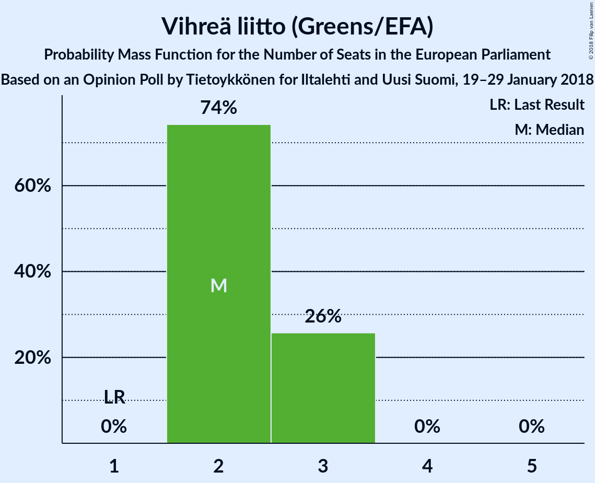
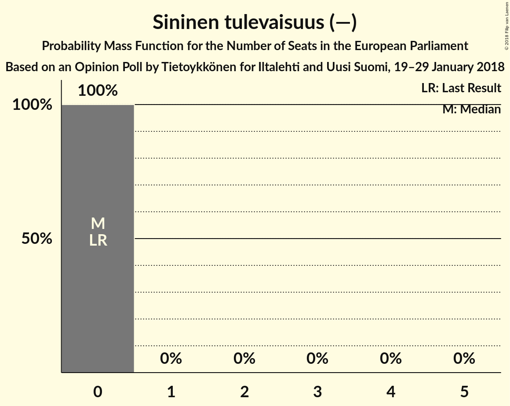

# Opinion Poll by Tietoykkönen for Iltalehti and Uusi Suomi, 19–29 January 2018

<a href="#voting-intentions">Voting Intentions</a> | <a href="#seats">Seats</a> | <a href="#coalitions">Coalitions</a> | <a href="#technical-information">Technical Information</a>

## Voting Intentions

### Confidence Intervals

| Party | Last Result | Poll Result | 80% Confidence Interval | 90% Confidence Interval | 95% Confidence Interval | 99% Confidence Interval |
|:-----:|:-----------:|:-----------:|:-----------------------:|:-----------------------:|:-----------------------:|:-----------------------:|
| Kansallinen Kokoomus (EPP) | 22.6% | 20.9% | 19.4–22.4% |19.0–22.9% |18.7–23.2% |18.0–24.0% |
| Suomen Sosialidemokraattinen Puolue (S&D) | 12.3% | 19.2% | 17.8–20.7% |17.4–21.2% |17.1–21.5% |16.4–22.3% |
| Suomen Keskusta (ALDE) | 19.7% | 15.4% | 14.1–16.8% |13.8–17.2% |13.5–17.5% |12.9–18.2% |
| Vihreä liitto (Greens/EFA) | 9.3% | 14.5% | 13.3–15.9% |12.9–16.2% |12.6–16.6% |12.0–17.3% |
| Vasemmistoliitto (GUE/NGL) | 9.3% | 8.6% | 7.7–9.7% |7.4–10.1% |7.1–10.3% |6.7–10.9% |
| Perussuomalaiset (ECR) | 12.9% | 8.2% | 7.3–9.3% |7.0–9.6% |6.8–9.9% |6.4–10.4% |
| Svenska folkpartiet i Finland (ALDE) | 6.8% | 4.6% | 3.9–5.5% |3.7–5.8% |3.6–6.0% |3.3–6.4% |
| Kristillisdemokraatit (EPP) | 5.2% | 3.9% | 3.3–4.7% |3.1–4.9% |2.9–5.1% |2.7–5.6% |
| Sininen tulevaisuus (—) | 0.0% | 2.7% | 2.2–3.4% |2.1–3.6% |2.0–3.8% |1.7–4.2% |

*Note:* The poll result column reflects the actual value used in the calculations. Published results may vary slightly, and in addition be rounded to fewer digits.

## Seats

### Confidence Intervals

| Party | Last Result | Median | 80% Confidence Interval | 90% Confidence Interval | 95% Confidence Interval | 99% Confidence Interval |
|:-----:|:-----------:|:------:|:-----------------------:|:-----------------------:|:-----------------------:|:-----------------------:|
| <a href="#kansallinen-kokoomus-(epp)">Kansallinen Kokoomus (EPP)</a> | 3 | 4 | 3–4 |3–4 |3–4 |3–4 |
| <a href="#suomen-sosialidemokraattinen-puolue-(s&d)">Suomen Sosialidemokraattinen Puolue (S&D)</a> | 2 | 3 | 3–4 |3–4 |3–4 |3–4 |
| <a href="#suomen-keskusta-(alde)">Suomen Keskusta (ALDE)</a> | 3 | 3 | 2–3 |2–3 |2–3 |2–3 |
| <a href="#vihreä-liitto-(greens/efa)">Vihreä liitto (Greens/EFA)</a> | 1 | 2 | 2–3 |2–3 |2–3 |2–3 |
| <a href="#vasemmistoliitto-(gue/ngl)">Vasemmistoliitto (GUE/NGL)</a> | 1 | 1 | 1 |1 |1 |1 |
| <a href="#perussuomalaiset-(ecr)">Perussuomalaiset (ECR)</a> | 2 | 1 | 1 |1 |1 |1 |
| <a href="#svenska-folkpartiet-i-finland-(alde)">Svenska folkpartiet i Finland (ALDE)</a> | 1 | 0 | 0 |0 |0–1 |0–1 |
| <a href="#kristillisdemokraatit-(epp)">Kristillisdemokraatit (EPP)</a> | 0 | 0 | 0 |0–1 |0–1 |0–1 |
| <a href="#sininen-tulevaisuus-(—)">Sininen tulevaisuus (—)</a> | 0 | 0 | 0 |0 |0 |0 |

### Kansallinen Kokoomus (EPP)

*For a full overview of the results for this party, see the [Kansallinen Kokoomus (EPP)](party-kansallinenkokoomusepp.html) page.*

| Number of Seats | Probability | Accumulated | Special Marks |
|:---------------:|:-----------:|:-----------:|:-------------:|
| 3 | 14% | 100% | Last Result |
| 4 | 86% | 86% | Median |
| 5 | 0% | 0% |  |

### Suomen Sosialidemokraattinen Puolue (S&D)

*For a full overview of the results for this party, see the [Suomen Sosialidemokraattinen Puolue (S&D)](party-suomensosialidemokraattinenpuoluesd.html) page.*

| Number of Seats | Probability | Accumulated | Special Marks |
|:---------------:|:-----------:|:-----------:|:-------------:|
| 2 | 0% | 100% | Last Result |
| 3 | 81% | 100% | Median |
| 4 | 19% | 19% |  |
| 5 | 0% | 0% |  |

### Suomen Keskusta (ALDE)

*For a full overview of the results for this party, see the [Suomen Keskusta (ALDE)](party-suomenkeskustaalde.html) page.*

| Number of Seats | Probability | Accumulated | Special Marks |
|:---------------:|:-----------:|:-----------:|:-------------:|
| 2 | 29% | 100% |  |
| 3 | 71% | 71% | Last Result, Median |
| 4 | 0% | 0% |  |

### Vihreä liitto (Greens/EFA)

*For a full overview of the results for this party, see the [Vihreä liitto (Greens/EFA)](party-vihreäliittogreensefa.html) page.*

| Number of Seats | Probability | Accumulated | Special Marks |
|:---------------:|:-----------:|:-----------:|:-------------:|
| 1 | 0% | 100% | Last Result |
| 2 | 87% | 100% | Median |
| 3 | 13% | 13% |  |
| 4 | 0% | 0% |  |

### Vasemmistoliitto (GUE/NGL)

*For a full overview of the results for this party, see the [Vasemmistoliitto (GUE/NGL)](party-vasemmistoliittoguengl.html) page.*

| Number of Seats | Probability | Accumulated | Special Marks |
|:---------------:|:-----------:|:-----------:|:-------------:|
| 1 | 100% | 100% | Last Result, Median |

### Perussuomalaiset (ECR)

*For a full overview of the results for this party, see the [Perussuomalaiset (ECR)](party-perussuomalaisetecr.html) page.*

| Number of Seats | Probability | Accumulated | Special Marks |
|:---------------:|:-----------:|:-----------:|:-------------:|
| 1 | 100% | 100% | Median |
| 2 | 0% | 0% | Last Result |

### Svenska folkpartiet i Finland (ALDE)

*For a full overview of the results for this party, see the [Svenska folkpartiet i Finland (ALDE)](party-svenskafolkpartietifinlandalde.html) page.*

| Number of Seats | Probability | Accumulated | Special Marks |
|:---------------:|:-----------:|:-----------:|:-------------:|
| 0 | 95% | 100% | Median |
| 1 | 5% | 5% | Last Result |
| 2 | 0% | 0% |  |

### Kristillisdemokraatit (EPP)

*For a full overview of the results for this party, see the [Kristillisdemokraatit (EPP)](party-kristillisdemokraatitepp.html) page.*

| Number of Seats | Probability | Accumulated | Special Marks |
|:---------------:|:-----------:|:-----------:|:-------------:|
| 0 | 93% | 100% | Last Result, Median |
| 1 | 7% | 7% |  |
| 2 | 0% | 0% |  |

### Sininen tulevaisuus (—)

*For a full overview of the results for this party, see the [Sininen tulevaisuus (—)](party-sininentulevaisuus—.html) page.*

| Number of Seats | Probability | Accumulated | Special Marks |
|:---------------:|:-----------:|:-----------:|:-------------:|
| 0 | 100% | 100% | Last Result, Median |

## Coalitions

### Confidence Intervals

| Coalition | Last Result | Median | Majority? | 80% Confidence Interval | 90% Confidence Interval | 95% Confidence Interval | 99% Confidence Interval |
|:---------:|:-----------:|:------:|:---------:|:-----------------------:|:-----------------------:|:-----------------------:|:-----------------------:|
| Kansallinen Kokoomus (EPP) – Kristillisdemokraatit (EPP) | 3 | 4 | 0% | 4 | 3–4 | 3–4 | 3–4 |
| Suomen Sosialidemokraattinen Puolue (S&D) | 2 | 3 | 0% | 3–4 | 3–4 | 3–4 | 3–4 |
| Suomen Keskusta (ALDE) – Svenska folkpartiet i Finland (ALDE) | 4 | 3 | 0% | 2–3 | 2–3 | 2–3 | 2–4 |
| Vihreä liitto (Greens/EFA) | 1 | 2 | 0% | 2–3 | 2–3 | 2–3 | 2–3 |
| Perussuomalaiset (ECR) | 2 | 1 | 0% | 1 | 1 | 1 | 1 |
| Vasemmistoliitto (GUE/NGL) | 1 | 1 | 0% | 1 | 1 | 1 | 1 |
| Sininen tulevaisuus (—) | 0 | 0 | 0% | 0 | 0 | 0 | 0 |

### Kansallinen Kokoomus (EPP) – Kristillisdemokraatit (EPP)

| Number of Seats | Probability | Accumulated | Special Marks |
|:---------------:|:-----------:|:-----------:|:-------------:|
| 3 | 7% | 100% | Last Result |
| 4 | 93% | 93% | Median |
| 5 | 0% | 0% |  |

### Suomen Sosialidemokraattinen Puolue (S&D)

| Number of Seats | Probability | Accumulated | Special Marks |
|:---------------:|:-----------:|:-----------:|:-------------:|
| 2 | 0% | 100% | Last Result |
| 3 | 81% | 100% | Median |
| 4 | 19% | 19% |  |
| 5 | 0% | 0% |  |

### Suomen Keskusta (ALDE) – Svenska folkpartiet i Finland (ALDE)

| Number of Seats | Probability | Accumulated | Special Marks |
|:---------------:|:-----------:|:-----------:|:-------------:|
| 2 | 26% | 100% |  |
| 3 | 73% | 74% | Median |
| 4 | 1.1% | 1.1% | Last Result |
| 5 | 0% | 0% |  |

### Vihreä liitto (Greens/EFA)

| Number of Seats | Probability | Accumulated | Special Marks |
|:---------------:|:-----------:|:-----------:|:-------------:|
| 1 | 0% | 100% | Last Result |
| 2 | 87% | 100% | Median |
| 3 | 13% | 13% |  |
| 4 | 0% | 0% |  |

### Perussuomalaiset (ECR)

| Number of Seats | Probability | Accumulated | Special Marks |
|:---------------:|:-----------:|:-----------:|:-------------:|
| 1 | 100% | 100% | Median |
| 2 | 0% | 0% | Last Result |

### Vasemmistoliitto (GUE/NGL)

| Number of Seats | Probability | Accumulated | Special Marks |
|:---------------:|:-----------:|:-----------:|:-------------:|
| 1 | 100% | 100% | Last Result, Median |

### Sininen tulevaisuus (—)

| Number of Seats | Probability | Accumulated | Special Marks |
|:---------------:|:-----------:|:-----------:|:-------------:|
| 0 | 100% | 100% | Last Result, Median |

## Technical Information

### Opinion Poll

+ **Polling firm:** Tietoykkönen
+ **Commissioner(s):** Iltalehti and Uusi Suomi
+ **Fieldwork period:** 19–29 January 2018

### Calculations

+ **Sample size:** 1208
+ **Simulations done:** 1,024
+ **Error estimate:** 2.65%

