# Opinion Poll by Taloustutkimus for Yle, 7–28 February 2018

<a href="#voting-intentions">Voting Intentions</a> | <a href="#seats">Seats</a> | <a href="#coalitions">Coalitions</a> | <a href="#technical-information">Technical Information</a>

## Voting Intentions

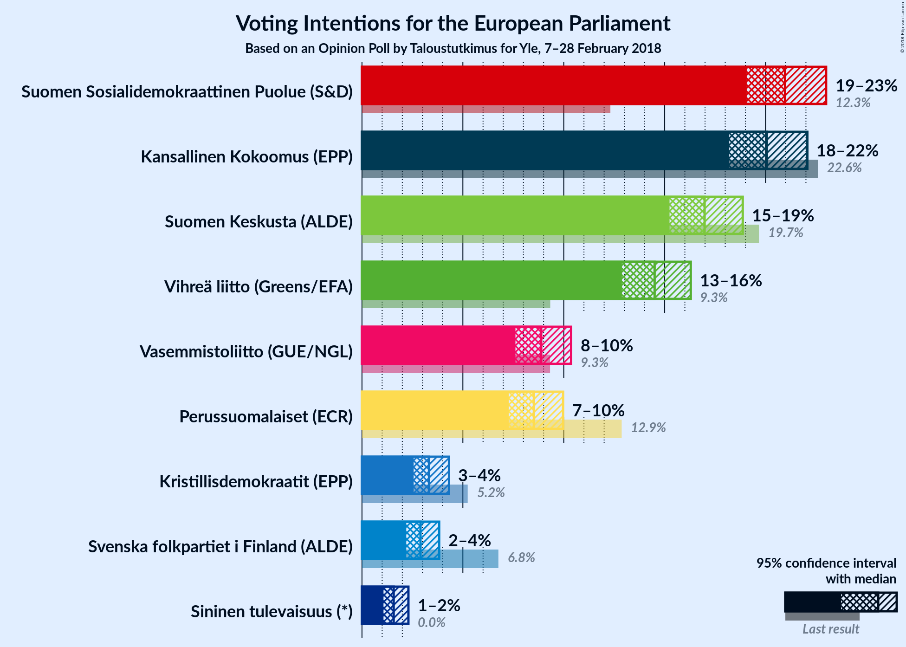

### Confidence Intervals

| Party | Last Result | Poll Result | 80% Confidence Interval | 90% Confidence Interval | 95% Confidence Interval | 99% Confidence Interval |
|:-----:|:-----------:|:-----------:|:-----------------------:|:-----------------------:|:-----------------------:|:-----------------------:|
| Suomen Sosialidemokraattinen Puolue (S&D) | 12.3% | 21.0% | 19.7–22.3% |19.4–22.7% |19.1–23.0% |18.5–23.7% |
| Kansallinen Kokoomus (EPP) | 22.6% | 20.1% | 18.8–21.4% |18.5–21.7% |18.2–22.1% |17.6–22.7% |
| Suomen Keskusta (ALDE) | 19.7% | 17.0% | 15.8–18.2% |15.5–18.6% |15.2–18.9% |14.7–19.5% |
| Vihreä liitto (Greens/EFA) | 9.3% | 14.5% | 13.4–15.7% |13.1–16.0% |12.9–16.3% |12.4–16.9% |
| Vasemmistoliitto (GUE/NGL) | 9.3% | 8.9% | 8.0–9.8% |7.8–10.1% |7.6–10.4% |7.2–10.8% |
| Perussuomalaiset (ECR) | 12.9% | 8.5% | 7.7–9.5% |7.5–9.7% |7.3–10.0% |6.9–10.4% |
| Kristillisdemokraatit (EPP) | 5.2% | 3.3% | 2.8–4.0% |2.7–4.1% |2.6–4.3% |2.3–4.6% |
| Svenska folkpartiet i Finland (ALDE) | 6.8% | 2.9% | 2.4–3.5% |2.3–3.7% |2.2–3.8% |2.0–4.1% |
| Sininen tulevaisuus (*) | 0.0% | 1.6% | 1.2–2.0% |1.1–2.2% |1.1–2.3% |0.9–2.5% |

*Note:* The poll result column reflects the actual value used in the calculations. Published results may vary slightly, and in addition be rounded to fewer digits.

## Seats

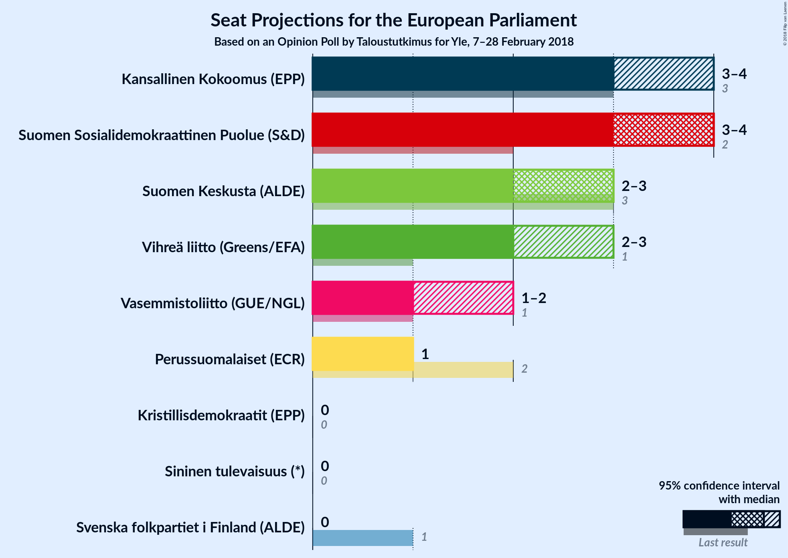

### Confidence Intervals

| Party | Last Result | Median | 80% Confidence Interval | 90% Confidence Interval | 95% Confidence Interval | 99% Confidence Interval |
|:-----:|:-----------:|:------:|:-----------------------:|:-----------------------:|:-----------------------:|:-----------------------:|
| <a href="#suomen-sosialidemokraattinen-puolue-(s&d)">Suomen Sosialidemokraattinen Puolue (S&D)</a> | 2 | 3 | 3–4 |3–4 |3–4 |3–4 |
| <a href="#kansallinen-kokoomus-(epp)">Kansallinen Kokoomus (EPP)</a> | 3 | 3 | 3–4 |3–4 |3–4 |3–4 |
| <a href="#suomen-keskusta-(alde)">Suomen Keskusta (ALDE)</a> | 3 | 3 | 3 |3 |2–3 |2–3 |
| <a href="#vihreä-liitto-(greens/efa)">Vihreä liitto (Greens/EFA)</a> | 1 | 2 | 2 |2–3 |2–3 |2–3 |
| <a href="#vasemmistoliitto-(gue/ngl)">Vasemmistoliitto (GUE/NGL)</a> | 1 | 1 | 1 |1 |1–2 |1–2 |
| <a href="#perussuomalaiset-(ecr)">Perussuomalaiset (ECR)</a> | 2 | 1 | 1 |1 |1 |1–2 |
| <a href="#kristillisdemokraatit-(epp)">Kristillisdemokraatit (EPP)</a> | 0 | 0 | 0 |0 |0 |0 |
| <a href="#svenska-folkpartiet-i-finland-(alde)">Svenska folkpartiet i Finland (ALDE)</a> | 1 | 0 | 0 |0 |0 |0 |
| <a href="#sininen-tulevaisuus-(*)">Sininen tulevaisuus (*)</a> | 0 | 0 | 0 |0 |0 |0 |

### Suomen Sosialidemokraattinen Puolue (S&D)

*For a full overview of the results for this party, see the [Suomen Sosialidemokraattinen Puolue (S&D)](party-suomensosialidemokraattinenpuoluesd.html) page.*

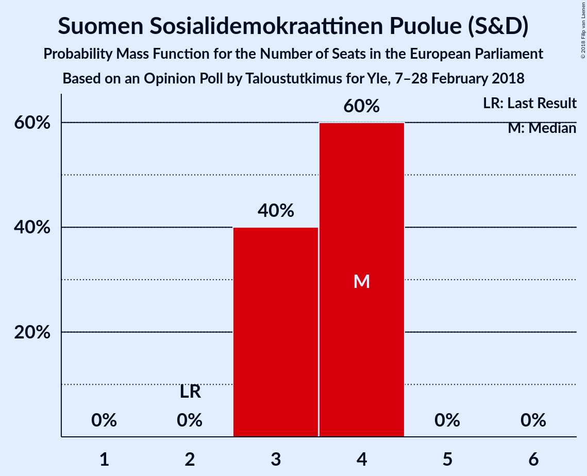

| Number of Seats | Probability | Accumulated | Special Marks |
|:---------------:|:-----------:|:-----------:|:-------------:|
| 2 | 0% | 100% | Last Result |
| 3 | 51% | 100% | Median |
| 4 | 49% | 49% |  |
| 5 | 0% | 0% |  |

### Kansallinen Kokoomus (EPP)

*For a full overview of the results for this party, see the [Kansallinen Kokoomus (EPP)](party-kansallinenkokoomusepp.html) page.*

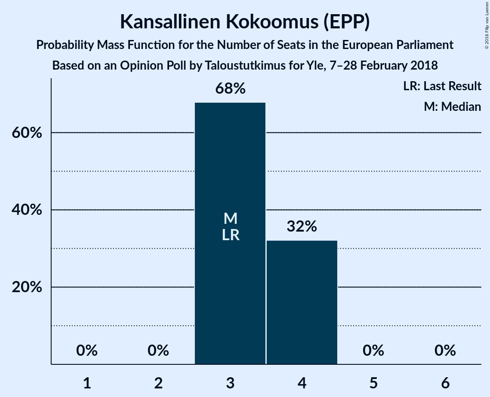

| Number of Seats | Probability | Accumulated | Special Marks |
|:---------------:|:-----------:|:-----------:|:-------------:|
| 3 | 57% | 100% | Last Result, Median |
| 4 | 43% | 43% |  |
| 5 | 0% | 0% |  |

### Suomen Keskusta (ALDE)

*For a full overview of the results for this party, see the [Suomen Keskusta (ALDE)](party-suomenkeskustaalde.html) page.*

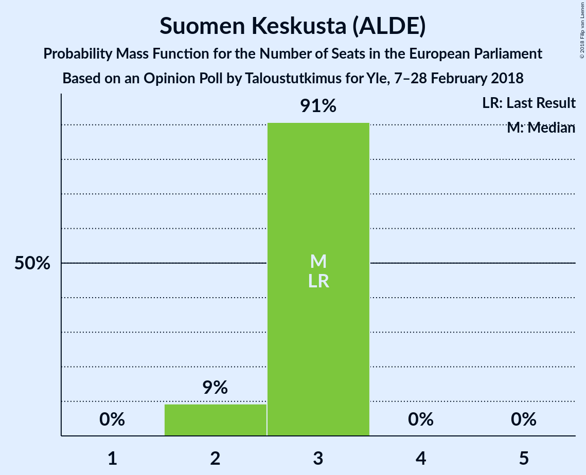

| Number of Seats | Probability | Accumulated | Special Marks |
|:---------------:|:-----------:|:-----------:|:-------------:|
| 2 | 3% | 100% |  |
| 3 | 97% | 97% | Last Result, Median |
| 4 | 0% | 0% |  |

### Vihreä liitto (Greens/EFA)

*For a full overview of the results for this party, see the [Vihreä liitto (Greens/EFA)](party-vihreäliittogreensefa.html) page.*

| Number of Seats | Probability | Accumulated | Special Marks |
|:---------------:|:-----------:|:-----------:|:-------------:|
| 1 | 0% | 100% | Last Result |
| 2 | 93% | 100% | Median |
| 3 | 7% | 7% |  |
| 4 | 0% | 0% |  |

### Vasemmistoliitto (GUE/NGL)

*For a full overview of the results for this party, see the [Vasemmistoliitto (GUE/NGL)](party-vasemmistoliittoguengl.html) page.*

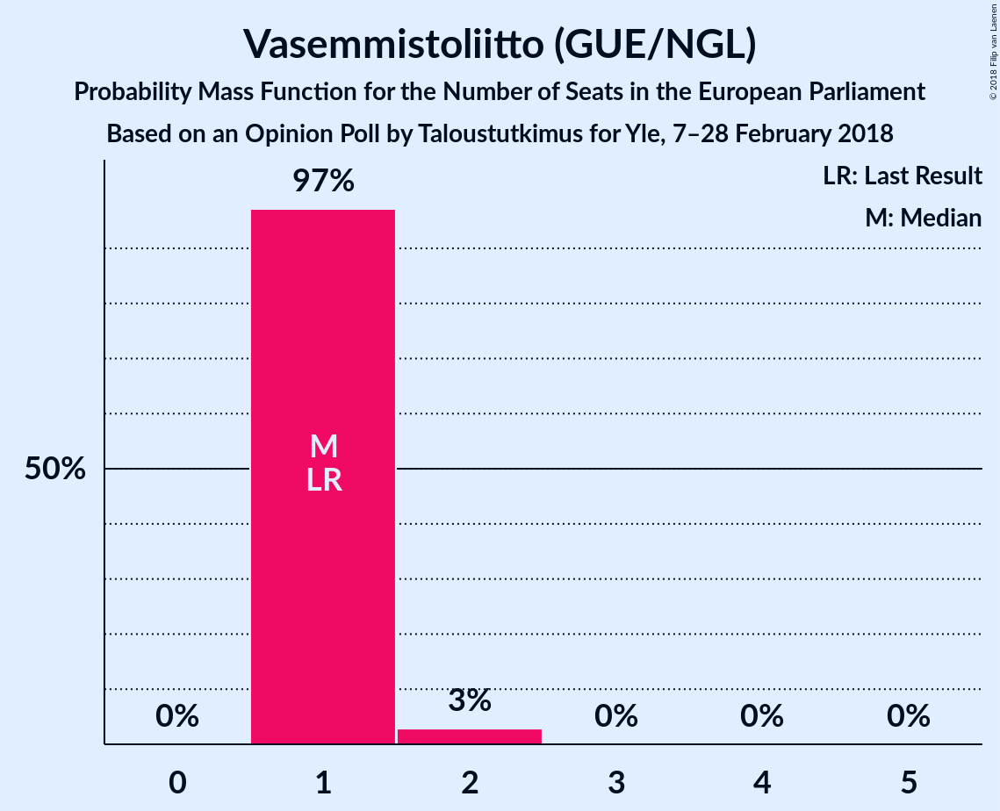

| Number of Seats | Probability | Accumulated | Special Marks |
|:---------------:|:-----------:|:-----------:|:-------------:|
| 1 | 97% | 100% | Last Result, Median |
| 2 | 3% | 3% |  |
| 3 | 0% | 0% |  |

### Perussuomalaiset (ECR)

*For a full overview of the results for this party, see the [Perussuomalaiset (ECR)](party-perussuomalaisetecr.html) page.*

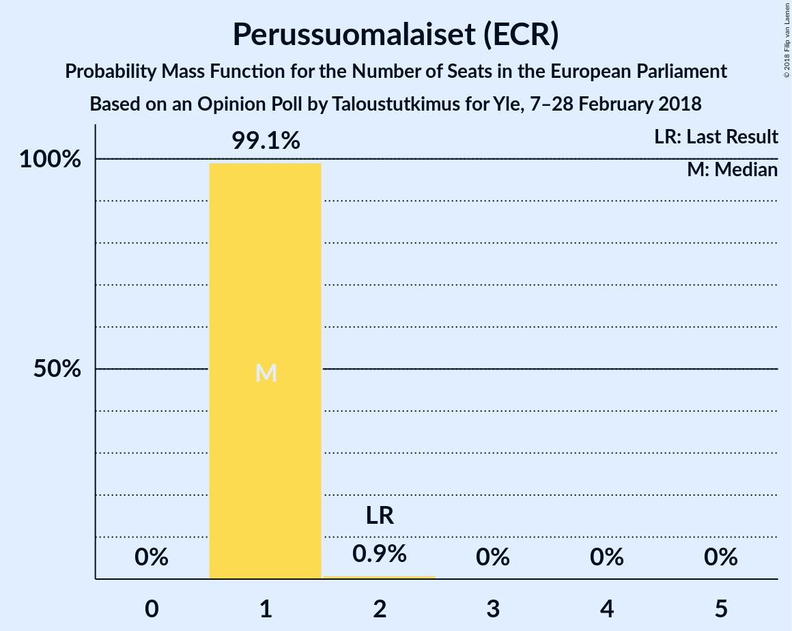

| Number of Seats | Probability | Accumulated | Special Marks |
|:---------------:|:-----------:|:-----------:|:-------------:|
| 1 | 99.3% | 100% | Median |
| 2 | 0.7% | 0.7% | Last Result |
| 3 | 0% | 0% |  |

### Kristillisdemokraatit (EPP)

*For a full overview of the results for this party, see the [Kristillisdemokraatit (EPP)](party-kristillisdemokraatitepp.html) page.*

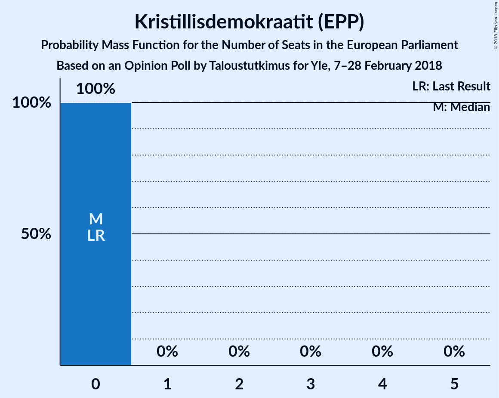

| Number of Seats | Probability | Accumulated | Special Marks |
|:---------------:|:-----------:|:-----------:|:-------------:|
| 0 | 100% | 100% | Last Result, Median |

### Svenska folkpartiet i Finland (ALDE)

*For a full overview of the results for this party, see the [Svenska folkpartiet i Finland (ALDE)](party-svenskafolkpartietifinlandalde.html) page.*

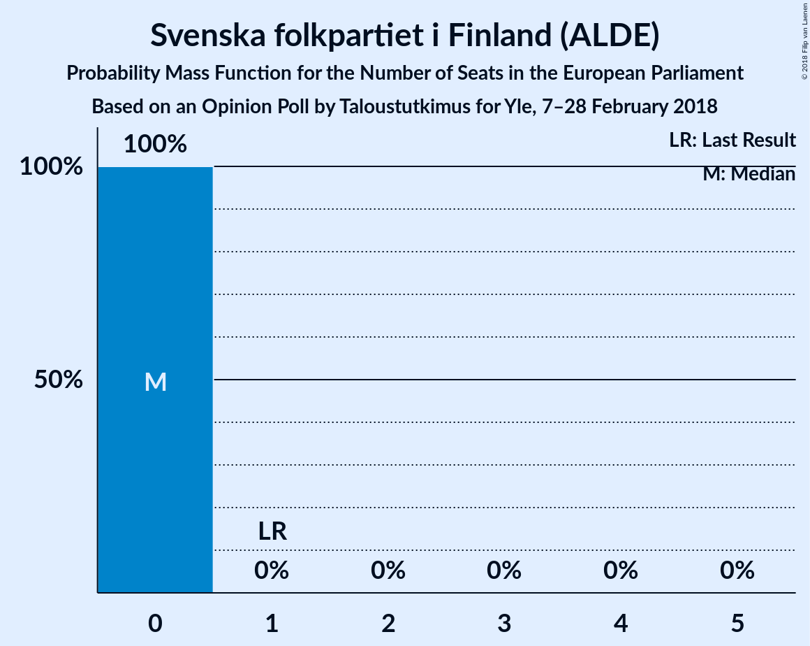

| Number of Seats | Probability | Accumulated | Special Marks |
|:---------------:|:-----------:|:-----------:|:-------------:|
| 0 | 100% | 100% | Median |
| 1 | 0% | 0% | Last Result |

### Sininen tulevaisuus (*)

*For a full overview of the results for this party, see the [Sininen tulevaisuus (*)](party-sininentulevaisuus.html) page.*

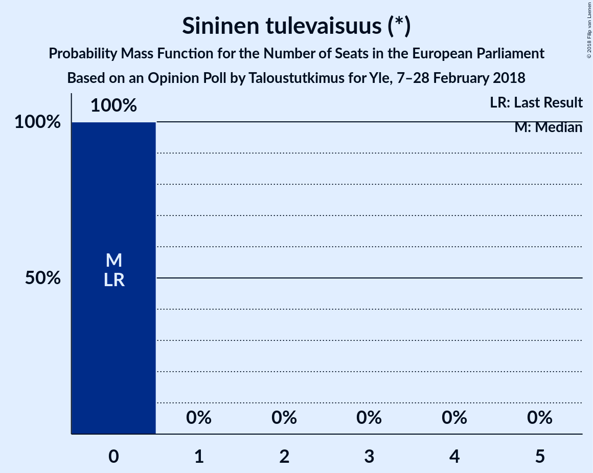

| Number of Seats | Probability | Accumulated | Special Marks |
|:---------------:|:-----------:|:-----------:|:-------------:|
| 0 | 100% | 100% | Last Result, Median |

## Coalitions

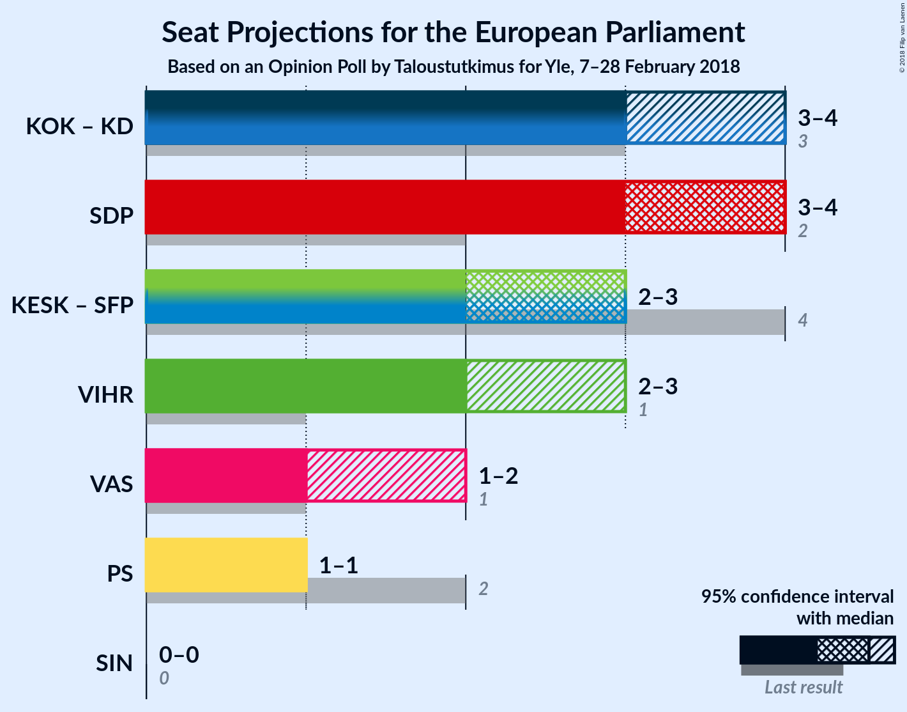

### Confidence Intervals

| Coalition | Last Result | Median | Majority? | 80% Confidence Interval | 90% Confidence Interval | 95% Confidence Interval | 99% Confidence Interval |
|:---------:|:-----------:|:------:|:---------:|:-----------------------:|:-----------------------:|:-----------------------:|:-----------------------:|
| Kansallinen Kokoomus (EPP) – Kristillisdemokraatit (EPP) | 3 | 3 | 0% | 3–4 | 3–4 | 3–4 | 3–4 |
| Suomen Sosialidemokraattinen Puolue (S&D) | 2 | 3 | 0% | 3–4 | 3–4 | 3–4 | 3–4 |
| Suomen Keskusta (ALDE) – Svenska folkpartiet i Finland (ALDE) | 4 | 3 | 0% | 3 | 3 | 2–3 | 2–3 |
| Vihreä liitto (Greens/EFA) | 1 | 2 | 0% | 2 | 2–3 | 2–3 | 2–3 |
| Vasemmistoliitto (GUE/NGL) | 1 | 1 | 0% | 1 | 1 | 1–2 | 1–2 |
| Perussuomalaiset (ECR) | 2 | 1 | 0% | 1 | 1 | 1 | 1–2 |
| Sininen tulevaisuus (*) | 0 | 0 | 0% | 0 | 0 | 0 | 0 |

### Kansallinen Kokoomus (EPP) – Kristillisdemokraatit (EPP)

| Number of Seats | Probability | Accumulated | Special Marks |
|:---------------:|:-----------:|:-----------:|:-------------:|
| 3 | 57% | 100% | Last Result, Median |
| 4 | 43% | 43% |  |
| 5 | 0% | 0% |  |

### Suomen Sosialidemokraattinen Puolue (S&D)

| Number of Seats | Probability | Accumulated | Special Marks |
|:---------------:|:-----------:|:-----------:|:-------------:|
| 2 | 0% | 100% | Last Result |
| 3 | 51% | 100% | Median |
| 4 | 49% | 49% |  |
| 5 | 0% | 0% |  |

### Suomen Keskusta (ALDE) – Svenska folkpartiet i Finland (ALDE)

| Number of Seats | Probability | Accumulated | Special Marks |
|:---------------:|:-----------:|:-----------:|:-------------:|
| 2 | 3% | 100% |  |
| 3 | 97% | 97% | Median |
| 4 | 0% | 0% | Last Result |

### Vihreä liitto (Greens/EFA)

| Number of Seats | Probability | Accumulated | Special Marks |
|:---------------:|:-----------:|:-----------:|:-------------:|
| 1 | 0% | 100% | Last Result |
| 2 | 93% | 100% | Median |
| 3 | 7% | 7% |  |
| 4 | 0% | 0% |  |

### Vasemmistoliitto (GUE/NGL)

| Number of Seats | Probability | Accumulated | Special Marks |
|:---------------:|:-----------:|:-----------:|:-------------:|
| 1 | 97% | 100% | Last Result, Median |
| 2 | 3% | 3% |  |
| 3 | 0% | 0% |  |

### Perussuomalaiset (ECR)

| Number of Seats | Probability | Accumulated | Special Marks |
|:---------------:|:-----------:|:-----------:|:-------------:|
| 1 | 99.3% | 100% | Median |
| 2 | 0.7% | 0.7% | Last Result |
| 3 | 0% | 0% |  |

### Sininen tulevaisuus (*)

| Number of Seats | Probability | Accumulated | Special Marks |
|:---------------:|:-----------:|:-----------:|:-------------:|
| 0 | 100% | 100% | Last Result, Median |

## Technical Information

### Opinion Poll

+ **Polling firm:** Taloustutkimus
+ **Commissioner(s):** Yle
+ **Fieldwork period:** 7–28 February 2018

### Calculations

+ **Sample size:** 1655
+ **Simulations done:** 131,072
+ **Error estimate:** 1.40%

