# Opinion Poll by Taloustutkimus for Yle, 13 May–4 June 2019

<a href="#voting-intentions">Voting Intentions</a> | <a href="#seats">Seats</a> | <a href="#coalitions">Coalitions</a> | <a href="#technical-information">Technical Information</a>

## Voting Intentions

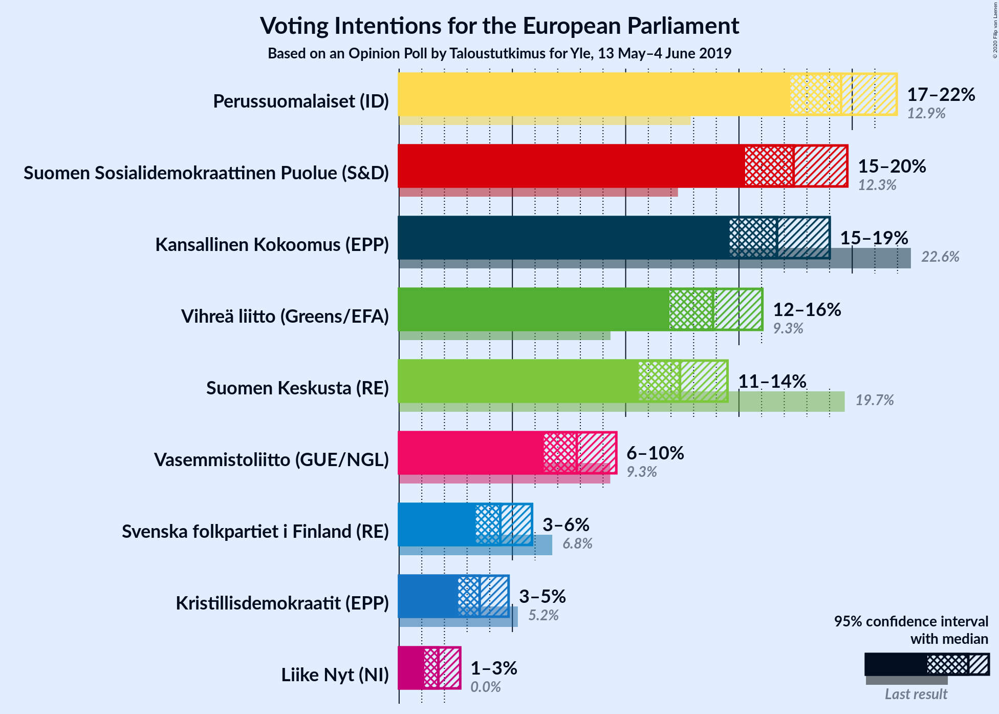

### Confidence Intervals

| Party | Last Result | Poll Result | 80% Confidence Interval | 90% Confidence Interval | 95% Confidence Interval | 99% Confidence Interval |
|:-----:|:-----------:|:-----------:|:-----------------------:|:-----------------------:|:-----------------------:|:-----------------------:|
| Perussuomalaiset (ID) | 12.9% | 19.5% | 18.0–21.1% |17.6–21.6% |17.3–22.0% |16.6–22.8% |
| Suomen Sosialidemokraattinen Puolue (S&D) | 12.3% | 17.4% | 16.0–19.0% |15.6–19.4% |15.3–19.8% |14.6–20.5% |
| Kansallinen Kokoomus (EPP) | 22.6% | 16.7% | 15.3–18.2% |14.9–18.6% |14.6–19.0% |13.9–19.8% |
| Vihreä liitto (Greens/EFA) | 9.3% | 13.9% | 12.6–15.3% |12.2–15.7% |11.9–16.0% |11.4–16.7% |
| Suomen Keskusta (RE) | 19.7% | 12.4% | 11.2–13.8% |10.9–14.1% |10.6–14.5% |10.0–15.2% |
| Vasemmistoliitto (GUE/NGL) | 9.3% | 7.8% | 6.9–9.0% |6.6–9.3% |6.4–9.6% |6.0–10.2% |
| Svenska folkpartiet i Finland (RE) | 6.8% | 4.5% | 3.7–5.4% |3.6–5.6% |3.4–5.9% |3.1–6.3% |
| Kristillisdemokraatit (EPP) | 5.2% | 3.6% | 2.9–4.4% |2.8–4.6% |2.6–4.8% |2.3–5.3% |
| Liike Nyt (EFDD) | 0.0% | 1.7% | 1.3–2.4% |1.2–2.5% |1.1–2.7% |0.9–3.0% |

*Note:* The poll result column reflects the actual value used in the calculations. Published results may vary slightly, and in addition be rounded to fewer digits.

## Seats

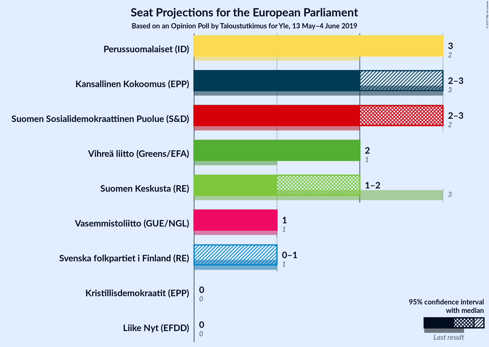

### Confidence Intervals

| Party | Last Result | Median | 80% Confidence Interval | 90% Confidence Interval | 95% Confidence Interval | 99% Confidence Interval |
|:-----:|:-----------:|:------:|:-----------------------:|:-----------------------:|:-----------------------:|:-----------------------:|
| <a href="#perussuomalaiset-(id)">Perussuomalaiset (ID)</a> | 2 | 3 | 3 |3 |3 |2–4 |
| <a href="#suomen-sosialidemokraattinen-puolue-(s&d)">Suomen Sosialidemokraattinen Puolue (S&D)</a> | 2 | 3 | 2–3 |2–3 |2–3 |2–3 |
| <a href="#kansallinen-kokoomus-(epp)">Kansallinen Kokoomus (EPP)</a> | 3 | 2 | 2–3 |2–3 |2–3 |2–3 |
| <a href="#vihreä-liitto-(greens/efa)">Vihreä liitto (Greens/EFA)</a> | 1 | 2 | 2 |2 |2 |1–3 |
| <a href="#suomen-keskusta-(re)">Suomen Keskusta (RE)</a> | 3 | 2 | 2 |1–2 |1–2 |1–2 |
| <a href="#vasemmistoliitto-(gue/ngl)">Vasemmistoliitto (GUE/NGL)</a> | 1 | 1 | 1 |1 |1 |1 |
| <a href="#svenska-folkpartiet-i-finland-(re)">Svenska folkpartiet i Finland (RE)</a> | 1 | 0 | 0 |0 |0–1 |0–1 |
| <a href="#kristillisdemokraatit-(epp)">Kristillisdemokraatit (EPP)</a> | 0 | 0 | 0 |0 |0 |0 |
| <a href="#liike-nyt-(efdd)">Liike Nyt (EFDD)</a> | 0 | 0 | 0 |0 |0 |0 |

### Perussuomalaiset (ID)

*For a full overview of the results for this party, see the [Perussuomalaiset (ID)](party-perussuomalaisetid.html) page.*

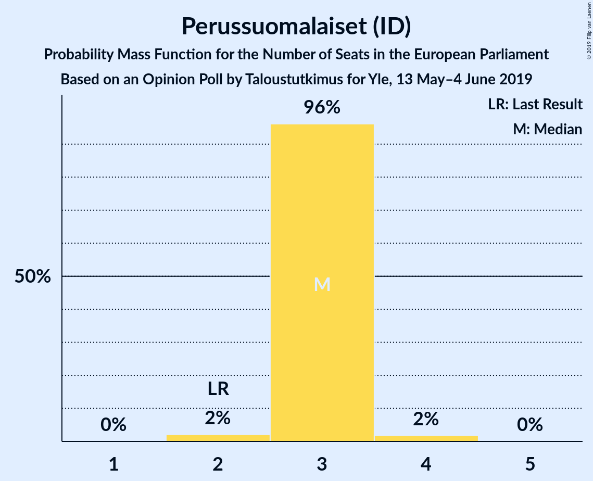

| Number of Seats | Probability | Accumulated | Special Marks |
|:---------------:|:-----------:|:-----------:|:-------------:|
| 2 | 2% | 100% | Last Result |
| 3 | 96% | 98% | Median |
| 4 | 2% | 2% |  |
| 5 | 0% | 0% |  |

### Suomen Sosialidemokraattinen Puolue (S&D)

*For a full overview of the results for this party, see the [Suomen Sosialidemokraattinen Puolue (S&D)](party-suomensosialidemokraattinenpuoluesd.html) page.*

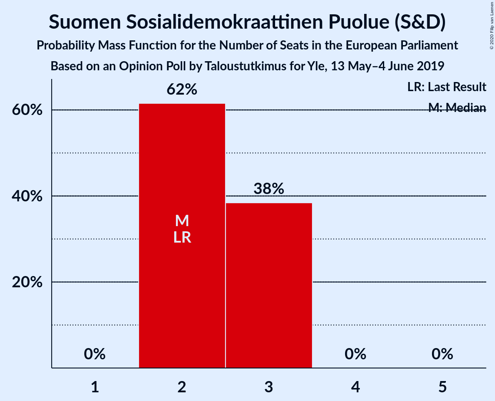

| Number of Seats | Probability | Accumulated | Special Marks |
|:---------------:|:-----------:|:-----------:|:-------------:|
| 2 | 32% | 100% | Last Result |
| 3 | 68% | 68% | Median |
| 4 | 0% | 0% |  |

### Kansallinen Kokoomus (EPP)

*For a full overview of the results for this party, see the [Kansallinen Kokoomus (EPP)](party-kansallinenkokoomusepp.html) page.*

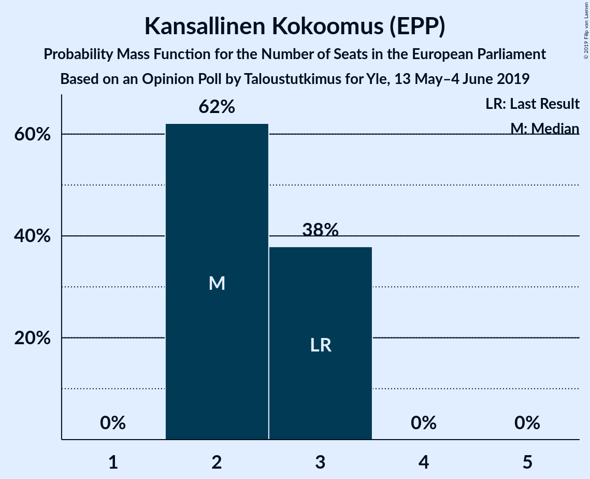

| Number of Seats | Probability | Accumulated | Special Marks |
|:---------------:|:-----------:|:-----------:|:-------------:|
| 2 | 62% | 100% | Median |
| 3 | 38% | 38% | Last Result |
| 4 | 0% | 0% |  |

### Vihreä liitto (Greens/EFA)

*For a full overview of the results for this party, see the [Vihreä liitto (Greens/EFA)](party-vihreäliittogreensefa.html) page.*

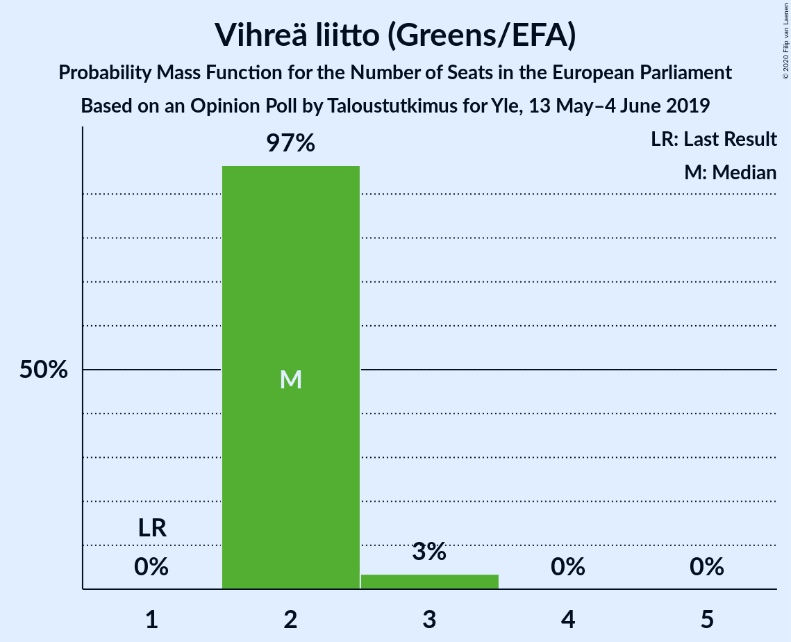

| Number of Seats | Probability | Accumulated | Special Marks |
|:---------------:|:-----------:|:-----------:|:-------------:|
| 1 | 0.8% | 100% | Last Result |
| 2 | 98% | 99.2% | Median |
| 3 | 0.9% | 0.9% |  |
| 4 | 0% | 0% |  |

### Suomen Keskusta (RE)

*For a full overview of the results for this party, see the [Suomen Keskusta (RE)](party-suomenkeskustare.html) page.*

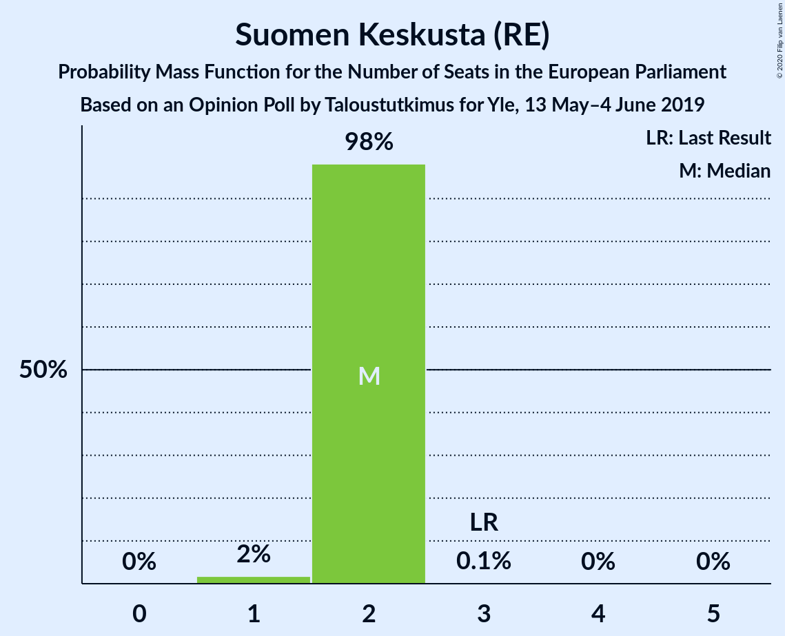

| Number of Seats | Probability | Accumulated | Special Marks |
|:---------------:|:-----------:|:-----------:|:-------------:|
| 1 | 9% | 100% |  |
| 2 | 91% | 91% | Median |
| 3 | 0% | 0% | Last Result |

### Vasemmistoliitto (GUE/NGL)

*For a full overview of the results for this party, see the [Vasemmistoliitto (GUE/NGL)](party-vasemmistoliittoguengl.html) page.*

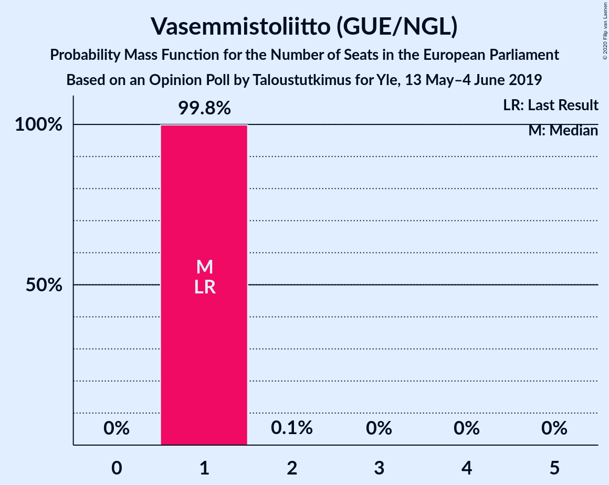

| Number of Seats | Probability | Accumulated | Special Marks |
|:---------------:|:-----------:|:-----------:|:-------------:|
| 0 | 0.2% | 100% |  |
| 1 | 99.8% | 99.8% | Last Result, Median |
| 2 | 0% | 0% |  |

### Svenska folkpartiet i Finland (RE)

*For a full overview of the results for this party, see the [Svenska folkpartiet i Finland (RE)](party-svenskafolkpartietifinlandre.html) page.*

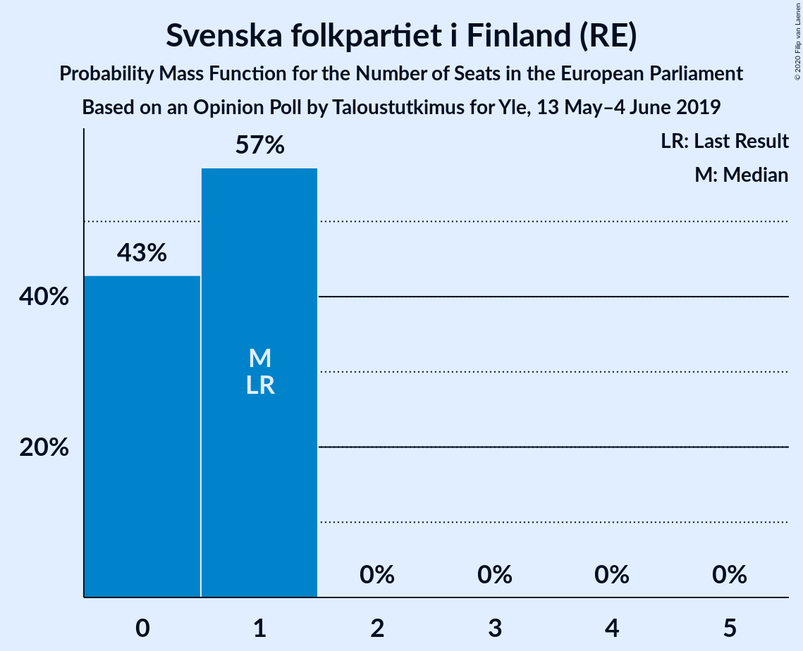

| Number of Seats | Probability | Accumulated | Special Marks |
|:---------------:|:-----------:|:-----------:|:-------------:|
| 0 | 97% | 100% | Median |
| 1 | 3% | 3% | Last Result |
| 2 | 0% | 0% |  |

### Kristillisdemokraatit (EPP)

*For a full overview of the results for this party, see the [Kristillisdemokraatit (EPP)](party-kristillisdemokraatitepp.html) page.*

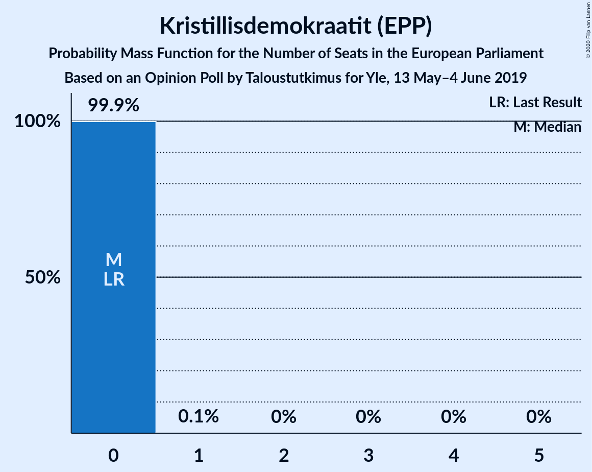

| Number of Seats | Probability | Accumulated | Special Marks |
|:---------------:|:-----------:|:-----------:|:-------------:|
| 0 | 99.9% | 100% | Last Result, Median |
| 1 | 0.1% | 0.1% |  |
| 2 | 0% | 0% |  |

### Liike Nyt (EFDD)

*For a full overview of the results for this party, see the [Liike Nyt (EFDD)](party-liikenytefdd.html) page.*

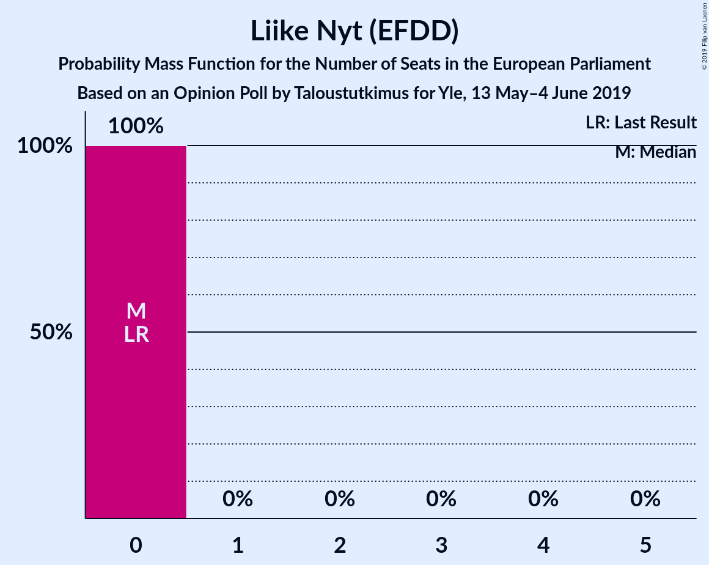

| Number of Seats | Probability | Accumulated | Special Marks |
|:---------------:|:-----------:|:-----------:|:-------------:|
| 0 | 100% | 100% | Last Result, Median |

## Coalitions

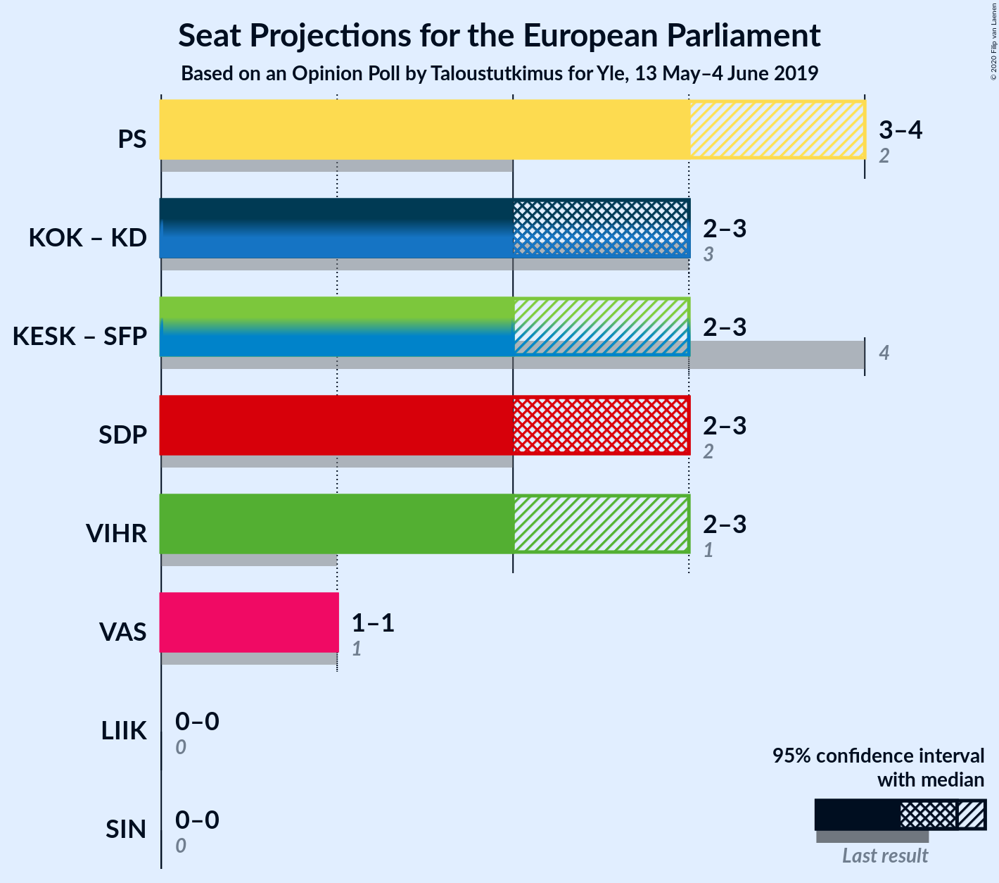

### Confidence Intervals

| Coalition | Last Result | Median | Majority? | 80% Confidence Interval | 90% Confidence Interval | 95% Confidence Interval | 99% Confidence Interval |
|:---------:|:-----------:|:------:|:---------:|:-----------------------:|:-----------------------:|:-----------------------:|:-----------------------:|
| Perussuomalaiset (ID) | 2 | 3 | 0% | 3 | 3 | 3 | 2–4 |
| Kansallinen Kokoomus (EPP) – Kristillisdemokraatit (EPP) | 3 | 2 | 0% | 2–3 | 2–3 | 2–3 | 2–3 |
| Suomen Sosialidemokraattinen Puolue (S&D) | 2 | 3 | 0% | 2–3 | 2–3 | 2–3 | 2–3 |
| Vihreä liitto (Greens/EFA) | 1 | 2 | 0% | 2 | 2 | 2 | 1–3 |
| Suomen Keskusta (RE) – Svenska folkpartiet i Finland (RE) | 4 | 2 | 0% | 2 | 1–2 | 1–2 | 1–3 |
| Vasemmistoliitto (GUE/NGL) | 1 | 1 | 0% | 1 | 1 | 1 | 1 |
| Liike Nyt (EFDD) | 0 | 0 | 0% | 0 | 0 | 0 | 0 |

### Perussuomalaiset (ID)

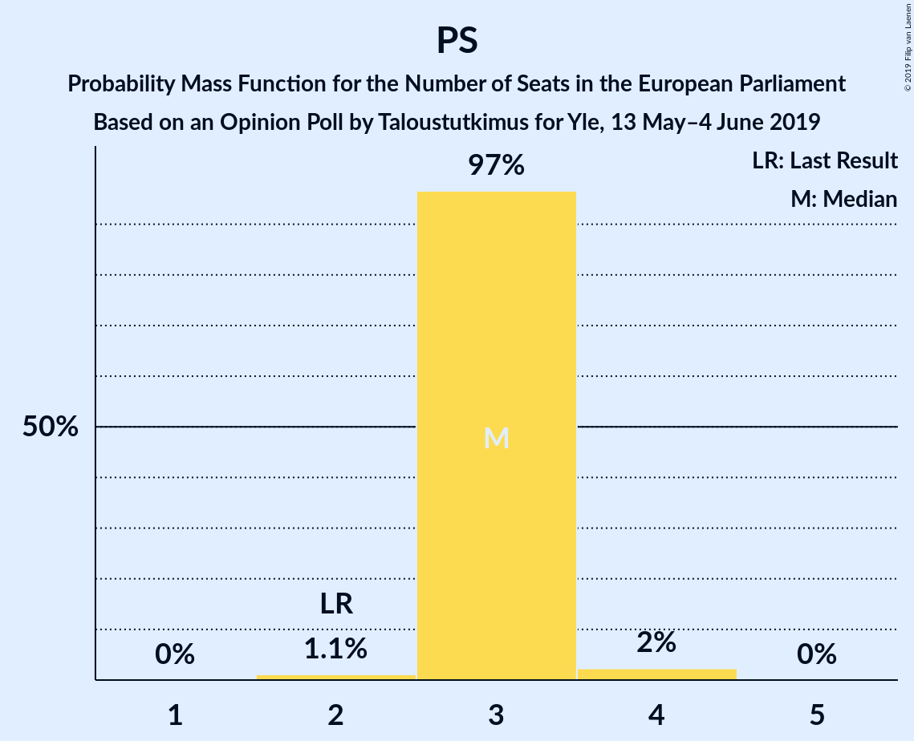

| Number of Seats | Probability | Accumulated | Special Marks |
|:---------------:|:-----------:|:-----------:|:-------------:|
| 2 | 2% | 100% | Last Result |
| 3 | 96% | 98% | Median |
| 4 | 2% | 2% |  |
| 5 | 0% | 0% |  |

### Kansallinen Kokoomus (EPP) – Kristillisdemokraatit (EPP)

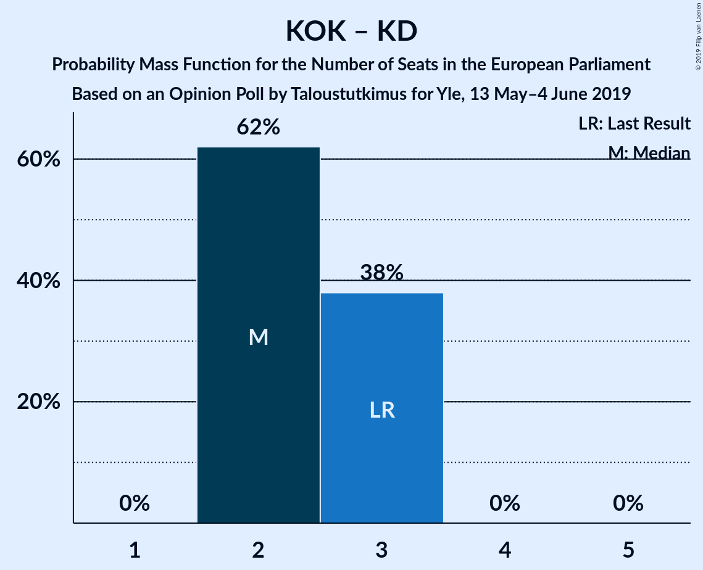

| Number of Seats | Probability | Accumulated | Special Marks |
|:---------------:|:-----------:|:-----------:|:-------------:|
| 2 | 62% | 100% | Median |
| 3 | 38% | 38% | Last Result |
| 4 | 0% | 0% |  |

### Suomen Sosialidemokraattinen Puolue (S&D)

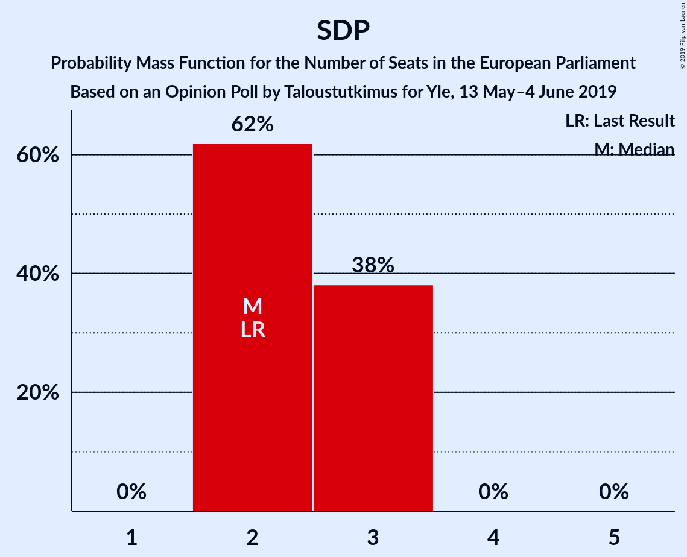

| Number of Seats | Probability | Accumulated | Special Marks |
|:---------------:|:-----------:|:-----------:|:-------------:|
| 2 | 32% | 100% | Last Result |
| 3 | 68% | 68% | Median |
| 4 | 0% | 0% |  |

### Vihreä liitto (Greens/EFA)

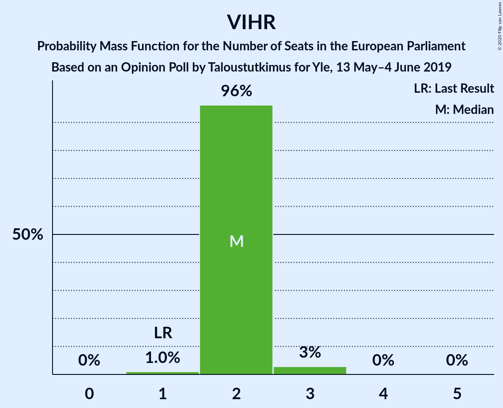

| Number of Seats | Probability | Accumulated | Special Marks |
|:---------------:|:-----------:|:-----------:|:-------------:|
| 1 | 0.8% | 100% | Last Result |
| 2 | 98% | 99.2% | Median |
| 3 | 0.9% | 0.9% |  |
| 4 | 0% | 0% |  |

### Suomen Keskusta (RE) – Svenska folkpartiet i Finland (RE)

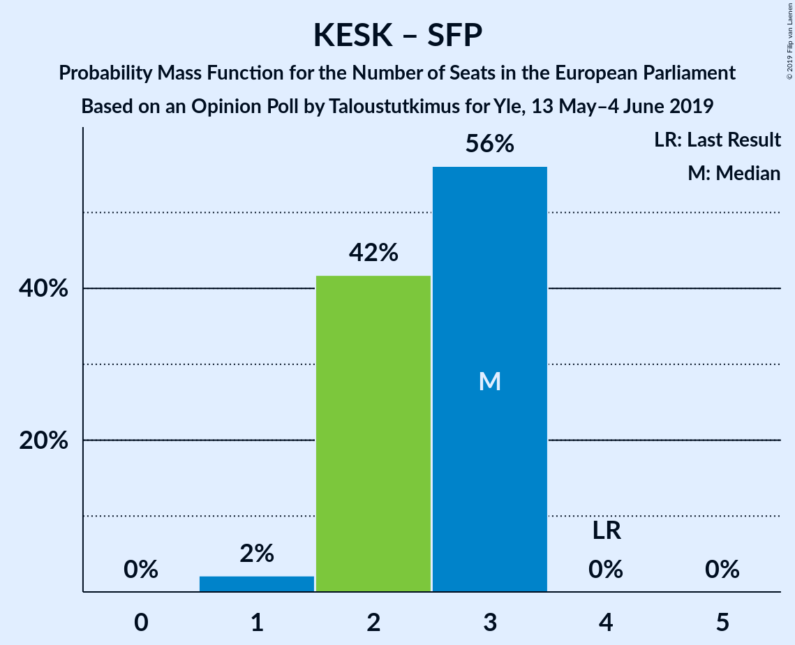

| Number of Seats | Probability | Accumulated | Special Marks |
|:---------------:|:-----------:|:-----------:|:-------------:|
| 1 | 8% | 100% |  |
| 2 | 89% | 92% | Median |
| 3 | 2% | 2% |  |
| 4 | 0% | 0% | Last Result |

### Vasemmistoliitto (GUE/NGL)

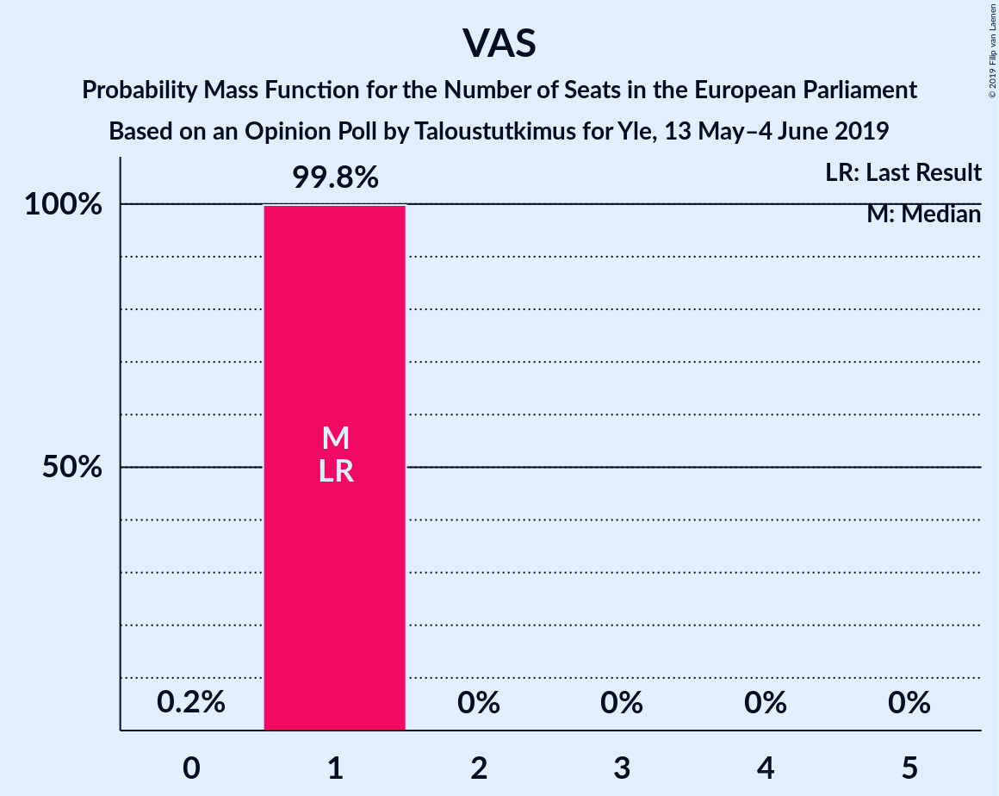

| Number of Seats | Probability | Accumulated | Special Marks |
|:---------------:|:-----------:|:-----------:|:-------------:|
| 0 | 0.2% | 100% |  |
| 1 | 99.8% | 99.8% | Last Result, Median |
| 2 | 0% | 0% |  |

### Liike Nyt (EFDD)

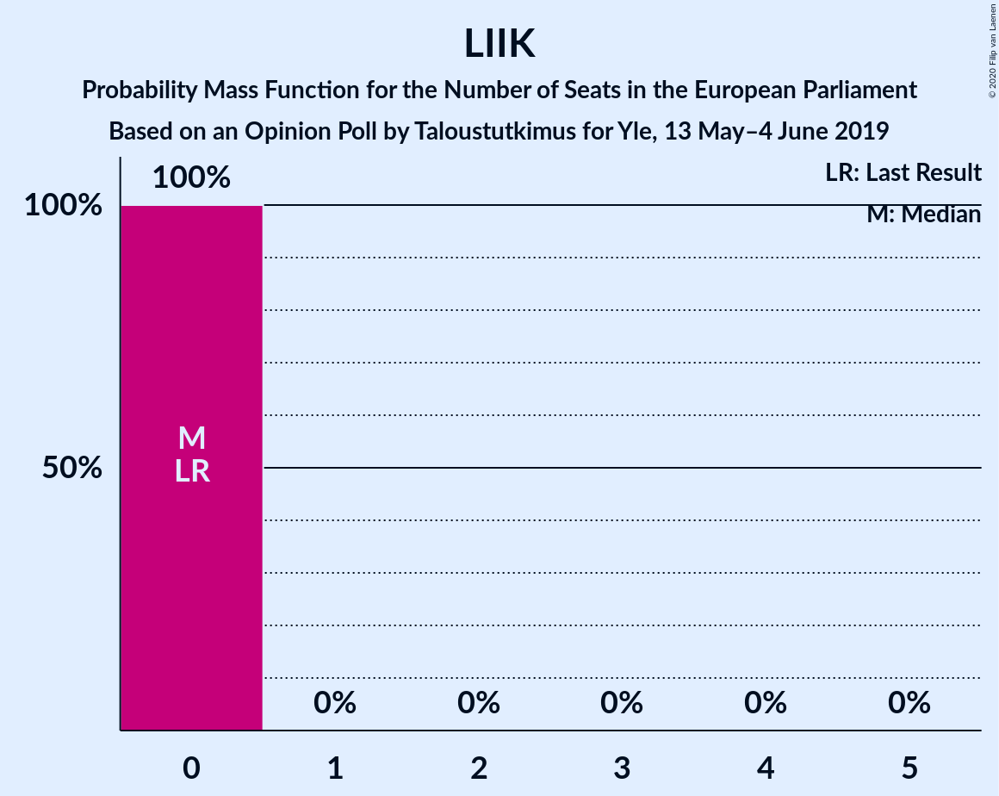

| Number of Seats | Probability | Accumulated | Special Marks |
|:---------------:|:-----------:|:-----------:|:-------------:|
| 0 | 100% | 100% | Last Result, Median |

## Technical Information

### Opinion Poll

+ **Polling firm:** Taloustutkimus
+ **Commissioner(s):** Yle
+ **Fieldwork period:** 13 May–4 June 2019

### Calculations

+ **Sample size:** 1097
+ **Simulations done:** 1,048,576
+ **Error estimate:** 1.98%

