# Poll Average

<a href="#voting-intentions">Voting Intentions</a> | <a href="#seats">Seats</a> | <a href="#coalitions">Coalitions</a> | <a href="#technical-information">Technical Information</a>

## Summary

The table below lists the polls on which the average is based. They are the most recent polls (less than 20 days old) registered and analyzed so far.

| Period     | Polling firm/Commissioner(s) | KOK | KESK | PS | SDP | VIHR | VAS | SFP | KD | SIN | LIIK |
|:----------:|:----------------------------:|:--:|:--:|:--:|:--:|:--:|:--:|:--:|:--:|:--:|:--:|
| 25 May 2014 | General Election | 22.6%   3 | 19.7%   3 | 12.9%   2 | 12.3%   2 | 9.3%   1 | 9.3%   1 | 6.8%   1 | 5.2%   0 | 0.0%   0 | 0.0%   0 |
| N/A | Poll Average | 16–22%   2–3 | 12–15%   2 | 15–21%   2–3 | 14–19%   2–3 | 11–15%   1–2 | 7–11%   1 | 3–8%   0–1 | 3–6%   0 | N/A   N/A | 1–2%   0 |
| [6–18 May 2019](2019-05-18-KantarTNS.html) | Kantar TNS   Helsingin Sanomat | 18–22%   3 | 12–15%   2 | 15–18%   2–3 | 14–17%   2 | 12–15%   1–2 | 7–10%   1 | 6–8%   1 | 4–6%   0 | N/A   N/A | N/A   N/A |
| [3–14 May 2019](2019-05-14-Tietoykkönen.html) | Tietoykkönen   Iltalehti and Uusi Suomi | 16–20%   2–3 | 12–15%   2 | 17–21%   2–3 | 14–19%   2–3 | 10–14%   1–2 | 8–11%   1 | 4–6%   0–1 | 3–5%   0 | N/A   N/A | N/A   N/A |
| [15 April–7 May 2019](2019-05-07-Taloustutkimus.html) | Taloustutkimus   Yle | 15–19%   2–3 | 12–15%   2 | 17–21%   2–3 | 16–20%   2–3 | 12–15%   2 | 7–9%   1 | 3–5%   0 | 3–5%   0 | N/A   N/A | 1–2%   0 |
| 25 May 2014 | General Election | 22.6%   3 | 19.7%   3 | 12.9%   2 | 12.3%   2 | 9.3%   1 | 9.3%   1 | 6.8%   1 | 5.2%   0 | 0.0%   0 | 0.0%   0 |

Only polls for which at least the sample size has been published are included in the table above.

**Legend:**
+ **Top half of each row:** Voting intentions (95% confidence interval)
+ **Bottom half of each row:** Seat projections for the European Parliament (95% confidence interval)
+ **KOK:** Kansallinen Kokoomus (EPP)
+ **KESK:** Suomen Keskusta (ALDE)
+ **PS:** Perussuomalaiset (EAPN)
+ **SDP:** Suomen Sosialidemokraattinen Puolue (S&D)
+ **VIHR:** Vihreä liitto (Greens/EFA)
+ **VAS:** Vasemmistoliitto (GUE/NGL)
+ **SFP:** Svenska folkpartiet i Finland (ALDE)
+ **KD:** Kristillisdemokraatit (EPP)
+ **SIN:** Sininen tulevaisuus (ECR)
+ **LIIK:** Liike Nyt (EFDD)
+ **N/A (single party):** Party not included the published results
+ **N/A (entire row):** Calculation for this opinion poll not started yet

## Voting Intentions

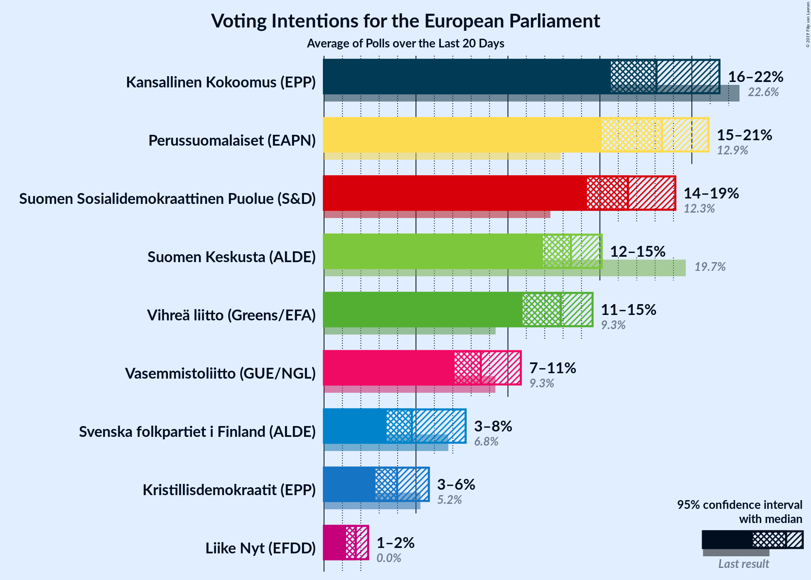

### Confidence Intervals

| Party | Last Result | Median | 80% Confidence Interval | 90% Confidence Interval | 95% Confidence Interval | 99% Confidence Interval |
|:-----:|:-----------:|:------:|:-----------------------:|:-----------------------:|:-----------------------:|:-----------------------:|
| <a href="#kansallinen-kokoomus-(epp)">Kansallinen Kokoomus (EPP)</a> | 22.6% | 18.1% | 16.3–20.6% |15.9–21.1% | 15.6–21.5% | 15.1–22.1% |
| <a href="#suomen-keskusta-(alde)">Suomen Keskusta (ALDE)</a> | 19.7% | 13.4% | 12.4–14.5% |12.1–14.9% | 11.9–15.1% | 11.3–15.7% |
| <a href="#perussuomalaiset-(eapn)">Perussuomalaiset (EAPN)</a> | 12.9% | 18.4% | 15.9–20.1% |15.5–20.5% | 15.1–20.9% | 14.6–21.7% |
| <a href="#suomen-sosialidemokraattinen-puolue-(s&d)">Suomen Sosialidemokraattinen Puolue (S&D)</a> | 12.3% | 16.5% | 14.9–18.4% |14.6–18.8% | 14.3–19.1% | 13.7–19.8% |
| <a href="#vihreä-liitto-(greens/efa)">Vihreä liitto (Greens/EFA)</a> | 9.3% | 12.9% | 11.6–14.0% |11.2–14.3% | 10.8–14.6% | 10.2–15.2% |
| <a href="#vasemmistoliitto-(gue/ngl)">Vasemmistoliitto (GUE/NGL)</a> | 9.3% | 8.5% | 7.5–9.9% |7.3–10.4% | 7.1–10.7% | 6.7–11.3% |
| <a href="#svenska-folkpartiet-i-finland-(alde)">Svenska folkpartiet i Finland (ALDE)</a> | 6.8% | 4.8% | 3.7–7.2% |3.5–7.4% | 3.4–7.7% | 3.1–8.1% |
| <a href="#kristillisdemokraatit-(epp)">Kristillisdemokraatit (EPP)</a> | 5.2% | 4.0% | 3.2–5.3% |3.0–5.5% | 2.8–5.7% | 2.5–6.1% |
| <a href="#sininen-tulevaisuus-(ecr)">Sininen tulevaisuus (ECR)</a> | 0.0% | N/A | N/A |N/A | N/A | N/A |
| <a href="#liike-nyt-(efdd)">Liike Nyt (EFDD)</a> | 0.0% | 1.7% | 1.4–2.1% |1.3–2.2% | 1.2–2.4% | 1.1–2.6% |

### Kansallinen Kokoomus (EPP)

*For a full overview of the results for this party, see the [Kansallinen Kokoomus (EPP)](party-kansallinenkokoomusepp.html) page.*

| Voting Intentions | Probability | Accumulated | Special Marks |
|:-----------------:|:-----------:|:-----------:|:-------------:|
| 12.5–13.5% | 0% | 100% |  |
| 13.5–14.5% | 0.1% | 100% |  |
| 14.5–15.5% | 2% | 99.9% |  |
| 15.5–16.5% | 13% | 98% |  |
| 16.5–17.5% | 24% | 85% |  |
| 17.5–18.5% | 20% | 62% | Median |
| 18.5–19.5% | 15% | 42% |  |
| 19.5–20.5% | 16% | 27% |  |
| 20.5–21.5% | 9% | 11% |  |
| 21.5–22.5% | 2% | 2% |  |
| 22.5–23.5% | 0.1% | 0.1% | Last Result |
| 23.5–24.5% | 0% | 0% |  |

### Suomen Keskusta (ALDE)

*For a full overview of the results for this party, see the [Suomen Keskusta (ALDE)](party-suomenkeskustaalde.html) page.*

| Voting Intentions | Probability | Accumulated | Special Marks |
|:-----------------:|:-----------:|:-----------:|:-------------:|
| 9.5–10.5% | 0% | 100% |  |
| 10.5–11.5% | 1.0% | 100% |  |
| 11.5–12.5% | 13% | 99.0% |  |
| 12.5–13.5% | 42% | 86% | Median |
| 13.5–14.5% | 35% | 44% |  |
| 14.5–15.5% | 9% | 9% |  |
| 15.5–16.5% | 0.8% | 0.9% |  |
| 16.5–17.5% | 0% | 0% |  |
| 17.5–18.5% | 0% | 0% |  |
| 18.5–19.5% | 0% | 0% |  |
| 19.5–20.5% | 0% | 0% | Last Result |

### Perussuomalaiset (EAPN)

*For a full overview of the results for this party, see the [Perussuomalaiset (EAPN)](party-perussuomalaiseteapn.html) page.*

| Voting Intentions | Probability | Accumulated | Special Marks |
|:-----------------:|:-----------:|:-----------:|:-------------:|
| 12.5–13.5% | 0% | 100% | Last Result |
| 13.5–14.5% | 0.5% | 100% |  |
| 14.5–15.5% | 5% | 99.5% |  |
| 15.5–16.5% | 15% | 94% |  |
| 16.5–17.5% | 14% | 79% |  |
| 17.5–18.5% | 19% | 65% | Median |
| 18.5–19.5% | 26% | 45% |  |
| 19.5–20.5% | 15% | 20% |  |
| 20.5–21.5% | 4% | 5% |  |
| 21.5–22.5% | 0.6% | 0.7% |  |
| 22.5–23.5% | 0.1% | 0.1% |  |
| 23.5–24.5% | 0% | 0% |  |

### Suomen Sosialidemokraattinen Puolue (S&D)

*For a full overview of the results for this party, see the [Suomen Sosialidemokraattinen Puolue (S&D)](party-suomensosialidemokraattinenpuoluesd.html) page.*

| Voting Intentions | Probability | Accumulated | Special Marks |
|:-----------------:|:-----------:|:-----------:|:-------------:|
| 11.5–12.5% | 0% | 100% | Last Result |
| 12.5–13.5% | 0.3% | 100% |  |
| 13.5–14.5% | 5% | 99.7% |  |
| 14.5–15.5% | 19% | 95% |  |
| 15.5–16.5% | 27% | 76% |  |
| 16.5–17.5% | 24% | 49% | Median |
| 17.5–18.5% | 18% | 26% |  |
| 18.5–19.5% | 7% | 7% |  |
| 19.5–20.5% | 0.8% | 0.9% |  |
| 20.5–21.5% | 0% | 0% |  |

### Vihreä liitto (Greens/EFA)

*For a full overview of the results for this party, see the [Vihreä liitto (Greens/EFA)](party-vihreäliittogreensefa.html) page.*

| Voting Intentions | Probability | Accumulated | Special Marks |
|:-----------------:|:-----------:|:-----------:|:-------------:|
| 8.5–9.5% | 0% | 100% | Last Result |
| 9.5–10.5% | 1.1% | 100% |  |
| 10.5–11.5% | 8% | 98.8% |  |
| 11.5–12.5% | 26% | 90% |  |
| 12.5–13.5% | 41% | 64% | Median |
| 13.5–14.5% | 20% | 23% |  |
| 14.5–15.5% | 3% | 3% |  |
| 15.5–16.5% | 0.1% | 0.1% |  |
| 16.5–17.5% | 0% | 0% |  |

### Vasemmistoliitto (GUE/NGL)

*For a full overview of the results for this party, see the [Vasemmistoliitto (GUE/NGL)](party-vasemmistoliittoguengl.html) page.*

| Voting Intentions | Probability | Accumulated | Special Marks |
|:-----------------:|:-----------:|:-----------:|:-------------:|
| 4.5–5.5% | 0% | 100% |  |
| 5.5–6.5% | 0.2% | 100% |  |
| 6.5–7.5% | 10% | 99.8% |  |
| 7.5–8.5% | 41% | 90% |  |
| 8.5–9.5% | 32% | 48% | Last Result, Median |
| 9.5–10.5% | 13% | 17% |  |
| 10.5–11.5% | 3% | 3% |  |
| 11.5–12.5% | 0.3% | 0.3% |  |
| 12.5–13.5% | 0% | 0% |  |

### Svenska folkpartiet i Finland (ALDE)

*For a full overview of the results for this party, see the [Svenska folkpartiet i Finland (ALDE)](party-svenskafolkpartietifinlandalde.html) page.*

| Voting Intentions | Probability | Accumulated | Special Marks |
|:-----------------:|:-----------:|:-----------:|:-------------:|
| 1.5–2.5% | 0% | 100% |  |
| 2.5–3.5% | 5% | 100% |  |
| 3.5–4.5% | 37% | 95% |  |
| 4.5–5.5% | 21% | 58% | Median |
| 5.5–6.5% | 13% | 36% |  |
| 6.5–7.5% | 20% | 24% | Last Result |
| 7.5–8.5% | 4% | 4% |  |
| 8.5–9.5% | 0.1% | 0.1% |  |
| 9.5–10.5% | 0% | 0% |  |

### Kristillisdemokraatit (EPP)

*For a full overview of the results for this party, see the [Kristillisdemokraatit (EPP)](party-kristillisdemokraatitepp.html) page.*

| Voting Intentions | Probability | Accumulated | Special Marks |
|:-----------------:|:-----------:|:-----------:|:-------------:|
| 0.5–1.5% | 0% | 100% |  |
| 1.5–2.5% | 0.5% | 100% |  |
| 2.5–3.5% | 26% | 99.5% |  |
| 3.5–4.5% | 43% | 73% | Median |
| 4.5–5.5% | 26% | 30% | Last Result |
| 5.5–6.5% | 5% | 5% |  |
| 6.5–7.5% | 0.1% | 0.1% |  |
| 7.5–8.5% | 0% | 0% |  |

### Liike Nyt (EFDD)

*For a full overview of the results for this party, see the [Liike Nyt (EFDD)](party-liikenytefdd.html) page.*

| Voting Intentions | Probability | Accumulated | Special Marks |
|:-----------------:|:-----------:|:-----------:|:-------------:|
| 0.0–0.5% | 0% | 100% | Last Result |
| 0.5–1.5% | 29% | 100% |  |
| 1.5–2.5% | 71% | 71% | Median |
| 2.5–3.5% | 0.7% | 0.7% |  |
| 3.5–4.5% | 0% | 0% |  |

## Seats

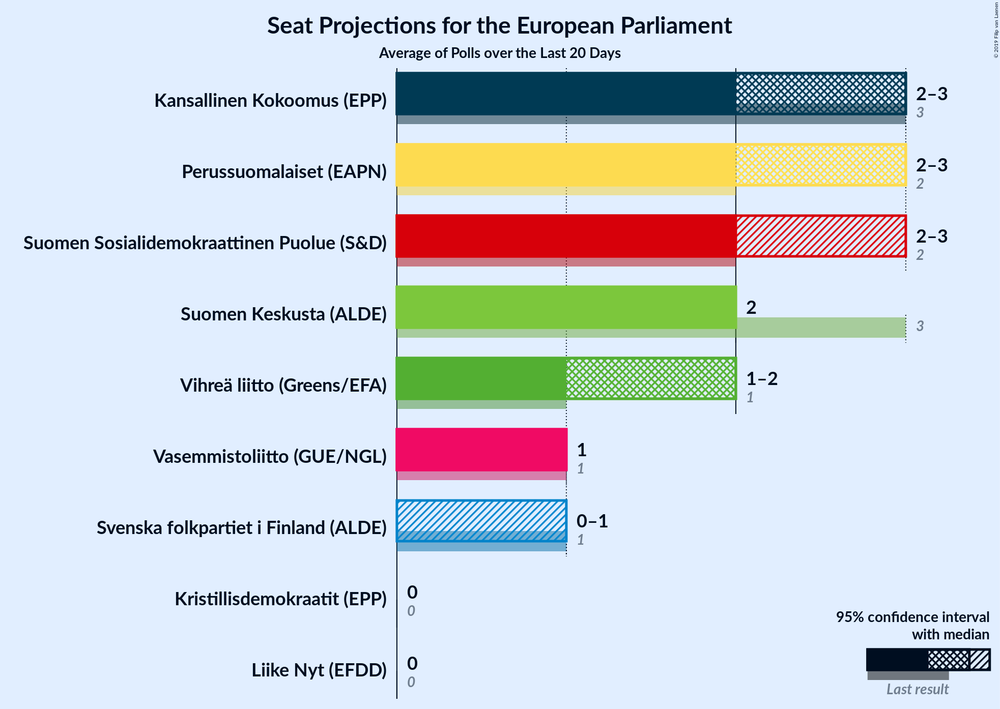

### Confidence Intervals

| Party | Last Result | Median | 80% Confidence Interval | 90% Confidence Interval | 95% Confidence Interval | 99% Confidence Interval |
|:-----:|:-----------:|:------:|:-----------------------:|:-----------------------:|:-----------------------:|:-----------------------:|
| <a href="#kansallinen-kokoomus-(epp)">Kansallinen Kokoomus (EPP)</a> | 3 | 3 | 2–3 |2–3 | 2–3 | 2–3 |
| <a href="#suomen-keskusta-(alde)">Suomen Keskusta (ALDE)</a> | 3 | 2 | 2 |2 | 2 | 1–2 |
| <a href="#perussuomalaiset-(eapn)">Perussuomalaiset (EAPN)</a> | 2 | 3 | 2–3 |2–3 | 2–3 | 2–3 |
| <a href="#suomen-sosialidemokraattinen-puolue-(s&d)">Suomen Sosialidemokraattinen Puolue (S&D)</a> | 2 | 2 | 2–3 |2–3 | 2–3 | 2–3 |
| <a href="#vihreä-liitto-(greens/efa)">Vihreä liitto (Greens/EFA)</a> | 1 | 2 | 2 |1–2 | 1–2 | 1–2 |
| <a href="#vasemmistoliitto-(gue/ngl)">Vasemmistoliitto (GUE/NGL)</a> | 1 | 1 | 1 |1 | 1 | 1–2 |
| <a href="#svenska-folkpartiet-i-finland-(alde)">Svenska folkpartiet i Finland (ALDE)</a> | 1 | 0 | 0–1 |0–1 | 0–1 | 0–1 |
| <a href="#kristillisdemokraatit-(epp)">Kristillisdemokraatit (EPP)</a> | 0 | 0 | 0 |0 | 0 | 0–1 |
| <a href="#sininen-tulevaisuus-(ecr)">Sininen tulevaisuus (ECR)</a> | 0 | N/A | N/A |N/A | N/A | N/A |
| <a href="#liike-nyt-(efdd)">Liike Nyt (EFDD)</a> | 0 | 0 | 0 |0 | 0 | 0 |

### Kansallinen Kokoomus (EPP)

*For a full overview of the results for this party, see the [Kansallinen Kokoomus (EPP)](party-kansallinenkokoomusepp.html) page.*

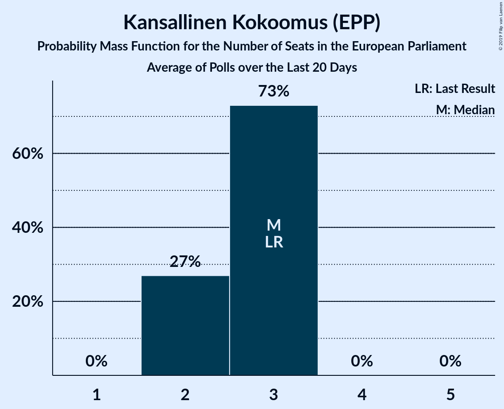

| Number of Seats | Probability | Accumulated | Special Marks |
|:---------------:|:-----------:|:-----------:|:-------------:|
| 2 | 27% | 100% |  |
| 3 | 73% | 73% | Last Result, Median |
| 4 | 0% | 0% |  |

### Suomen Keskusta (ALDE)

*For a full overview of the results for this party, see the [Suomen Keskusta (ALDE)](party-suomenkeskustaalde.html) page.*

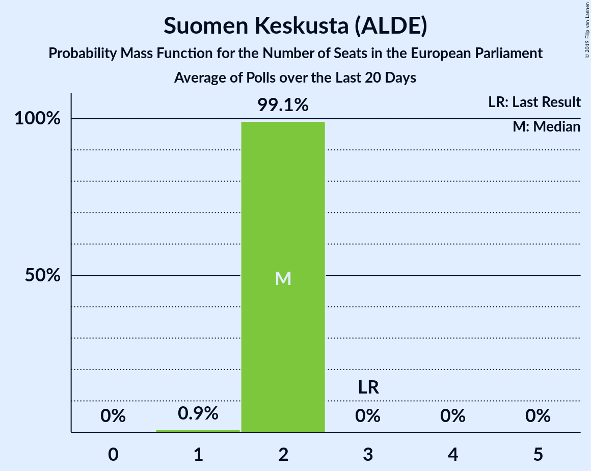

| Number of Seats | Probability | Accumulated | Special Marks |
|:---------------:|:-----------:|:-----------:|:-------------:|
| 1 | 0.9% | 100% |  |
| 2 | 99.1% | 99.1% | Median |
| 3 | 0% | 0% | Last Result |

### Perussuomalaiset (EAPN)

*For a full overview of the results for this party, see the [Perussuomalaiset (EAPN)](party-perussuomalaiseteapn.html) page.*

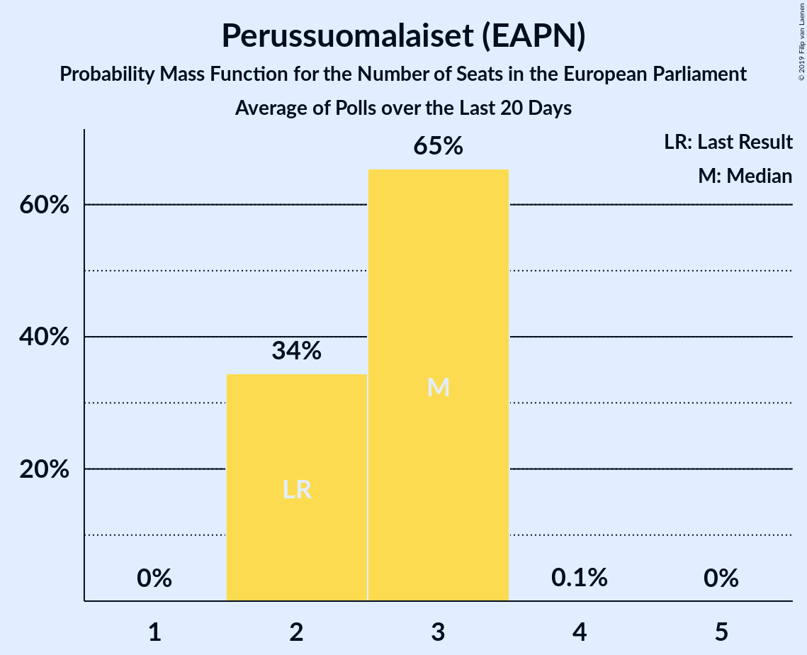

| Number of Seats | Probability | Accumulated | Special Marks |
|:---------------:|:-----------:|:-----------:|:-------------:|
| 2 | 34% | 100% | Last Result |
| 3 | 65% | 66% | Median |
| 4 | 0.1% | 0.1% |  |
| 5 | 0% | 0% |  |

### Suomen Sosialidemokraattinen Puolue (S&D)

*For a full overview of the results for this party, see the [Suomen Sosialidemokraattinen Puolue (S&D)](party-suomensosialidemokraattinenpuoluesd.html) page.*

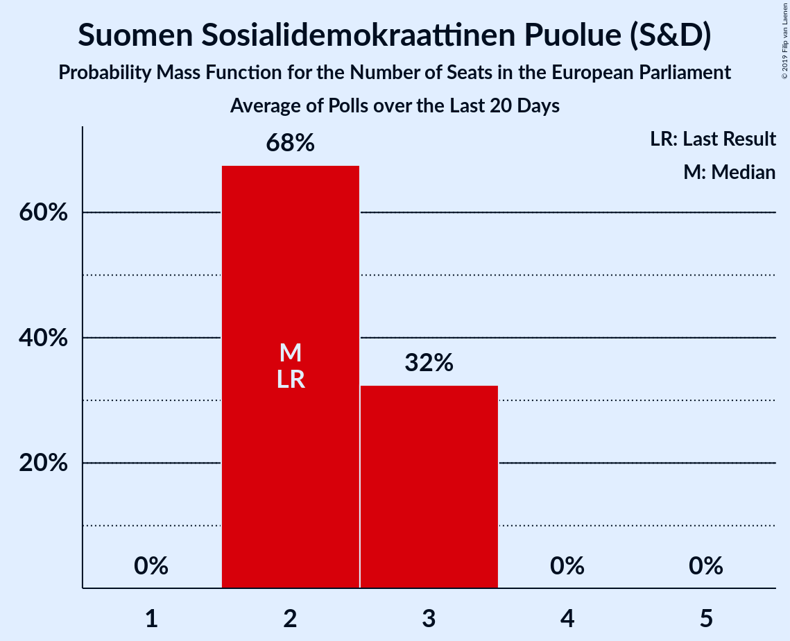

| Number of Seats | Probability | Accumulated | Special Marks |
|:---------------:|:-----------:|:-----------:|:-------------:|
| 2 | 68% | 100% | Last Result, Median |
| 3 | 32% | 32% |  |
| 4 | 0% | 0% |  |

### Vihreä liitto (Greens/EFA)

*For a full overview of the results for this party, see the [Vihreä liitto (Greens/EFA)](party-vihreäliittogreensefa.html) page.*

| Number of Seats | Probability | Accumulated | Special Marks |
|:---------------:|:-----------:|:-----------:|:-------------:|
| 1 | 6% | 100% | Last Result |
| 2 | 94% | 94% | Median |
| 3 | 0% | 0% |  |

### Vasemmistoliitto (GUE/NGL)

*For a full overview of the results for this party, see the [Vasemmistoliitto (GUE/NGL)](party-vasemmistoliittoguengl.html) page.*

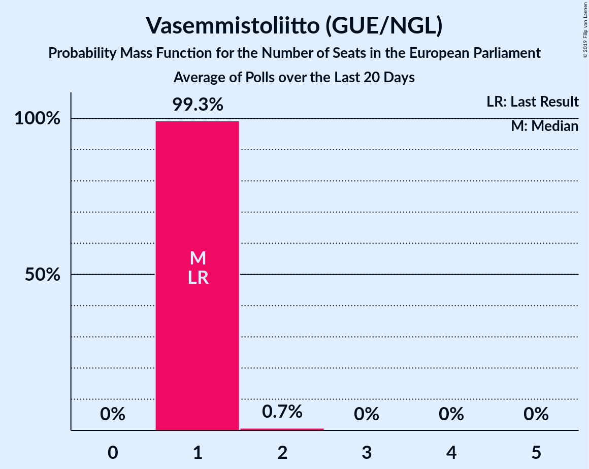

| Number of Seats | Probability | Accumulated | Special Marks |
|:---------------:|:-----------:|:-----------:|:-------------:|
| 1 | 99.3% | 100% | Last Result, Median |
| 2 | 0.7% | 0.7% |  |
| 3 | 0% | 0% |  |

### Svenska folkpartiet i Finland (ALDE)

*For a full overview of the results for this party, see the [Svenska folkpartiet i Finland (ALDE)](party-svenskafolkpartietifinlandalde.html) page.*

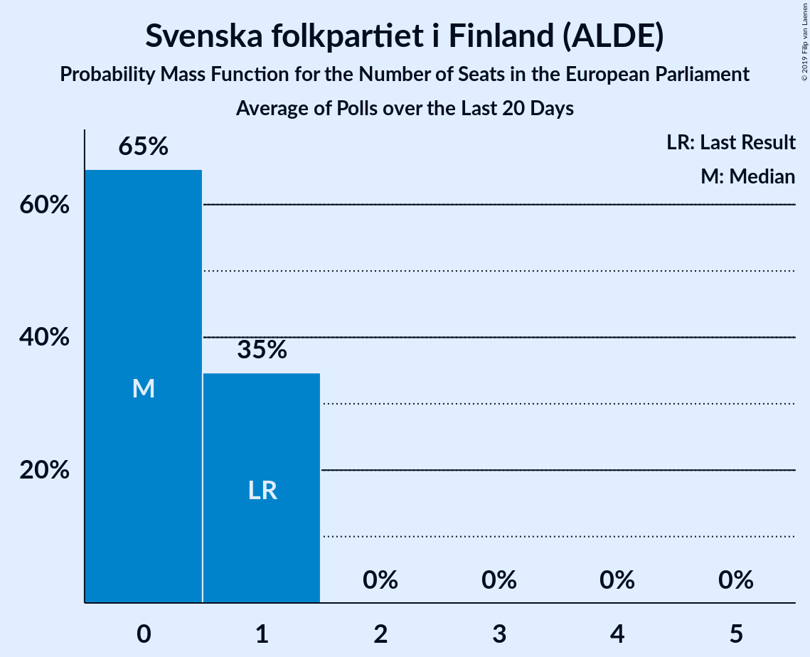

| Number of Seats | Probability | Accumulated | Special Marks |
|:---------------:|:-----------:|:-----------:|:-------------:|
| 0 | 65% | 100% | Median |
| 1 | 35% | 35% | Last Result |
| 2 | 0% | 0% |  |

### Kristillisdemokraatit (EPP)

*For a full overview of the results for this party, see the [Kristillisdemokraatit (EPP)](party-kristillisdemokraatitepp.html) page.*

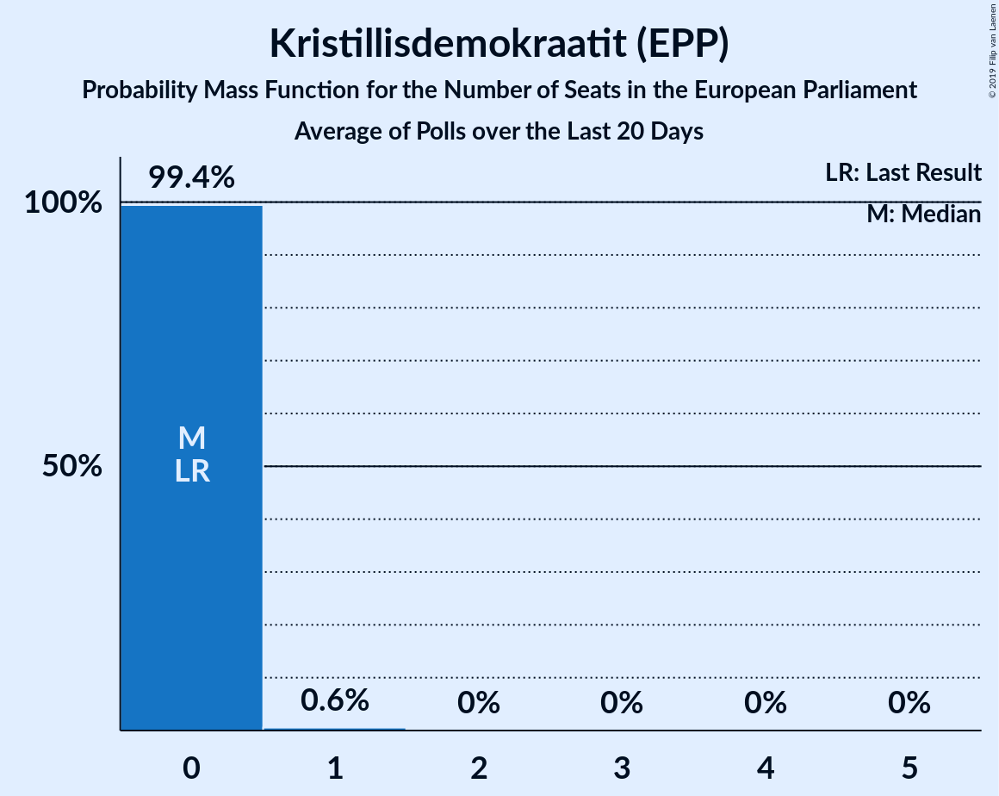

| Number of Seats | Probability | Accumulated | Special Marks |
|:---------------:|:-----------:|:-----------:|:-------------:|
| 0 | 99.4% | 100% | Last Result, Median |
| 1 | 0.6% | 0.6% |  |
| 2 | 0% | 0% |  |

### Liike Nyt (EFDD)

*For a full overview of the results for this party, see the [Liike Nyt (EFDD)](party-liikenytefdd.html) page.*

| Number of Seats | Probability | Accumulated | Special Marks |
|:---------------:|:-----------:|:-----------:|:-------------:|
| 0 | 100% | 100% | Last Result, Median |

## Coalitions

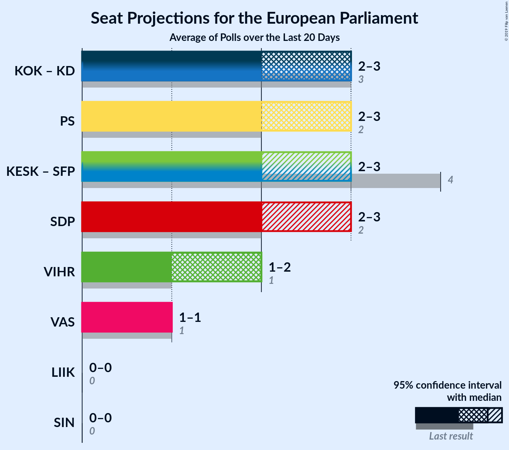

### Confidence Intervals

| Coalition | Last Result | Median | Majority? | 80% Confidence Interval | 90% Confidence Interval | 95% Confidence Interval | 99% Confidence Interval |
|:---------:|:-----------:|:------:|:---------:|:-----------------------:|:-----------------------:|:-----------------------:|:-----------------------:|
| Kansallinen Kokoomus (EPP) – Kristillisdemokraatit (EPP) | 3 | 3 | 0% | 2–3 | 2–3 | 2–3 | 2–4 |
| Perussuomalaiset (EAPN) | 2 | 3 | 0% | 2–3 | 2–3 | 2–3 | 2–3 |
| Suomen Keskusta (ALDE) – Svenska folkpartiet i Finland (ALDE) | 4 | 2 | 0% | 2–3 | 2–3 | 2–3 | 1–3 |
| Suomen Sosialidemokraattinen Puolue (S&D) | 2 | 2 | 0% | 2–3 | 2–3 | 2–3 | 2–3 |
| Vihreä liitto (Greens/EFA) | 1 | 2 | 0% | 2 | 1–2 | 1–2 | 1–2 |
| Vasemmistoliitto (GUE/NGL) | 1 | 1 | 0% | 1 | 1 | 1 | 1–2 |
| Liike Nyt (EFDD) | 0 | 0 | 0% | 0 | 0 | 0 | 0 |
| Sininen tulevaisuus (ECR) | 0 | 0 | 0% | 0 | 0 | 0 | 0 |

### Kansallinen Kokoomus (EPP) – Kristillisdemokraatit (EPP)

| Number of Seats | Probability | Accumulated | Special Marks |
|:---------------:|:-----------:|:-----------:|:-------------:|
| 2 | 27% | 100% |  |
| 3 | 73% | 73% | Last Result, Median |
| 4 | 0.5% | 0.5% |  |
| 5 | 0% | 0% |  |

### Perussuomalaiset (EAPN)

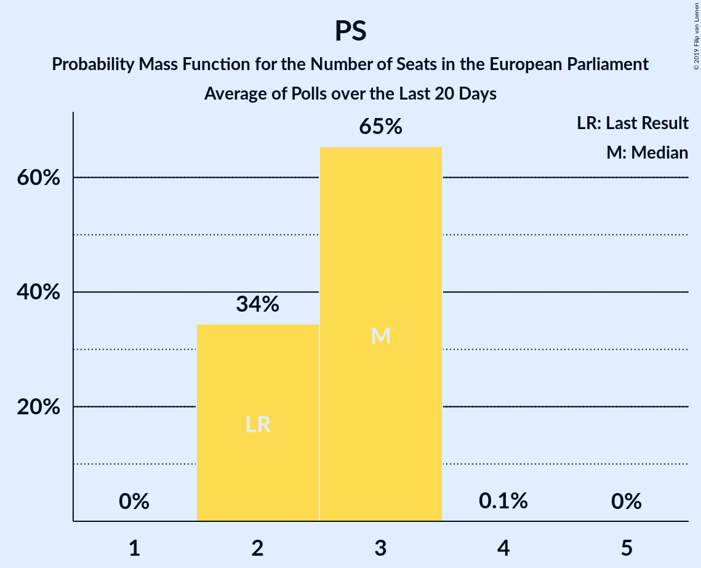

| Number of Seats | Probability | Accumulated | Special Marks |
|:---------------:|:-----------:|:-----------:|:-------------:|
| 2 | 34% | 100% | Last Result |
| 3 | 65% | 66% | Median |
| 4 | 0.1% | 0.1% |  |
| 5 | 0% | 0% |  |

### Suomen Keskusta (ALDE) – Svenska folkpartiet i Finland (ALDE)

| Number of Seats | Probability | Accumulated | Special Marks |
|:---------------:|:-----------:|:-----------:|:-------------:|
| 1 | 0.6% | 100% |  |
| 2 | 65% | 99.4% | Median |
| 3 | 35% | 35% |  |
| 4 | 0% | 0% | Last Result |

### Suomen Sosialidemokraattinen Puolue (S&D)

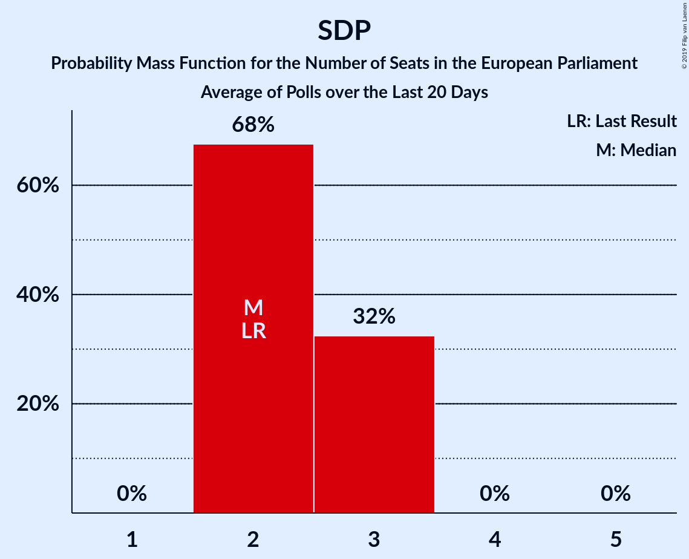

| Number of Seats | Probability | Accumulated | Special Marks |
|:---------------:|:-----------:|:-----------:|:-------------:|
| 2 | 68% | 100% | Last Result, Median |
| 3 | 32% | 32% |  |
| 4 | 0% | 0% |  |

### Vihreä liitto (Greens/EFA)

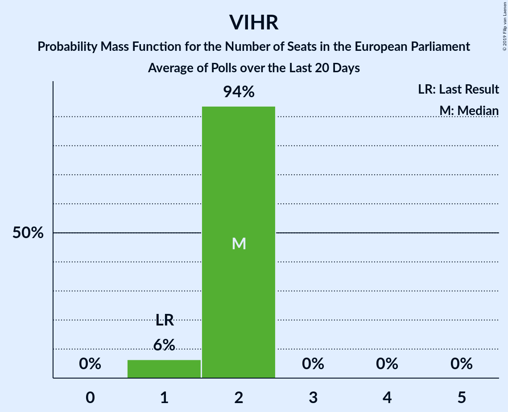

| Number of Seats | Probability | Accumulated | Special Marks |
|:---------------:|:-----------:|:-----------:|:-------------:|
| 1 | 6% | 100% | Last Result |
| 2 | 94% | 94% | Median |
| 3 | 0% | 0% |  |

### Vasemmistoliitto (GUE/NGL)

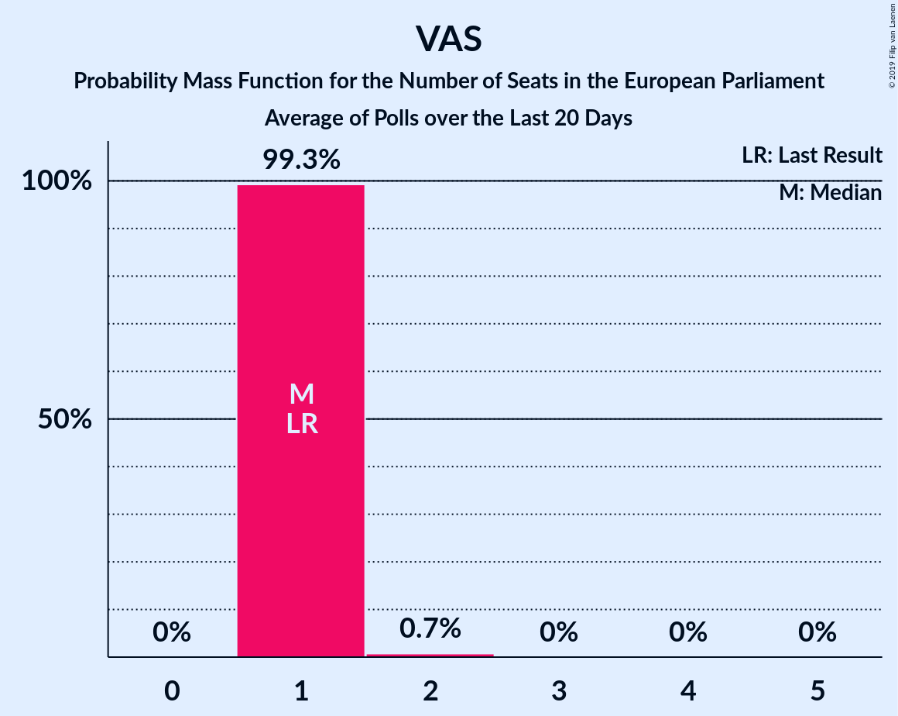

| Number of Seats | Probability | Accumulated | Special Marks |
|:---------------:|:-----------:|:-----------:|:-------------:|
| 1 | 99.3% | 100% | Last Result, Median |
| 2 | 0.7% | 0.7% |  |
| 3 | 0% | 0% |  |

### Liike Nyt (EFDD)

| Number of Seats | Probability | Accumulated | Special Marks |
|:---------------:|:-----------:|:-----------:|:-------------:|
| 0 | 100% | 100% | Last Result, Median |

### Sininen tulevaisuus (ECR)

| Number of Seats | Probability | Accumulated | Special Marks |
|:---------------:|:-----------:|:-----------:|:-------------:|
| 0 | 100% | 100% | Last Result, Median |

## Technical Information

+ **Number of polls included in this average:** 3
+ **Lowest number of simulations done in a poll included in this average:** 524,288
+ **Total number of simulations done in the polls included in this average:** 2,621,440
+ **Error estimate:** 2.47%
