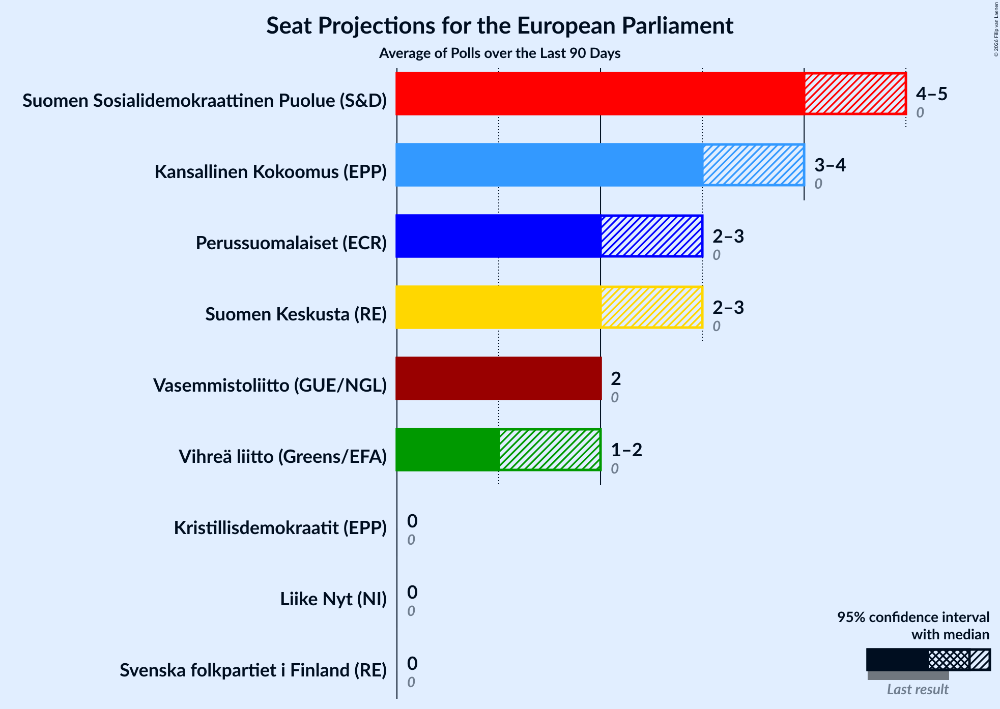
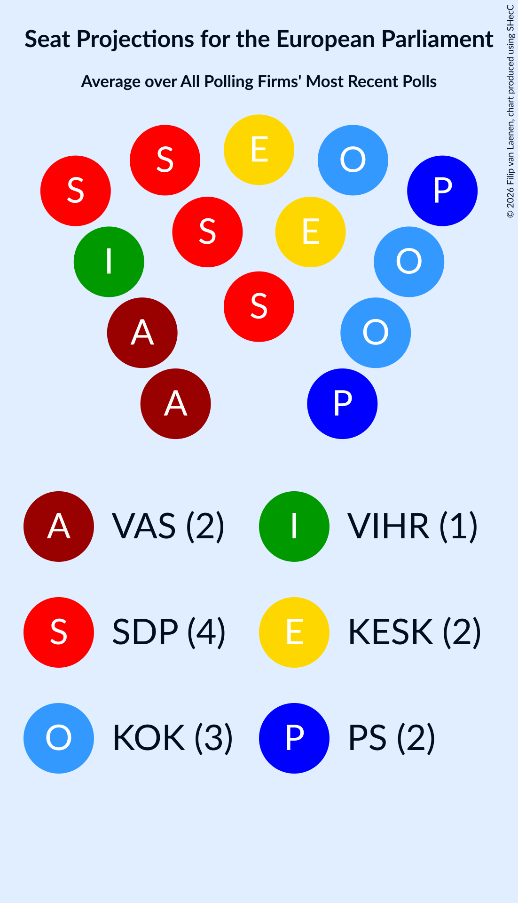
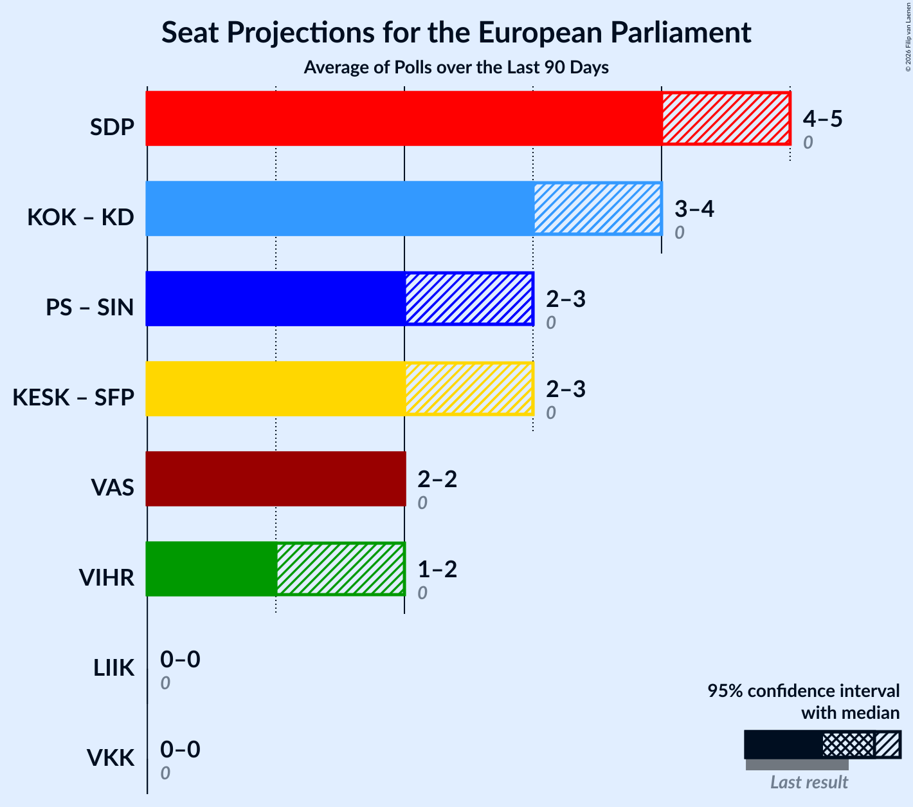

# Overview

The table below lists the most recent polls (less than 90 days old) registered and analyzed so far.

| Period     | Polling firm/Commissioner(s) | VAS | VIHR | SDP | KESK | SFP | KOK | KD | PS | SIN | LIIK | VKK |
|:----------:|:----------------------------:|:--:|:--:|:--:|:--:|:--:|:--:|:--:|:--:|:--:|:--:|:--:|
| 9 June 2024 | General Election | 0.0%   0 | 0.0%   0 | 0.0%   0 | 0.0%   0 | 0.0%   0 | 0.0%   0 | 0.0%   0 | 0.0%   0 | 0.0%   0 | 0.0%   0 | 0.0%   0 |
| N/A | [Poll Average](average.html) | 10–13%   1–2 | 8–10%   1–2 | 22–26%   4–5 | 13–16%   2–3 | 3–5%   0 | 16–19%   3 | 3–4%   0 | 12–15%   2–3 | N/A   N/A | 1–2%   0 | N/A   N/A |
| [4 March–7 April 2026](2026-04-07-Taloustutkimus.html) | Taloustutkimus   Yle | 10–13%   2 | 7–10%   1–2 | 22–26%   4–5 | 13–16%   2–3 | 3–5%   0 | 16–19%   3–4 | 2–4%   0 | 12–15%   2–3 | N/A   N/A | 1–2%   0 | N/A   N/A |
| [17 February–16 March 2026](2026-03-16-Verian.html) | Verian   Helsingin Sanomat | 9–11%   1–2 | 8–10%   1–2 | 23–26%   4–5 | 13–15%   2–3 | 3–5%   0 | 17–19%   3 | 3–4%   0 | 12–14%   2–3 | N/A   N/A | 1–2%   0 | N/A   N/A |
| 9 June 2024 | General Election | 0.0%   0 | 0.0%   0 | 0.0%   0 | 0.0%   0 | 0.0%   0 | 0.0%   0 | 0.0%   0 | 0.0%   0 | 0.0%   0 | 0.0%   0 | 0.0%   0 |

Only polls for which at least the sample size has been published are included in the table above.

**Legend:**
+ **Top half of each row:** Voting intentions (95% confidence interval)
+ **Bottom half of each row:** Seat projections for the European Parliament (95% confidence interval)
+ **VAS:** Vasemmistoliitto (GUE/NGL)
+ **VIHR:** Vihreä liitto (Greens/EFA)
+ **SDP:** Suomen Sosialidemokraattinen Puolue (S&D)
+ **KESK:** Suomen Keskusta (RE)
+ **SFP:** Svenska folkpartiet i Finland (RE)
+ **KOK:** Kansallinen Kokoomus (EPP)
+ **KD:** Kristillisdemokraatit (EPP)
+ **PS:** Perussuomalaiset (ECR)
+ **SIN:** Sininen tulevaisuus (ECR)
+ **LIIK:** Liike Nyt (NI)
+ **VKK:** Valta kuuluu kansalle (*)
+ **N/A (single party):** Party not included the published results
+ **N/A (entire row):** Calculation for this opinion poll not started yet

