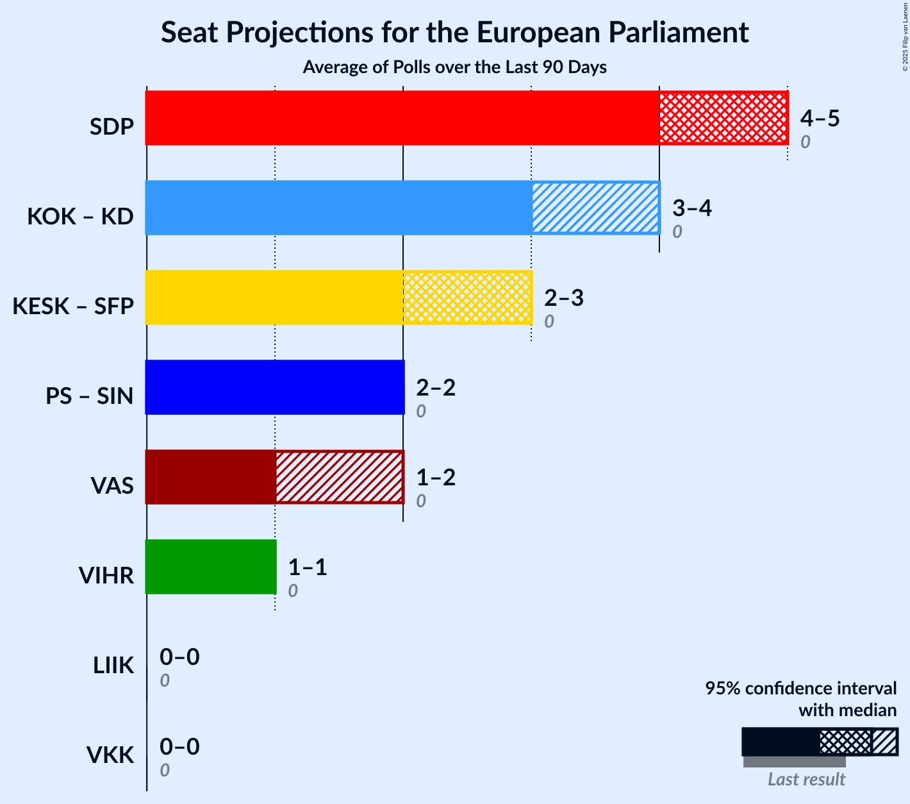

# Overview

The table below lists the most recent polls (less than 90 days old) registered and analyzed so far.

| Period     | Polling firm/Commissioner(s) | KOK | KESK | PS | SDP | VIHR | VAS | SFP | KD | SIN | LIIK |
|:----------:|:----------------------------:|:--:|:--:|:--:|:--:|:--:|:--:|:--:|:--:|:--:|:--:|
| 26 May 2019 | General Election | 22.6%   3 | 19.7%   3 | 12.9%   2 | 12.3%   2 | 9.3%   1 | 9.3%   1 | 6.8%   1 | 5.2%   0 | 0.0%   0 | 0.0%   0 |
| N/A | [Poll Average](average.html) | 20–23%   3–4 | 12–15%   2–3 | 14–17%   2–3 | 17–21%   3–4 | 8–11%   1–2 | 7–10%   1 | 4–6%   0–1 | 3–4%   0 | N/A   N/A | 2–4%   0 |
| [17 January–11 February 2022](2022-02-11-KantarTNS.html) | Kantar TNS   Helsingin Sanomat | 20–24%   3–4 | 13–15%   2–3 | 14–17%   2–3 | 18–21%   3–4 | 8–11%   1–2 | 7–9%   1 | 4–5%   0–1 | 3–4%   0 | N/A   N/A | 2–3%   0 |
| [9 January–1 February 2022](2022-02-01-Taloustutkimus.html) | Taloustutkimus   Yle | 19–23%   3–4 | 11–14%   2 | 13–17%   2–3 | 17–21%   3–4 | 8–11%   1–2 | 8–10%   1–2 | 4–6%   0–1 | 3–4%   0 | N/A   N/A | 2–4%   0 |
| 26 May 2019 | General Election | 22.6%   3 | 19.7%   3 | 12.9%   2 | 12.3%   2 | 9.3%   1 | 9.3%   1 | 6.8%   1 | 5.2%   0 | 0.0%   0 | 0.0%   0 |

Only polls for which at least the sample size has been published are included in the table above.

**Legend:**
+ **Top half of each row:** Voting intentions (95% confidence interval)
+ **Bottom half of each row:** Seat projections for the European Parliament (95% confidence interval)
+ **KOK:** Kansallinen Kokoomus (EPP)
+ **KESK:** Suomen Keskusta (RE)
+ **PS:** Perussuomalaiset (ID)
+ **SDP:** Suomen Sosialidemokraattinen Puolue (S&D)
+ **VIHR:** Vihreä liitto (Greens/EFA)
+ **VAS:** Vasemmistoliitto (GUE/NGL)
+ **SFP:** Svenska folkpartiet i Finland (RE)
+ **KD:** Kristillisdemokraatit (EPP)
+ **SIN:** Sininen tulevaisuus (ECR)
+ **LIIK:** Liike Nyt (NI)
+ **N/A (single party):** Party not included the published results
+ **N/A (entire row):** Calculation for this opinion poll not started yet

