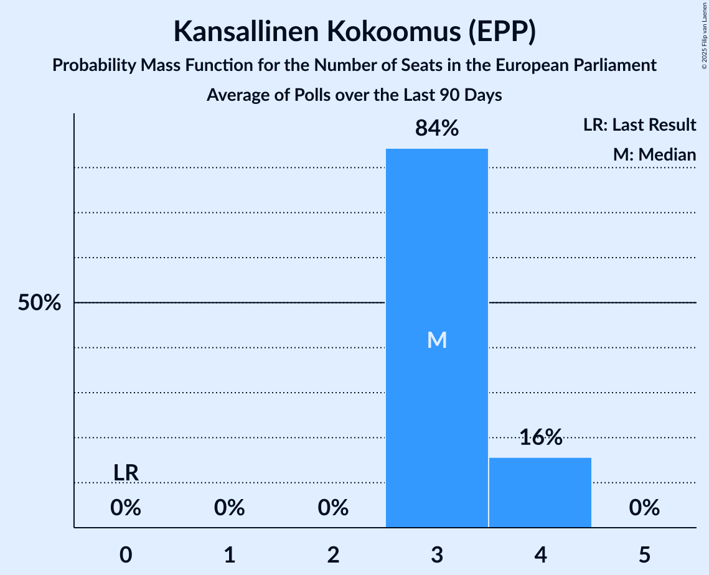

# Kansallinen Kokoomus (EPP)

<a href="#voting-intentions">Voting Intentions</a> | <a href="#seats">Seats</a>

## Voting Intentions

Last result: **22.6%** (General Election of 26 May 2019)

### Confidence Intervals

| Period     | Polling firm/Commissioner(s) | Median | 80% Confidence Interval | 90% Confidence Interval | 95% Confidence Interval | 99% Confidence Interval |
|:----------:|:----------------:|:-----------:|:-----------------------:|:-----------------------:|:-----------------------:|:-----------------------:|
| N/A | [Poll Average](average.html) | 25.0% | 23.4–27.0% | 23.0–27.4% | 22.7–27.8% | 22.2–28.5% |
| [14 March–13 April 2022](2022-04-13-KantarTNS.html) | Kantar TNS   Helsingin Sanomat | 24.1% | 23.0–25.2% | 22.7–25.5% | 22.5–25.8% | 22.0–26.3% |
| [2 March–5 April 2022](2022-04-05-Taloustutkimus.html) | Taloustutkimus   Yle | 26.1% | 24.9–27.4% | 24.5–27.8% | 24.2–28.1% | 23.7–28.7% |
| [14 February–11 March 2022](2022-03-11-KantarTNS.html) | Kantar TNS   Helsingin Sanomat | 22.5% | 21.4–23.6% | 21.1–23.9% | 20.9–24.2% | 20.4–24.8% |
| [2 February–1 March 2022](2022-03-01-Taloustutkimus.html) | Taloustutkimus   Yle | 22.6% | 21.4–23.8% | 21.1–24.2% | 20.8–24.5% | 20.3–25.1% |
| [17 January–11 February 2022](2022-02-11-KantarTNS.html) | Kantar TNS   Helsingin Sanomat | 21.9% | 20.8–23.0% | 20.5–23.3% | 20.3–23.6% | 19.8–24.1% |
| [9 January–1 February 2022](2022-02-01-Taloustutkimus.html) | Taloustutkimus   Yle | 21.2% | 20.0–22.4% | 19.7–22.7% | 19.4–23.0% | 18.9–23.6% |
| [1 December 2021–4 January 2022](2022-01-04-Taloustutkimus.html) | Taloustutkimus   Yle | 20.6% | 19.3–21.9% | 18.9–22.3% | 18.6–22.7% | 18.0–23.4% |
| [16 November–10 December 2021](2021-12-10-KantarTNS.html) | Kantar TNS   Helsingin Sanomat | 21.4% | 20.3–22.5% | 20.0–22.8% | 19.8–23.1% | 19.3–23.6% |
| [3–30 November 2021](2021-11-30-Taloustutkimus.html) | Taloustutkimus   Yle | 21.8% | 20.5–23.1% | 20.1–23.5% | 19.8–23.8% | 19.3–24.5% |
| [18 October–15 November 2021](2021-11-15-KantarTNS.html) | Kantar TNS   Helsingin Sanomat | 21.1% | 20.1–22.2% | 19.8–22.5% | 19.5–22.8% | 19.0–23.3% |
| [6 October–2 November 2021](2021-11-02-Taloustutkimus.html) | Taloustutkimus   Yle | 20.9% | 19.7–22.2% | 19.4–22.6% | 19.1–22.9% | 18.5–23.5% |
| [18 September–15 October 2021](2021-10-15-KantarTNS.html) | Kantar TNS   Helsingin Sanomat | 21.2% | N/A | N/A | N/A | N/A |
| [1 September–5 October 2021](2021-10-05-Taloustutkimus.html) | Taloustutkimus   Yle | 20.9% | N/A | N/A | N/A | N/A |
| [23 August–17 September 2021](2021-09-17-KantarTNS.html) | Kantar TNS   Helsingin Sanomat | 20.8% | N/A | N/A | N/A | N/A |
| [4–31 August 2021](2021-08-31-Taloustutkimus.html) | Taloustutkimus   Yle | 21.3% | N/A | N/A | N/A | N/A |
| [26 July–20 August 2021](2021-08-20-KantarTNS.html) | Kantar TNS   Helsingin Sanomat | 19.8% | N/A | N/A | N/A | N/A |
| [12 July–3 August 2021](2021-08-03-Taloustutkimus.html) | Taloustutkimus   Yle | 20.5% | 19.3–21.8% | 18.9–22.2% | 18.7–22.5% | 18.1–23.1% |
| [21 June–20 July 2021](2021-07-20-KantarTNS.html) | Kantar TNS   Helsingin Sanomat | 19.9% | 18.9–21.0% | 18.6–21.3% | 18.4–21.5% | 17.9–22.0% |
| [14 June–6 July 2021](2021-07-06-Taloustutkimus.html) | Taloustutkimus   Yle | 19.8% | 18.7–21.0% | 18.3–21.4% | 18.1–21.7% | 17.5–22.3% |
| [12 April–7 May 2021](2021-05-07-KantarTNS.html) | Kantar TNS   Helsingin Sanomat | 17.0% | 16.1–18.0% | 15.8–18.3% | 15.6–18.6% | 15.1–19.1% |
| [15 March–9 April 2021](2021-04-09-KantarTNS.html) | Kantar TNS   Helsingin Sanomat | 16.2% | 15.3–17.2% | 15.0–17.5% | 14.8–17.7% | 14.4–18.2% |
| [15 February–12 March 2021](2021-03-12-KantarTNS.html) | Kantar TNS   Helsingin Sanomat | 16.0% | 15.1–17.0% | 14.8–17.3% | 14.6–17.5% | 14.2–18.0% |
| [18 January–12 February 2021](2021-02-12-KantarTNS.html) | Kantar TNS   Helsingin Sanomat | 16.4% | 15.5–17.4% | 15.2–17.7% | 15.0–17.9% | 14.6–18.4% |
| [21 December 2020–15 January 2021](2021-01-15-KantarTNS.html) | Kantar TNS   Helsingin Sanomat | 16.2% | 15.1–17.4% | 14.8–17.7% | 14.6–18.0% | 14.1–18.5% |
| [2 December 2020–5 January 2021](2021-01-05-Taloustutkimus.html) | Taloustutkimus   Yle | 16.2% | 15.1–17.5% | 14.7–17.9% | 14.4–18.2% | 13.9–18.8% |
| [23 November–18 December 2020](2020-12-18-KantarTNS.html) | Kantar TNS   Helsingin Sanomat | 16.2% | 15.2–17.3% | 14.9–17.6% | 14.6–17.9% | 14.1–18.5% |
| [9 November–1 December 2020](2020-12-01-Taloustutkimus.html) | Taloustutkimus   Yle | 15.9% | 14.8–17.0% | 14.6–17.3% | 14.3–17.6% | 13.8–18.2% |
| [19 October–20 November 2020](2020-11-20-KantarTNS.html) | Kantar TNS   Helsingin Sanomat | 16.5% | 15.5–17.6% | 15.2–18.0% | 14.9–18.2% | 14.4–18.8% |
| [12 October–3 November 2020](2020-11-03-Taloustutkimus.html) | Taloustutkimus   Yle | 16.6% | 15.5–17.8% | 15.2–18.2% | 14.9–18.5% | 14.4–19.1% |
| [14 September–16 October 2020](2020-10-16-KantarTNS.html) | Kantar TNS   Helsingin Sanomat | 16.8% | 15.8–18.0% | 15.5–18.3% | 15.2–18.6% | 14.7–19.2% |
| [7 September–6 October 2020](2020-10-06-Taloustutkimus.html) | Taloustutkimus | 17.7% | 16.5–19.0% | 16.1–19.4% | 15.9–19.7% | 15.3–20.3% |
| [17 August–12 September 2020](2020-09-12-KantarTNS.html) | Kantar TNS   Helsingin Sanomat | 17.0% | 15.9–18.2% | 15.6–18.6% | 15.3–18.9% | 14.8–19.4% |
| [10 August–1 September 2020](2020-09-01-Taloustutkimus.html) | Taloustutkimus   Yle | 18.3% | 17.1–19.5% | 16.8–19.9% | 16.5–20.2% | 15.9–20.8% |
| [13 July–14 August 2020](2020-08-14-KantarTNS.html) | Kantar TNS   Helsingin Sanomat | 16.9% | 15.8–18.1% | 15.5–18.4% | 15.3–18.7% | 14.7–19.3% |
| [6 July–4 August 2020](2020-08-04-Taloustutkimus.html) | Taloustutkimus   Yle | 17.3% | 16.2–18.5% | 15.8–18.9% | 15.5–19.2% | 15.0–19.8% |
| [15 June–10 July 2020](2020-07-10-KantarTNS.html) | Kantar TNS   Helsingin Sanomat | 17.7% | 16.5–19.0% | 16.1–19.3% | 15.8–19.7% | 15.3–20.3% |
| [3–30 June 2020](2020-06-30-Taloustutkimus.html) | Taloustutkimus   Yle | 17.9% | 16.7–19.2% | 16.4–19.5% | 16.1–19.8% | 15.6–20.5% |
| [18 May–14 June 2020](2020-06-14-KantarTNS.html) | Kantar TNS   Helsingin Sanomat | 17.4% | 16.4–18.5% | 16.1–18.8% | 15.9–19.1% | 15.4–19.6% |
| [11 May–2 June 2020](2020-06-02-Taloustutkimus.html) | Taloustutkimus   Yle | 17.5% | 16.3–18.7% | 16.0–19.1% | 15.7–19.4% | 15.2–20.0% |
| [20 April–14 May 2020](2020-05-14-KantarTNS.html) | Kantar TNS   Helsingin Sanomat | 17.3% | 16.2–18.6% | 15.9–18.9% | 15.6–19.2% | 15.1–19.8% |
| [14 April–5 May 2020](2020-05-05-Taloustutkimus.html) | Taloustutkimus   Yle | 18.2% | 17.0–19.5% | 16.7–19.8% | 16.4–20.1% | 15.8–20.8% |
| [14–29 April 2020](2020-04-29-Tietoykkönen.html) | Tietoykkönen   Iltalehti and Uusi Suomi | 16.2% | 15.0–17.6% | 14.6–18.0% | 14.3–18.4% | 13.7–19.1% |
| [16 March–15 April 2020](2020-04-15-KantarTNS.html) | Kantar TNS   Helsingin Sanomat | 16.8% | 15.7–18.0% | 15.3–18.3% | 15.1–18.6% | 14.6–19.2% |
| [4 March–7 April 2020](2020-04-07-Taloustutkimus.html) | Taloustutkimus   Yle | 17.6% | 16.7–18.6% | 16.4–18.9% | 16.2–19.1% | 15.7–19.6% |
| [20–27 March 2020](2020-03-27-Tietoykkönen.html) | Tietoykkönen   Iltalehti and Uusi Suomi | 16.8% | 15.3–18.4% | 14.9–18.9% | 14.5–19.3% | 13.8–20.1% |
| [15 February–13 March 2020](2020-03-13-KantarTNS.html) | Kantar TNS   Helsingin Sanomat | 16.9% | 15.9–18.0% | 15.7–18.3% | 15.4–18.5% | 15.0–19.1% |
| [5 February–3 March 2020](2020-03-03-Taloustutkimus.html) | Taloustutkimus   Yle | 18.0% | 17.0–19.1% | 16.8–19.4% | 16.5–19.6% | 16.0–20.1% |
| [19 January–14 February 2020](2020-02-14-KantarTNS.html) | Kantar TNS   Helsingin Sanomat | 17.3% | 16.3–18.4% | 16.0–18.7% | 15.8–18.9% | 15.3–19.4% |
| [21 January–10 February 2020](2020-02-10-Tietoykkönen.html) | Tietoykkönen   Iltalehti and Uusi Suomi | 17.2% | 15.9–18.7% | 15.5–19.1% | 15.2–19.5% | 14.6–20.2% |
| [13 January–4 February 2020](2020-02-04-Taloustutkimus.html) | Taloustutkimus   Yle | 17.5% | 16.4–18.6% | 16.2–18.9% | 15.9–19.2% | 15.4–19.8% |
| [23 December 2019–17 January 2020](2020-01-17-KantarTNS.html) | Kantar TNS   Helsingin Sanomat | 17.5% | 16.5–18.6% | 16.2–18.9% | 16.0–19.1% | 15.5–19.7% |
| [9 December 2019–8 January 2020](2020-01-08-Taloustutkimus.html) | Taloustutkimus   Yle | 19.3% | 17.7–20.9% | 17.3–21.4% | 16.9–21.8% | 16.2–22.6% |
| [25 November–20 December 2019](2019-12-20-KantarTNS.html) | Kantar TNS   Helsingin Sanomat | 17.2% | 16.1–18.5% | 15.7–18.8% | 15.5–19.2% | 14.9–19.8% |
| [11 November–3 December 2019](2019-12-03-Taloustutkimus.html) | Taloustutkimus   Yle | 18.6% | 17.5–19.8% | 17.2–20.1% | 17.0–20.3% | 16.5–20.9% |
| [24 October–21 November 2019](2019-11-21-KantarTNS.html) | Kantar TNS   Helsingin Sanomat | 17.3% | 16.2–18.5% | 15.8–18.9% | 15.6–19.2% | 15.0–19.8% |
| [2 October–5 November 2019](2019-11-05-Taloustutkimus.html) | Taloustutkimus   Yle | 17.3% | 16.4–18.4% | 16.1–18.6% | 15.9–18.9% | 15.4–19.4% |
| [23 September–21 October 2019](2019-10-21-KantarTNS.html) | Kantar TNS   Helsingin Sanomat | 17.0% | 15.8–18.2% | 15.5–18.6% | 15.2–18.9% | 14.7–19.5% |
| [17 September–8 October 2019](2019-10-08-Tietoykkönen.html) | Tietoykkönen   Iltalehti and Uusi Suomi | 17.2% | 15.9–18.6% | 15.5–19.0% | 15.2–19.4% | 14.6–20.1% |
| [9 September–1 October 2019](2019-10-01-Taloustutkimus.html) | Taloustutkimus   Yle | 17.1% | 16.0–18.3% | 15.6–18.6% | 15.4–18.9% | 14.9–19.5% |
| [26 August–22 September 2019](2019-09-22-KantarTNS.html) | Kantar TNS   Helsingin Sanomat | 17.3% | 16.1–18.5% | 15.8–18.9% | 15.5–19.2% | 15.0–19.8% |
| [12 August–3 September 2019](2019-09-03-Taloustutkimus.html) | Taloustutkimus   Yle | 17.4% | 16.2–18.6% | 15.9–19.0% | 15.6–19.3% | 15.1–19.9% |
| [29 July–23 August 2019](2019-08-23-KantarTNS.html) | Kantar TNS   Helsingin Sanomat | 17.4% | 16.2–18.7% | 15.9–19.0% | 15.6–19.3% | 15.1–19.9% |
| [8 July–6 August 2019](2019-08-06-Taloustutkimus.html) | Taloustutkimus   Yle | 16.8% | 15.7–18.0% | 15.4–18.3% | 15.1–18.6% | 14.6–19.2% |
| [1–27 July 2019](2019-07-27-KantarTNS.html) | Kantar TNS   Helsingin Sanomat | 16.7% | 15.5–17.9% | 15.2–18.3% | 14.9–18.6% | 14.4–19.2% |
| [5 June–2 July 2019](2019-07-02-Taloustutkimus.html) | Taloustutkimus   Yle | 16.8% | 15.7–18.0% | 15.4–18.3% | 15.2–18.6% | 14.7–19.1% |
| [3–28 June 2019](2019-06-28-KantarTNS.html) | Kantar TNS   Helsingin Sanomat | 17.3% | 16.2–18.5% | 15.9–18.9% | 15.6–19.2% | 15.1–19.8% |
| [4–14 June 2019](2019-06-14-Tietoykkönen.html) | Tietoykkönen   Iltalehti and Uusi Suomi | 17.2% | 15.9–18.6% | 15.5–19.0% | 15.2–19.4% | 14.6–20.1% |
| [13 May–4 June 2019](2019-06-04-Taloustutkimus.html) | Taloustutkimus   Yle | 16.7% | 15.3–18.2% | 14.9–18.6% | 14.6–19.0% | 13.9–19.8% |
| [6 May–2 June 2019](2019-06-02-KantarTNS.html) | Kantar TNS   Helsingin Sanomat | 17.5% | 16.4–18.7% | 16.1–19.0% | 15.8–19.3% | 15.3–19.9% |

### Probability Mass Function

The following table shows the probability mass function per percentage block of voting intentions for the [poll average](average.html) for Kansallinen Kokoomus (EPP).

| Voting Intentions | Probability | Accumulated | Special Marks |
|:-----------------:|:-----------:|:-----------:|:-------------:|
| 20.5–21.5% | 0% | 100% |  |
| 21.5–22.5% | 2% | 100% |  |
| 22.5–23.5% | 11% | 98% | Last Result |
| 23.5–24.5% | 25% | 87% |  |
| 24.5–25.5% | 23% | 62% | Median |
| 25.5–26.5% | 22% | 39% |  |
| 26.5–27.5% | 13% | 17% |  |
| 27.5–28.5% | 3% | 4% |  |
| 28.5–29.5% | 0.4% | 0.4% |  |
| 29.5–30.5% | 0% | 0% |  |

## Seats

Last result: **3** seats (General Election of 26 May 2019)

### Confidence Intervals

| Period     | Polling firm/Commissioner(s) | Median | 80% Confidence Interval | 90% Confidence Interval | 95% Confidence Interval | 99% Confidence Interval |
|:----------:|:----------------:|:------:|:-----------------------:|:-----------------------:|:-----------------------:|:-----------------------:|
| N/A | [Poll Average](average.html) | 4 | 4–5 | 4–5 | 4–5 | 4–5 |
| [14 March–13 April 2022](2022-04-13-KantarTNS.html) | Kantar TNS   Helsingin Sanomat | 4 | 4–5 | 4–5 | 4–5 | 4–5 |
| [2 March–5 April 2022](2022-04-05-Taloustutkimus.html) | Taloustutkimus   Yle | 5 | 4–5 | 4–5 | 4–5 | 4–5 |
| [14 February–11 March 2022](2022-03-11-KantarTNS.html) | Kantar TNS   Helsingin Sanomat | 4 | 4 | 4 | 4–5 | 4–5 |
| [2 February–1 March 2022](2022-03-01-Taloustutkimus.html) | Taloustutkimus   Yle | 4 | 4 | 4 | 3–4 | 3–4 |
| [17 January–11 February 2022](2022-02-11-KantarTNS.html) | Kantar TNS   Helsingin Sanomat | 4 | 4 | 4 | 3–4 | 3–4 |
| [9 January–1 February 2022](2022-02-01-Taloustutkimus.html) | Taloustutkimus   Yle | 4 | 3–4 | 3–4 | 3–4 | 3–4 |
| [1 December 2021–4 January 2022](2022-01-04-Taloustutkimus.html) | Taloustutkimus   Yle | 4 | 3–4 | 3–4 | 3–4 | 3–4 |
| [16 November–10 December 2021](2021-12-10-KantarTNS.html) | Kantar TNS   Helsingin Sanomat | 4 | 3–4 | 3–4 | 3–4 | 3–4 |
| [3–30 November 2021](2021-11-30-Taloustutkimus.html) | Taloustutkimus   Yle | 4 | 3–4 | 3–4 | 3–4 | 3–4 |
| [18 October–15 November 2021](2021-11-15-KantarTNS.html) | Kantar TNS   Helsingin Sanomat | 3 | 3–4 | 3–4 | 3–4 | 3–4 |
| [6 October–2 November 2021](2021-11-02-Taloustutkimus.html) | Taloustutkimus   Yle | 3 | 3–4 | 3–4 | 3–4 | 3–4 |
| [18 September–15 October 2021](2021-10-15-KantarTNS.html) | Kantar TNS   Helsingin Sanomat |  |  |  |  |  |
| [1 September–5 October 2021](2021-10-05-Taloustutkimus.html) | Taloustutkimus   Yle |  |  |  |  |  |
| [23 August–17 September 2021](2021-09-17-KantarTNS.html) | Kantar TNS   Helsingin Sanomat |  |  |  |  |  |
| [4–31 August 2021](2021-08-31-Taloustutkimus.html) | Taloustutkimus   Yle |  |  |  |  |  |
| [26 July–20 August 2021](2021-08-20-KantarTNS.html) | Kantar TNS   Helsingin Sanomat |  |  |  |  |  |
| [12 July–3 August 2021](2021-08-03-Taloustutkimus.html) | Taloustutkimus   Yle | 3 | 3–4 | 3–4 | 3–4 | 3–4 |
| [21 June–20 July 2021](2021-07-20-KantarTNS.html) | Kantar TNS   Helsingin Sanomat | 3 | 3–4 | 3–4 | 3–4 | 3–4 |
| [14 June–6 July 2021](2021-07-06-Taloustutkimus.html) | Taloustutkimus   Yle | 3 | 3–4 | 3–4 | 3–4 | 3–4 |
| [12 April–7 May 2021](2021-05-07-KantarTNS.html) | Kantar TNS   Helsingin Sanomat | 3 | 3 | 3 | 2–3 | 2–3 |
| [15 March–9 April 2021](2021-04-09-KantarTNS.html) | Kantar TNS   Helsingin Sanomat | 3 | 2–3 | 2–3 | 2–3 | 2–3 |
| [15 February–12 March 2021](2021-03-12-KantarTNS.html) | Kantar TNS   Helsingin Sanomat | 3 | 2–3 | 2–3 | 2–3 | 2–3 |
| [18 January–12 February 2021](2021-02-12-KantarTNS.html) | Kantar TNS   Helsingin Sanomat | 3 | 2–3 | 2–3 | 2–3 | 2–3 |
| [21 December 2020–15 January 2021](2021-01-15-KantarTNS.html) | Kantar TNS   Helsingin Sanomat | 3 | 2–3 | 2–3 | 2–3 | 2–3 |
| [2 December 2020–5 January 2021](2021-01-05-Taloustutkimus.html) | Taloustutkimus   Yle | 2 | 2–3 | 2–3 | 2–3 | 2–3 |
| [23 November–18 December 2020](2020-12-18-KantarTNS.html) | Kantar TNS   Helsingin Sanomat | 3 | 2–3 | 2–3 | 2–3 | 2–3 |
| [9 November–1 December 2020](2020-12-01-Taloustutkimus.html) | Taloustutkimus   Yle | 3 | 2–3 | 2–3 | 2–3 | 2–3 |
| [19 October–20 November 2020](2020-11-20-KantarTNS.html) | Kantar TNS   Helsingin Sanomat | 3 | 2–3 | 2–3 | 2–3 | 2–3 |
| [12 October–3 November 2020](2020-11-03-Taloustutkimus.html) | Taloustutkimus   Yle | 3 | 2–3 | 2–3 | 2–3 | 2–3 |
| [14 September–16 October 2020](2020-10-16-KantarTNS.html) | Kantar TNS   Helsingin Sanomat | 3 | 2–3 | 2–3 | 2–3 | 2–3 |
| [7 September–6 October 2020](2020-10-06-Taloustutkimus.html) | Taloustutkimus | 3 | 3 | 2–3 | 2–3 | 2–3 |
| [17 August–12 September 2020](2020-09-12-KantarTNS.html) | Kantar TNS   Helsingin Sanomat | 3 | 2–3 | 2–3 | 2–3 | 2–3 |
| [10 August–1 September 2020](2020-09-01-Taloustutkimus.html) | Taloustutkimus   Yle | 3 | 3 | 3 | 3 | 2–3 |
| [13 July–14 August 2020](2020-08-14-KantarTNS.html) | Kantar TNS   Helsingin Sanomat | 3 | 2–3 | 2–3 | 2–3 | 2–3 |
| [6 July–4 August 2020](2020-08-04-Taloustutkimus.html) | Taloustutkimus   Yle | 3 | 2–3 | 2–3 | 2–3 | 2–3 |
| [15 June–10 July 2020](2020-07-10-KantarTNS.html) | Kantar TNS   Helsingin Sanomat | 3 | 2–3 | 2–3 | 2–3 | 2–3 |
| [3–30 June 2020](2020-06-30-Taloustutkimus.html) | Taloustutkimus   Yle | 3 | 3 | 3 | 2–3 | 2–3 |
| [18 May–14 June 2020](2020-06-14-KantarTNS.html) | Kantar TNS   Helsingin Sanomat | 3 | 3 | 2–3 | 2–3 | 2–3 |
| [11 May–2 June 2020](2020-06-02-Taloustutkimus.html) | Taloustutkimus   Yle | 3 | 2–3 | 2–3 | 2–3 | 2–3 |
| [20 April–14 May 2020](2020-05-14-KantarTNS.html) | Kantar TNS   Helsingin Sanomat | 3 | 3 | 2–3 | 2–3 | 2–3 |
| [14 April–5 May 2020](2020-05-05-Taloustutkimus.html) | Taloustutkimus   Yle | 3 | 3 | 3 | 2–3 | 2–3 |
| [14–29 April 2020](2020-04-29-Tietoykkönen.html) | Tietoykkönen   Iltalehti and Uusi Suomi | 3 | 2–3 | 2–3 | 2–3 | 2–3 |
| [16 March–15 April 2020](2020-04-15-KantarTNS.html) | Kantar TNS   Helsingin Sanomat | 3 | 2–3 | 2–3 | 2–3 | 2–3 |
| [4 March–7 April 2020](2020-04-07-Taloustutkimus.html) | Taloustutkimus   Yle | 3 | 3 | 3 | 3 | 2–3 |
| [20–27 March 2020](2020-03-27-Tietoykkönen.html) | Tietoykkönen   Iltalehti and Uusi Suomi | 3 | 2–3 | 2–3 | 2–3 | 2–3 |
| [15 February–13 March 2020](2020-03-13-KantarTNS.html) | Kantar TNS   Helsingin Sanomat | 3 | 2–3 | 2–3 | 2–3 | 2–3 |
| [5 February–3 March 2020](2020-03-03-Taloustutkimus.html) | Taloustutkimus   Yle | 3 | 3 | 3 | 2–3 | 2–3 |
| [19 January–14 February 2020](2020-02-14-KantarTNS.html) | Kantar TNS   Helsingin Sanomat | 3 | 3 | 2–3 | 2–3 | 2–3 |
| [21 January–10 February 2020](2020-02-10-Tietoykkönen.html) | Tietoykkönen   Iltalehti and Uusi Suomi | 3 | 2–3 | 2–3 | 2–3 | 2–3 |
| [13 January–4 February 2020](2020-02-04-Taloustutkimus.html) | Taloustutkimus   Yle | 3 | 3 | 2–3 | 2–3 | 2–3 |
| [23 December 2019–17 January 2020](2020-01-17-KantarTNS.html) | Kantar TNS   Helsingin Sanomat | 3 | 3 | 3 | 3 | 2–3 |
| [9 December 2019–8 January 2020](2020-01-08-Taloustutkimus.html) | Taloustutkimus   Yle | 3 | 3 | 3 | 3–4 | 2–4 |
| [25 November–20 December 2019](2019-12-20-KantarTNS.html) | Kantar TNS   Helsingin Sanomat | 3 | 3 | 2–3 | 2–3 | 2–3 |
| [11 November–3 December 2019](2019-12-03-Taloustutkimus.html) | Taloustutkimus   Yle | 3 | 3 | 3 | 3–4 | 3–4 |
| [24 October–21 November 2019](2019-11-21-KantarTNS.html) | Kantar TNS   Helsingin Sanomat | 3 | 3 | 3 | 2–3 | 2–3 |
| [2 October–5 November 2019](2019-11-05-Taloustutkimus.html) | Taloustutkimus   Yle | 3 | 3 | 3 | 3 | 2–3 |
| [23 September–21 October 2019](2019-10-21-KantarTNS.html) | Kantar TNS   Helsingin Sanomat | 3 | 2–3 | 2–3 | 2–3 | 2–3 |
| [17 September–8 October 2019](2019-10-08-Tietoykkönen.html) | Tietoykkönen   Iltalehti and Uusi Suomi | 3 | 3 | 2–3 | 2–3 | 2–3 |
| [9 September–1 October 2019](2019-10-01-Taloustutkimus.html) | Taloustutkimus   Yle | 3 | 3 | 2–3 | 2–3 | 2–3 |
| [26 August–22 September 2019](2019-09-22-KantarTNS.html) | Kantar TNS   Helsingin Sanomat | 3 | 3 | 2–3 | 2–3 | 2–3 |
| [12 August–3 September 2019](2019-09-03-Taloustutkimus.html) | Taloustutkimus   Yle | 3 | 3 | 3 | 2–3 | 2–3 |
| [29 July–23 August 2019](2019-08-23-KantarTNS.html) | Kantar TNS   Helsingin Sanomat | 3 | 3 | 3 | 2–3 | 2–3 |
| [8 July–6 August 2019](2019-08-06-Taloustutkimus.html) | Taloustutkimus   Yle | 3 | 2–3 | 2–3 | 2–3 | 2–3 |
| [1–27 July 2019](2019-07-27-KantarTNS.html) | Kantar TNS   Helsingin Sanomat | 3 | 2–3 | 2–3 | 2–3 | 2–3 |
| [5 June–2 July 2019](2019-07-02-Taloustutkimus.html) | Taloustutkimus   Yle | 3 | 3 | 2–3 | 2–3 | 2–3 |
| [3–28 June 2019](2019-06-28-KantarTNS.html) | Kantar TNS   Helsingin Sanomat | 3 | 3 | 3 | 3 | 2–3 |
| [4–14 June 2019](2019-06-14-Tietoykkönen.html) | Tietoykkönen   Iltalehti and Uusi Suomi | 3 | 2–3 | 2–3 | 2–3 | 2–3 |
| [13 May–4 June 2019](2019-06-04-Taloustutkimus.html) | Taloustutkimus   Yle | 3 | 2–3 | 2–3 | 2–3 | 2–3 |
| [6 May–2 June 2019](2019-06-02-KantarTNS.html) | Kantar TNS   Helsingin Sanomat | 3 | 3 | 3 | 2–3 | 2–3 |

### Probability Mass Function

The following table shows the probability mass function per seat for the [poll average](average.html) for Kansallinen Kokoomus (EPP).

| Number of Seats | Probability | Accumulated | Special Marks |
|:---------------:|:-----------:|:-----------:|:-------------:|
| 3 | 0% | 100% | Last Result |
| 4 | 51% | 100% | Median |
| 5 | 49% | 49% |  |
| 6 | 0% | 0% |  |

