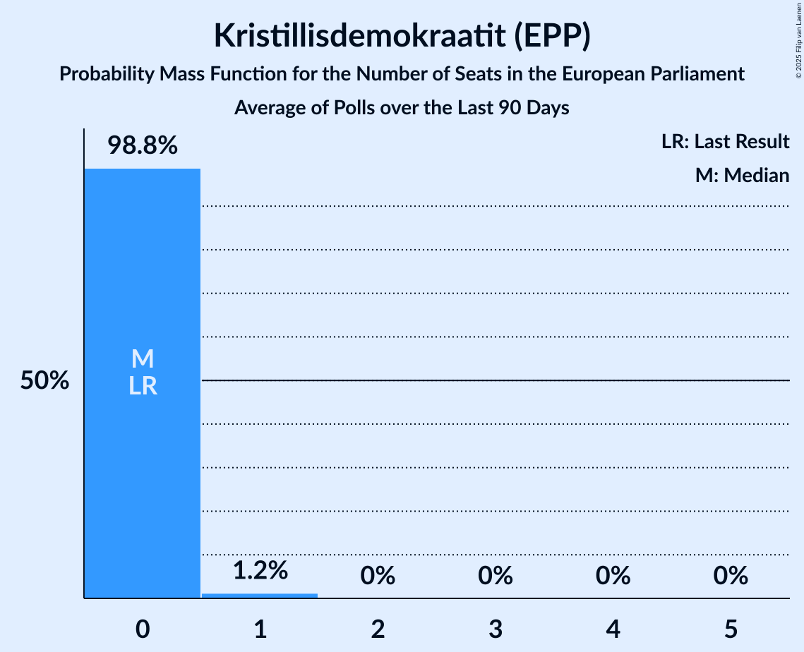

# Kristillisdemokraatit (EPP)

<a href="#voting-intentions">Voting Intentions</a> | <a href="#seats">Seats</a>

## Voting Intentions

Last result: **5.2%** (General Election of 26 May 2019)

### Confidence Intervals

| Period     | Polling firm/Commissioner(s) | Median | 80% Confidence Interval | 90% Confidence Interval | 95% Confidence Interval | 99% Confidence Interval |
|:----------:|:----------------:|:-----------:|:-----------------------:|:-----------------------:|:-----------------------:|:-----------------------:|
| N/A | [Poll Average](average.html) | 3.7% | 2.8–4.4% | 2.7–4.6% | 2.5–4.8% | 2.3–5.1% |
| [12 February–5 March 2024](2024-03-05-Taloustutkimus.html) | Taloustutkimus   Yle | 3.1% | 2.7–3.7% | 2.5–3.9% | 2.4–4.0% | 2.2–4.3% |
| [15 January–16 February 2024](2024-02-16-Verian.html) | Verian   Helsingin Sanomat | 4.1% | 3.6–4.6% | 3.5–4.8% | 3.4–4.9% | 3.2–5.2% |
| [3 January–6 February 2024](2024-02-06-Taloustutkimus.html) | Taloustutkimus   Yle | 3.6% | 3.1–4.2% | 3.0–4.4% | 2.9–4.6% | 2.6–4.9% |
| [11 December 2023–12 January 2024](2024-01-12-Verian.html) | Verian   Helsingin Sanomat | 4.3% | 3.8–4.9% | 3.7–5.0% | 3.6–5.2% | 3.4–5.4% |
| [29 November 2023–2 January 2024](2024-01-02-Taloustutkimus.html) | Taloustutkimus   Yle | 4.1% | 3.6–4.8% | 3.4–5.0% | 3.3–5.1% | 3.1–5.5% |
| [6 November–10 December 2023](2023-12-10-KantarTNS.html) | Kantar TNS   Helsingin Sanomat | 4.0% | 3.5–4.7% | 3.4–4.8% | 3.2–5.0% | 3.0–5.3% |
| [1–28 November 2023](2023-11-28-Taloustutkimus.html) | Taloustutkimus   Yle | 3.6% | 3.1–4.2% | 3.0–4.4% | 2.9–4.6% | 2.7–4.9% |
| [9 October–3 November 2023](2023-11-03-KantarTNS.html) | Kantar TNS   Helsingin Sanomat | 3.9% | 3.4–4.6% | 3.2–4.8% | 3.1–4.9% | 2.9–5.3% |
| [4–31 October 2023](2023-10-31-Taloustutkimus.html) | Taloustutkimus   Yle | 3.4% | 2.9–4.0% | 2.8–4.2% | 2.6–4.3% | 2.4–4.6% |
| [11 September–6 October 2023](2023-10-06-KantarTNS.html) | Kantar TNS   Helsingin Sanomat | 4.0% | 3.5–4.7% | 3.3–4.9% | 3.2–5.0% | 2.9–5.4% |
| [6 September–3 October 2023](2023-10-03-Taloustutkimus.html) | Taloustutkimus   Yle | 3.7% | 3.2–4.3% | 3.0–4.5% | 2.9–4.6% | 2.7–5.0% |
| [14 August–8 September 2023](2023-09-08-KantarTNS.html) | Kantar TNS   Helsingin Sanomat | 4.1% | 3.6–4.8% | 3.4–5.0% | 3.3–5.2% | 3.0–5.5% |
| [2 August–5 September 2023](2023-09-05-Taloustutkimus.html) | Taloustutkimus   Yle | 4.0% | 3.5–4.7% | 3.3–4.9% | 3.2–5.0% | 2.9–5.4% |
| [17 July–11 August 2023](2023-08-11-KantarTNS.html) | Kantar TNS   Helsingin Sanomat | 3.7% | 3.2–4.3% | 3.0–4.5% | 2.9–4.6% | 2.7–5.0% |
| [5 July–1 August 2023](2023-08-01-Taloustutkimus.html) | Taloustutkimus   Yle | 4.0% | 3.5–4.6% | 3.3–4.8% | 3.2–4.9% | 3.0–5.3% |
| [19 June–15 July 2023](2023-07-15-KantarTNS.html) | Kantar TNS   Helsingin Sanomat | 3.9% | 3.4–4.6% | 3.2–4.8% | 3.1–4.9% | 2.9–5.2% |
| [12 June–4 July 2023](2023-07-04-Taloustutkimus.html) | Taloustutkimus   Yle | 3.8% | 3.3–4.5% | 3.2–4.6% | 3.0–4.8% | 2.8–5.1% |
| [15 May–15 June 2023](2023-06-15-KantarTNS.html) | Kantar TNS   Helsingin Sanomat | 4.0% | 3.5–4.6% | 3.4–4.8% | 3.2–5.0% | 3.0–5.3% |
| [3 May–6 June 2023](2023-06-06-Taloustutkimus.html) | Taloustutkimus   Yle | 4.0% | 3.5–4.6% | 3.4–4.8% | 3.2–4.9% | 3.0–5.2% |
| [3 April–12 May 2023](2023-05-12-KantarTNS.html) | Kantar TNS   Helsingin Sanomat | 4.1% | 3.6–4.7% | 3.4–4.8% | 3.3–5.0% | 3.1–5.3% |
| [3 April–2 May 2023](2023-05-02-Taloustutkimus.html) | Taloustutkimus   Yle | 4.3% | 3.8–4.9% | 3.6–5.1% | 3.5–5.2% | 3.3–5.6% |
| [1–28 March 2023](2023-03-28-Taloustutkimus.html) | Taloustutkimus   Yle | 4.4% | 3.8–5.1% | 3.7–5.2% | 3.5–5.4% | 3.3–5.8% |
| [9–23 March 2023](2023-03-23-KantarTNS.html) | Kantar TNS   Helsingin Sanomat | 4.0% | 3.4–4.8% | 3.2–5.0% | 3.1–5.2% | 2.8–5.6% |
| [13 February–17 March 2023](2023-03-17-KantarTNS.html) | Kantar TNS   Helsingin Sanomat | 4.0% | 3.4–4.6% | 3.3–4.8% | 3.2–5.0% | 2.9–5.3% |
| [6–28 February 2023](2023-02-28-Taloustutkimus.html) | Taloustutkimus   Yle | 3.6% | 3.1–4.3% | 3.0–4.5% | 2.8–4.6% | 2.6–5.0% |
| [16 January–10 February 2023](2023-02-10-KantarTNS.html) | Kantar TNS   Helsingin Sanomat | 3.9% | 3.4–4.6% | 3.2–4.8% | 3.1–5.0% | 2.8–5.3% |
| [9–31 January 2023](2023-01-31-Taloustutkimus.html) | Taloustutkimus   Yle | 4.0% | 3.5–4.7% | 3.3–4.9% | 3.2–5.0% | 2.9–5.4% |
| [19 December 2022–13 January 2023](2023-01-13-KantarTNS.html) | Kantar TNS   Helsingin Sanomat | 3.9% | 3.3–4.6% | 3.2–4.8% | 3.0–5.0% | 2.8–5.3% |
| [7 December 2022–3 January 2023](2023-01-03-Taloustutkimus.html) | Taloustutkimus   Yle | 2.9% | 2.5–3.4% | 2.4–3.6% | 2.3–3.7% | 2.1–4.0% |
| [14 November–16 December 2022](2022-12-16-KantarTNS.html) | Kantar TNS   Helsingin Sanomat | 3.4% | 2.9–4.1% | 2.8–4.2% | 2.7–4.4% | 2.5–4.7% |
| [7 November–5 December 2022](2022-12-05-Taloustutkimus.html) | Taloustutkimus   Yle | 4.0% | 3.5–4.6% | 3.3–4.8% | 3.2–5.0% | 3.0–5.3% |
| [17 October–11 November 2022](2022-11-11-KantarTNS.html) | Kantar TNS   Helsingin Sanomat | 3.3% | 2.8–3.9% | 2.6–4.1% | 2.5–4.3% | 2.3–4.6% |
| [10 October–1 November 2022](2022-11-01-Taloustutkimus.html) | Taloustutkimus   Yle | 3.0% | 2.5–3.6% | 2.4–3.8% | 2.3–3.9% | 2.1–4.2% |
| [12 September–14 October 2022](2022-10-14-KantarTNS.html) | Kantar TNS   Helsingin Sanomat | 3.2% | 2.7–3.8% | 2.6–4.0% | 2.4–4.1% | 2.2–4.5% |
| [8 September–4 October 2022](2022-10-04-Taloustutkimus.html) | Taloustutkimus   Yle | 3.3% | 2.8–3.9% | 2.7–4.1% | 2.6–4.2% | 2.4–4.5% |
| [15 August–11 September 2022](2022-09-11-KantarTNS.html) | Kantar TNS   Helsingin Sanomat | 3.4% | 2.9–4.0% | 2.8–4.2% | 2.7–4.3% | 2.4–4.7% |
| [8 August–6 September 2022](2022-09-06-Taloustutkimus.html) | Taloustutkimus   Yle | 3.0% | 2.6–3.5% | 2.5–3.7% | 2.3–3.8% | 2.2–4.1% |
| [18 July–12 August 2022](2022-08-12-KantarTNS.html) | Kantar TNS   Helsingin Sanomat | 3.4% | 2.9–4.0% | 2.7–4.2% | 2.6–4.4% | 2.4–4.7% |
| [6 July–2 August 2022](2022-08-02-Taloustutkimus.html) | Taloustutkimus   Yle | 3.0% | 2.6–3.6% | 2.4–3.7% | 2.3–3.9% | 2.1–4.1% |
| [13 June–12 July 2022](2022-07-12-KantarTNS.html) | Kantar TNS   Helsingin Sanomat | 3.6% | 3.2–4.2% | 3.0–4.3% | 2.9–4.4% | 2.7–4.7% |
| [6 June–5 July 2022](2022-07-05-Taloustutkimus.html) | Taloustutkimus   Yle | 3.3% | 2.8–3.9% | 2.7–4.1% | 2.5–4.3% | 2.3–4.6% |
| [16 May–10 June 2022](2022-06-10-KantarTNS.html) | Kantar TNS   Helsingin Sanomat | 3.6% | 3.1–4.3% | 2.9–4.5% | 2.8–4.6% | 2.6–5.0% |
| [4–31 May 2022](2022-05-31-Taloustutkimus.html) | Taloustutkimus   Yle | 3.0% | 2.6–3.6% | 2.5–3.7% | 2.4–3.9% | 2.2–4.1% |
| [18 April–13 May 2022](2022-05-13-KantarTNS.html) | Kantar TNS   Helsingin Sanomat | 3.6% | 3.1–4.2% | 2.9–4.4% | 2.8–4.5% | 2.6–4.9% |
| [7 April–3 May 2022](2022-05-03-Taloustutkimus.html) | Taloustutkimus   Yle | 3.3% | 2.9–3.9% | 2.7–4.1% | 2.6–4.2% | 2.4–4.5% |
| [14 March–13 April 2022](2022-04-13-KantarTNS.html) | Kantar TNS   Helsingin Sanomat | 3.6% | 3.2–4.1% | 3.0–4.3% | 2.9–4.4% | 2.8–4.6% |
| [2 March–5 April 2022](2022-04-05-Taloustutkimus.html) | Taloustutkimus   Yle | 3.0% | 2.5–3.6% | 2.4–3.7% | 2.3–3.8% | 2.1–4.1% |
| [14 February–11 March 2022](2022-03-11-KantarTNS.html) | Kantar TNS   Helsingin Sanomat | 3.3% | 2.9–3.8% | 2.8–4.0% | 2.7–4.1% | 2.5–4.4% |
| [2 February–1 March 2022](2022-03-01-Taloustutkimus.html) | Taloustutkimus   Yle | 3.1% | 2.6–3.6% | 2.5–3.8% | 2.4–3.9% | 2.2–4.2% |
| [17 January–11 February 2022](2022-02-11-KantarTNS.html) | Kantar TNS   Helsingin Sanomat | 3.3% | 2.9–3.8% | 2.8–4.0% | 2.7–4.1% | 2.5–4.4% |
| [9 January–1 February 2022](2022-02-01-Taloustutkimus.html) | Taloustutkimus   Yle | 3.4% | 2.9–4.0% | 2.8–4.1% | 2.7–4.3% | 2.5–4.6% |
| [1 December 2021–4 January 2022](2022-01-04-Taloustutkimus.html) | Taloustutkimus   Yle | 3.2% | 2.7–3.9% | 2.5–4.1% | 2.4–4.2% | 2.2–4.6% |
| [16 November–10 December 2021](2021-12-10-KantarTNS.html) | Kantar TNS   Helsingin Sanomat | 3.3% | 2.9–3.8% | 2.8–4.0% | 2.7–4.1% | 2.5–4.4% |
| [3–30 November 2021](2021-11-30-Taloustutkimus.html) | Taloustutkimus   Yle | 2.9% | 2.4–3.5% | 2.3–3.7% | 2.2–3.8% | 2.0–4.2% |
| [18 October–15 November 2021](2021-11-15-KantarTNS.html) | Kantar TNS   Helsingin Sanomat | 3.3% | 2.9–3.8% | 2.7–4.0% | 2.6–4.1% | 2.5–4.3% |
| [6 October–2 November 2021](2021-11-02-Taloustutkimus.html) | Taloustutkimus   Yle | 2.6% | 2.2–3.2% | 2.1–3.4% | 2.0–3.5% | 1.8–3.8% |
| [18 September–15 October 2021](2021-10-15-KantarTNS.html) | Kantar TNS   Helsingin Sanomat | 3.6% | N/A | N/A | N/A | N/A |
| [1 September–5 October 2021](2021-10-05-Taloustutkimus.html) | Taloustutkimus   Yle | 3.2% | N/A | N/A | N/A | N/A |
| [23 August–17 September 2021](2021-09-17-KantarTNS.html) | Kantar TNS   Helsingin Sanomat | 3.6% | N/A | N/A | N/A | N/A |
| [4–31 August 2021](2021-08-31-Taloustutkimus.html) | Taloustutkimus   Yle | 3.3% | N/A | N/A | N/A | N/A |
| [26 July–20 August 2021](2021-08-20-KantarTNS.html) | Kantar TNS   Helsingin Sanomat | 3.6% | N/A | N/A | N/A | N/A |
| [12 July–3 August 2021](2021-08-03-Taloustutkimus.html) | Taloustutkimus   Yle | 3.4% | 2.9–4.1% | 2.8–4.2% | 2.7–4.4% | 2.4–4.7% |
| [21 June–20 July 2021](2021-07-20-KantarTNS.html) | Kantar TNS   Helsingin Sanomat | 3.7% | 3.3–4.2% | 3.1–4.4% | 3.0–4.5% | 2.8–4.8% |
| [14 June–6 July 2021](2021-07-06-Taloustutkimus.html) | Taloustutkimus   Yle | 3.3% | 2.8–3.9% | 2.7–4.1% | 2.6–4.2% | 2.4–4.5% |
| [12 April–7 May 2021](2021-05-07-KantarTNS.html) | Kantar TNS   Helsingin Sanomat | 3.8% | 3.3–4.3% | 3.2–4.5% | 3.1–4.6% | 2.9–4.9% |
| [15 March–9 April 2021](2021-04-09-KantarTNS.html) | Kantar TNS   Helsingin Sanomat | 3.8% | 3.4–4.4% | 3.2–4.5% | 3.1–4.7% | 2.9–4.9% |
| [15 February–12 March 2021](2021-03-12-KantarTNS.html) | Kantar TNS   Helsingin Sanomat | 3.7% | 3.2–4.2% | 3.1–4.4% | 3.0–4.5% | 2.8–4.8% |
| [18 January–12 February 2021](2021-02-12-KantarTNS.html) | Kantar TNS   Helsingin Sanomat | 3.7% | 3.3–4.3% | 3.1–4.4% | 3.0–4.5% | 2.8–4.8% |
| [21 December 2020–15 January 2021](2021-01-15-KantarTNS.html) | Kantar TNS   Helsingin Sanomat | 3.7% | 3.2–4.4% | 3.1–4.5% | 2.9–4.7% | 2.7–5.0% |
| [2 December 2020–5 January 2021](2021-01-05-Taloustutkimus.html) | Taloustutkimus   Yle | 2.8% | 2.3–3.4% | 2.2–3.6% | 2.1–3.8% | 1.9–4.1% |
| [23 November–18 December 2020](2020-12-18-KantarTNS.html) | Kantar TNS   Helsingin Sanomat | 3.8% | 3.3–4.5% | 3.2–4.6% | 3.0–4.8% | 2.8–5.1% |
| [9 November–1 December 2020](2020-12-01-Taloustutkimus.html) | Taloustutkimus   Yle | 3.0% | 2.5–3.6% | 2.4–3.7% | 2.3–3.9% | 2.1–4.1% |
| [19 October–20 November 2020](2020-11-20-KantarTNS.html) | Kantar TNS   Helsingin Sanomat | 3.7% | 3.2–4.3% | 3.1–4.5% | 3.0–4.7% | 2.7–5.0% |
| [12 October–3 November 2020](2020-11-03-Taloustutkimus.html) | Taloustutkimus   Yle | 4.0% | 3.4–4.7% | 3.3–4.9% | 3.1–5.0% | 2.9–5.4% |
| [14 September–16 October 2020](2020-10-16-KantarTNS.html) | Kantar TNS   Helsingin Sanomat | 3.8% | 3.3–4.4% | 3.1–4.6% | 3.0–4.8% | 2.8–5.1% |
| [7 September–6 October 2020](2020-10-06-Taloustutkimus.html) | Taloustutkimus   Yle | 3.3% | 2.8–4.0% | 2.7–4.2% | 2.5–4.4% | 2.3–4.7% |
| [17 August–12 September 2020](2020-09-12-KantarTNS.html) | Kantar TNS   Helsingin Sanomat | 3.7% | 3.2–4.3% | 3.0–4.5% | 2.9–4.7% | 2.7–5.0% |
| [10 August–1 September 2020](2020-09-01-Taloustutkimus.html) | Taloustutkimus   Yle | 3.0% | 2.5–3.6% | 2.4–3.8% | 2.3–4.0% | 2.1–4.3% |
| [13 July–14 August 2020](2020-08-14-KantarTNS.html) | Kantar TNS   Helsingin Sanomat | 3.9% | 3.4–4.5% | 3.2–4.7% | 3.1–4.9% | 2.9–5.2% |
| [6 July–4 August 2020](2020-08-04-Taloustutkimus.html) | Taloustutkimus   Yle | 3.6% | 3.1–4.3% | 3.0–4.5% | 2.8–4.6% | 2.6–5.0% |
| [15 June–10 July 2020](2020-07-10-KantarTNS.html) | Kantar TNS   Helsingin Sanomat | 3.9% | 3.3–4.6% | 3.2–4.8% | 3.0–5.0% | 2.8–5.3% |
| [3–30 June 2020](2020-06-30-Taloustutkimus.html) | Taloustutkimus   Yle | 3.4% | 2.9–4.0% | 2.7–4.2% | 2.6–4.4% | 2.4–4.7% |
| [18 May–14 June 2020](2020-06-14-KantarTNS.html) | Kantar TNS   Helsingin Sanomat | 4.0% | 3.5–4.6% | 3.4–4.8% | 3.2–4.9% | 3.0–5.2% |
| [11 May–2 June 2020](2020-06-02-Taloustutkimus.html) | Taloustutkimus   Yle | 3.5% | 3.0–4.2% | 2.8–4.4% | 2.7–4.5% | 2.5–4.9% |
| [20 April–14 May 2020](2020-05-14-KantarTNS.html) | Kantar TNS   Helsingin Sanomat | 3.7% | 3.2–4.5% | 3.1–4.7% | 3.0–4.8% | 2.7–5.2% |
| [14 April–5 May 2020](2020-05-05-Taloustutkimus.html) | Taloustutkimus   Yle | 3.7% | 3.1–4.4% | 3.0–4.6% | 2.9–4.7% | 2.6–5.1% |
| [14–29 April 2020](2020-04-29-Tietoykkönen.html) | Tietoykkönen   Iltalehti and Uusi Suomi | 3.2% | 2.7–4.0% | 2.5–4.2% | 2.4–4.4% | 2.1–4.7% |
| [16 March–15 April 2020](2020-04-15-KantarTNS.html) | Kantar TNS   Helsingin Sanomat | 3.5% | 3.0–4.1% | 2.8–4.3% | 2.7–4.5% | 2.5–4.8% |
| [4 March–7 April 2020](2020-04-07-Taloustutkimus.html) | Taloustutkimus   Yle | 3.9% | 3.4–4.4% | 3.3–4.6% | 3.2–4.7% | 3.0–5.0% |
| [20–27 March 2020](2020-03-27-Tietoykkönen.html) | Tietoykkönen   Iltalehti and Uusi Suomi | 2.9% | 2.3–3.7% | 2.2–4.0% | 2.0–4.2% | 1.8–4.6% |
| [15 February–13 March 2020](2020-03-13-KantarTNS.html) | Kantar TNS   Helsingin Sanomat | 3.7% | 3.2–4.3% | 3.1–4.5% | 3.0–4.6% | 2.8–4.9% |
| [5 February–3 March 2020](2020-03-03-Taloustutkimus.html) | Taloustutkimus   Yle | 2.9% | 2.5–3.4% | 2.4–3.5% | 2.3–3.6% | 2.1–3.9% |
| [19 January–14 February 2020](2020-02-14-KantarTNS.html) | Kantar TNS   Helsingin Sanomat | 3.6% | 3.1–4.1% | 3.0–4.3% | 2.9–4.5% | 2.7–4.7% |
| [21 January–10 February 2020](2020-02-10-Tietoykkönen.html) | Tietoykkönen   Iltalehti and Uusi Suomi | 3.5% | 2.9–4.3% | 2.7–4.5% | 2.6–4.7% | 2.3–5.1% |
| [13 January–4 February 2020](2020-02-04-Taloustutkimus.html) | Taloustutkimus   Yle | 3.0% | 2.6–3.6% | 2.5–3.7% | 2.3–3.9% | 2.2–4.1% |
| [23 December 2019–17 January 2020](2020-01-17-KantarTNS.html) | Kantar TNS   Helsingin Sanomat | 3.9% | 3.4–4.5% | 3.3–4.7% | 3.2–4.8% | 3.0–5.1% |
| [9 December 2019–8 January 2020](2020-01-08-Taloustutkimus.html) | Taloustutkimus   Yle | 2.2% | 1.7–2.9% | 1.6–3.1% | 1.4–3.3% | 1.2–3.7% |
| [25 November–20 December 2019](2019-12-20-KantarTNS.html) | Kantar TNS   Helsingin Sanomat | 4.0% | 3.4–4.7% | 3.3–4.9% | 3.1–5.1% | 2.9–5.4% |
| [11 November–3 December 2019](2019-12-03-Taloustutkimus.html) | Taloustutkimus   Yle | 3.9% | 3.4–4.5% | 3.2–4.6% | 3.1–4.8% | 2.9–5.1% |
| [24 October–21 November 2019](2019-11-21-KantarTNS.html) | Kantar TNS   Helsingin Sanomat | 3.8% | 3.3–4.5% | 3.1–4.6% | 3.0–4.8% | 2.7–5.2% |
| [2 October–5 November 2019](2019-11-05-Taloustutkimus.html) | Taloustutkimus   Yle | 3.2% | 2.8–3.7% | 2.7–3.9% | 2.6–4.0% | 2.4–4.3% |
| [23 September–21 October 2019](2019-10-21-KantarTNS.html) | Kantar TNS   Helsingin Sanomat | 3.3% | 2.8–3.9% | 2.6–4.1% | 2.5–4.3% | 2.3–4.6% |
| [17 September–8 October 2019](2019-10-08-Tietoykkönen.html) | Tietoykkönen   Iltalehti and Uusi Suomi | 3.2% | 2.7–4.0% | 2.5–4.2% | 2.4–4.4% | 2.1–4.8% |
| [9 September–1 October 2019](2019-10-01-Taloustutkimus.html) | Taloustutkimus   Yle | 3.7% | 3.2–4.4% | 3.0–4.5% | 2.9–4.7% | 2.7–5.0% |
| [26 August–22 September 2019](2019-09-22-KantarTNS.html) | Kantar TNS   Helsingin Sanomat | 3.4% | 2.9–4.0% | 2.7–4.2% | 2.6–4.4% | 2.4–4.7% |
| [12 August–3 September 2019](2019-09-03-Taloustutkimus.html) | Taloustutkimus   Yle | 3.4% | 2.9–4.0% | 2.7–4.2% | 2.6–4.4% | 2.4–4.7% |
| [29 July–23 August 2019](2019-08-23-KantarTNS.html) | Kantar TNS   Helsingin Sanomat | 3.8% | 3.2–4.5% | 3.1–4.7% | 3.0–4.8% | 2.7–5.2% |
| [8 July–6 August 2019](2019-08-06-Taloustutkimus.html) | Taloustutkimus   Yle | 3.5% | 3.0–4.1% | 2.8–4.3% | 2.7–4.5% | 2.5–4.8% |
| [1–27 July 2019](2019-07-27-KantarTNS.html) | Kantar TNS   Helsingin Sanomat | 3.9% | 3.3–4.6% | 3.2–4.8% | 3.0–5.0% | 2.8–5.3% |
| [5 June–2 July 2019](2019-07-02-Taloustutkimus.html) | Taloustutkimus   Yle | 3.8% | 3.3–4.5% | 3.2–4.6% | 3.0–4.8% | 2.8–5.1% |
| [3–28 June 2019](2019-06-28-KantarTNS.html) | Kantar TNS   Helsingin Sanomat | 3.7% | 3.2–4.4% | 3.0–4.6% | 2.9–4.7% | 2.7–5.1% |
| [4–14 June 2019](2019-06-14-Tietoykkönen.html) | Tietoykkönen   Iltalehti and Uusi Suomi | 3.0% | 2.5–3.7% | 2.3–3.9% | 2.2–4.1% | 2.0–4.5% |
| [13 May–4 June 2019](2019-06-04-Taloustutkimus.html) | Taloustutkimus   Yle | 3.6% | 2.9–4.4% | 2.8–4.6% | 2.6–4.8% | 2.3–5.3% |
| [6 May–2 June 2019](2019-06-02-KantarTNS.html) | Kantar TNS   Helsingin Sanomat | 3.9% | 3.4–4.5% | 3.2–4.7% | 3.1–4.9% | 2.9–5.2% |

### Probability Mass Function

The following table shows the probability mass function per percentage block of voting intentions for the [poll average](average.html) for Kristillisdemokraatit (EPP).

| Voting Intentions | Probability | Accumulated | Special Marks |
|:-----------------:|:-----------:|:-----------:|:-------------:|
| 0.5–1.5% | 0% | 100% |  |
| 1.5–2.5% | 3% | 100% |  |
| 2.5–3.5% | 42% | 97% |  |
| 3.5–4.5% | 49% | 56% | Median |
| 4.5–5.5% | 6% | 6% | Last Result |
| 5.5–6.5% | 0% | 0% |  |

## Seats

Last result: **0** seats (General Election of 26 May 2019)

### Confidence Intervals

| Period     | Polling firm/Commissioner(s) | Median | 80% Confidence Interval | 90% Confidence Interval | 95% Confidence Interval | 99% Confidence Interval |
|:----------:|:----------------:|:------:|:-----------------------:|:-----------------------:|:-----------------------:|:-----------------------:|
| N/A | [Poll Average](average.html) | 0 | 0 | 0 | 0 | 0–1 |
| [12 February–5 March 2024](2024-03-05-Taloustutkimus.html) | Taloustutkimus   Yle | 0 | 0 | 0 | 0 | 0 |
| [15 January–16 February 2024](2024-02-16-Verian.html) | Verian   Helsingin Sanomat | 0 | 0 | 0 | 0 | 0–1 |
| [3 January–6 February 2024](2024-02-06-Taloustutkimus.html) | Taloustutkimus   Yle | 0 | 0 | 0 | 0 | 0 |
| [11 December 2023–12 January 2024](2024-01-12-Verian.html) | Verian   Helsingin Sanomat | 0 | 0 | 0–1 | 0–1 | 0–1 |
| [29 November 2023–2 January 2024](2024-01-02-Taloustutkimus.html) | Taloustutkimus   Yle | 0 | 0 | 0–1 | 0–1 | 0–1 |
| [6 November–10 December 2023](2023-12-10-KantarTNS.html) | Kantar TNS   Helsingin Sanomat | 0 | 0 | 0 | 0–1 | 0–1 |
| [1–28 November 2023](2023-11-28-Taloustutkimus.html) | Taloustutkimus   Yle | 0 | 0 | 0 | 0 | 0 |
| [9 October–3 November 2023](2023-11-03-KantarTNS.html) | Kantar TNS   Helsingin Sanomat | 0 | 0 | 0 | 0–1 | 0–1 |
| [4–31 October 2023](2023-10-31-Taloustutkimus.html) | Taloustutkimus   Yle | 0 | 0 | 0 | 0 | 0 |
| [11 September–6 October 2023](2023-10-06-KantarTNS.html) | Kantar TNS   Helsingin Sanomat | 0 | 0 | 0 | 0–1 | 0–1 |
| [6 September–3 October 2023](2023-10-03-Taloustutkimus.html) | Taloustutkimus   Yle | 0 | 0 | 0 | 0 | 0 |
| [14 August–8 September 2023](2023-09-08-KantarTNS.html) | Kantar TNS   Helsingin Sanomat | 0 | 0 | 0–1 | 0–1 | 0–1 |
| [2 August–5 September 2023](2023-09-05-Taloustutkimus.html) | Taloustutkimus   Yle | 0 | 0 | 0 | 0–1 | 0–1 |
| [17 July–11 August 2023](2023-08-11-KantarTNS.html) | Kantar TNS   Helsingin Sanomat | 0 | 0 | 0 | 0 | 0–1 |
| [5 July–1 August 2023](2023-08-01-Taloustutkimus.html) | Taloustutkimus   Yle | 0 | 0 | 0 | 0 | 0–1 |
| [19 June–15 July 2023](2023-07-15-KantarTNS.html) | Kantar TNS   Helsingin Sanomat | 0 | 0 | 0 | 0–1 | 0–1 |
| [12 June–4 July 2023](2023-07-04-Taloustutkimus.html) | Taloustutkimus   Yle | 0 | 0 | 0 | 0 | 0–1 |
| [15 May–15 June 2023](2023-06-15-KantarTNS.html) | Kantar TNS   Helsingin Sanomat | 0 | 0 | 0 | 0 | 0–1 |
| [3 May–6 June 2023](2023-06-06-Taloustutkimus.html) | Taloustutkimus   Yle | 0 | 0 | 0 | 0 | 0–1 |
| [3 April–12 May 2023](2023-05-12-KantarTNS.html) | Kantar TNS   Helsingin Sanomat | 0 | 0 | 0 | 0 | 0 |
| [3 April–2 May 2023](2023-05-02-Taloustutkimus.html) | Taloustutkimus   Yle | 0 | 0 | 0 | 0–1 | 0–1 |
| [1–28 March 2023](2023-03-28-Taloustutkimus.html) | Taloustutkimus   Yle | 0 | 0–1 | 0–1 | 0–1 | 0–1 |
| [9–23 March 2023](2023-03-23-KantarTNS.html) | Kantar TNS   Helsingin Sanomat | 0 | 0 | 0 | 0–1 | 0–1 |
| [13 February–17 March 2023](2023-03-17-KantarTNS.html) | Kantar TNS   Helsingin Sanomat | 0 | 0 | 0 | 0 | 0–1 |
| [6–28 February 2023](2023-02-28-Taloustutkimus.html) | Taloustutkimus   Yle | 0 | 0 | 0 | 0 | 0 |
| [16 January–10 February 2023](2023-02-10-KantarTNS.html) | Kantar TNS   Helsingin Sanomat | 0 | 0 | 0 | 0 | 0–1 |
| [9–31 January 2023](2023-01-31-Taloustutkimus.html) | Taloustutkimus   Yle | 0 | 0 | 0 | 0 | 0–1 |
| [19 December 2022–13 January 2023](2023-01-13-KantarTNS.html) | Kantar TNS   Helsingin Sanomat | 0 | 0 | 0 | 0 | 0–1 |
| [7 December 2022–3 January 2023](2023-01-03-Taloustutkimus.html) | Taloustutkimus   Yle | 0 | 0 | 0 | 0 | 0 |
| [14 November–16 December 2022](2022-12-16-KantarTNS.html) | Kantar TNS   Helsingin Sanomat | 0 | 0 | 0 | 0 | 0 |
| [7 November–5 December 2022](2022-12-05-Taloustutkimus.html) | Taloustutkimus   Yle | 0 | 0 | 0 | 0 | 0–1 |
| [17 October–11 November 2022](2022-11-11-KantarTNS.html) | Kantar TNS   Helsingin Sanomat | 0 | 0 | 0 | 0 | 0 |
| [10 October–1 November 2022](2022-11-01-Taloustutkimus.html) | Taloustutkimus   Yle | 0 | 0 | 0 | 0 | 0 |
| [12 September–14 October 2022](2022-10-14-KantarTNS.html) | Kantar TNS   Helsingin Sanomat | 0 | 0 | 0 | 0 | 0 |
| [8 September–4 October 2022](2022-10-04-Taloustutkimus.html) | Taloustutkimus   Yle | 0 | 0 | 0 | 0 | 0 |
| [15 August–11 September 2022](2022-09-11-KantarTNS.html) | Kantar TNS   Helsingin Sanomat | 0 | 0 | 0 | 0 | 0 |
| [8 August–6 September 2022](2022-09-06-Taloustutkimus.html) | Taloustutkimus   Yle | 0 | 0 | 0 | 0 | 0 |
| [18 July–12 August 2022](2022-08-12-KantarTNS.html) | Kantar TNS   Helsingin Sanomat | 0 | 0 | 0 | 0 | 0 |
| [6 July–2 August 2022](2022-08-02-Taloustutkimus.html) | Taloustutkimus   Yle | 0 | 0 | 0 | 0 | 0 |
| [13 June–12 July 2022](2022-07-12-KantarTNS.html) | Kantar TNS   Helsingin Sanomat | 0 | 0 | 0 | 0 | 0 |
| [6 June–5 July 2022](2022-07-05-Taloustutkimus.html) | Taloustutkimus   Yle | 0 | 0 | 0 | 0 | 0 |
| [16 May–10 June 2022](2022-06-10-KantarTNS.html) | Kantar TNS   Helsingin Sanomat | 0 | 0 | 0 | 0 | 0 |
| [4–31 May 2022](2022-05-31-Taloustutkimus.html) | Taloustutkimus   Yle | 0 | 0 | 0 | 0 | 0 |
| [18 April–13 May 2022](2022-05-13-KantarTNS.html) | Kantar TNS   Helsingin Sanomat | 0 | 0 | 0 | 0 | 0 |
| [7 April–3 May 2022](2022-05-03-Taloustutkimus.html) | Taloustutkimus   Yle | 0 | 0 | 0 | 0 | 0 |
| [14 March–13 April 2022](2022-04-13-KantarTNS.html) | Kantar TNS   Helsingin Sanomat | 0 | 0 | 0 | 0 | 0 |
| [2 March–5 April 2022](2022-04-05-Taloustutkimus.html) | Taloustutkimus   Yle | 0 | 0 | 0 | 0 | 0 |
| [14 February–11 March 2022](2022-03-11-KantarTNS.html) | Kantar TNS   Helsingin Sanomat | 0 | 0 | 0 | 0 | 0 |
| [2 February–1 March 2022](2022-03-01-Taloustutkimus.html) | Taloustutkimus   Yle | 0 | 0 | 0 | 0 | 0 |
| [17 January–11 February 2022](2022-02-11-KantarTNS.html) | Kantar TNS   Helsingin Sanomat | 0 | 0 | 0 | 0 | 0 |
| [9 January–1 February 2022](2022-02-01-Taloustutkimus.html) | Taloustutkimus   Yle | 0 | 0 | 0 | 0 | 0 |
| [1 December 2021–4 January 2022](2022-01-04-Taloustutkimus.html) | Taloustutkimus   Yle | 0 | 0 | 0 | 0 | 0 |
| [16 November–10 December 2021](2021-12-10-KantarTNS.html) | Kantar TNS   Helsingin Sanomat | 0 | 0 | 0 | 0 | 0 |
| [3–30 November 2021](2021-11-30-Taloustutkimus.html) | Taloustutkimus   Yle | 0 | 0 | 0 | 0 | 0 |
| [18 October–15 November 2021](2021-11-15-KantarTNS.html) | Kantar TNS   Helsingin Sanomat | 0 | 0 | 0 | 0 | 0 |
| [6 October–2 November 2021](2021-11-02-Taloustutkimus.html) | Taloustutkimus   Yle | 0 | 0 | 0 | 0 | 0 |
| [18 September–15 October 2021](2021-10-15-KantarTNS.html) | Kantar TNS   Helsingin Sanomat |  |  |  |  |  |
| [1 September–5 October 2021](2021-10-05-Taloustutkimus.html) | Taloustutkimus   Yle |  |  |  |  |  |
| [23 August–17 September 2021](2021-09-17-KantarTNS.html) | Kantar TNS   Helsingin Sanomat |  |  |  |  |  |
| [4–31 August 2021](2021-08-31-Taloustutkimus.html) | Taloustutkimus   Yle |  |  |  |  |  |
| [26 July–20 August 2021](2021-08-20-KantarTNS.html) | Kantar TNS   Helsingin Sanomat |  |  |  |  |  |
| [12 July–3 August 2021](2021-08-03-Taloustutkimus.html) | Taloustutkimus   Yle | 0 | 0 | 0 | 0 | 0 |
| [21 June–20 July 2021](2021-07-20-KantarTNS.html) | Kantar TNS   Helsingin Sanomat | 0 | 0 | 0 | 0 | 0 |
| [14 June–6 July 2021](2021-07-06-Taloustutkimus.html) | Taloustutkimus   Yle | 0 | 0 | 0 | 0 | 0 |
| [12 April–7 May 2021](2021-05-07-KantarTNS.html) | Kantar TNS   Helsingin Sanomat | 0 | 0 | 0 | 0 | 0 |
| [15 March–9 April 2021](2021-04-09-KantarTNS.html) | Kantar TNS   Helsingin Sanomat | 0 | 0 | 0 | 0 | 0 |
| [15 February–12 March 2021](2021-03-12-KantarTNS.html) | Kantar TNS   Helsingin Sanomat | 0 | 0 | 0 | 0 | 0 |
| [18 January–12 February 2021](2021-02-12-KantarTNS.html) | Kantar TNS   Helsingin Sanomat | 0 | 0 | 0 | 0 | 0 |
| [21 December 2020–15 January 2021](2021-01-15-KantarTNS.html) | Kantar TNS   Helsingin Sanomat | 0 | 0 | 0 | 0 | 0 |
| [2 December 2020–5 January 2021](2021-01-05-Taloustutkimus.html) | Taloustutkimus   Yle | 0 | 0 | 0 | 0 | 0 |
| [23 November–18 December 2020](2020-12-18-KantarTNS.html) | Kantar TNS   Helsingin Sanomat | 0 | 0 | 0 | 0 | 0 |
| [9 November–1 December 2020](2020-12-01-Taloustutkimus.html) | Taloustutkimus   Yle | 0 | 0 | 0 | 0 | 0 |
| [19 October–20 November 2020](2020-11-20-KantarTNS.html) | Kantar TNS   Helsingin Sanomat | 0 | 0 | 0 | 0 | 0 |
| [12 October–3 November 2020](2020-11-03-Taloustutkimus.html) | Taloustutkimus   Yle | 0 | 0 | 0 | 0 | 0–1 |
| [14 September–16 October 2020](2020-10-16-KantarTNS.html) | Kantar TNS   Helsingin Sanomat | 0 | 0 | 0 | 0 | 0 |
| [7 September–6 October 2020](2020-10-06-Taloustutkimus.html) | Taloustutkimus   Yle | 0 | 0 | 0 | 0 | 0 |
| [17 August–12 September 2020](2020-09-12-KantarTNS.html) | Kantar TNS   Helsingin Sanomat | 0 | 0 | 0 | 0 | 0 |
| [10 August–1 September 2020](2020-09-01-Taloustutkimus.html) | Taloustutkimus   Yle | 0 | 0 | 0 | 0 | 0 |
| [13 July–14 August 2020](2020-08-14-KantarTNS.html) | Kantar TNS   Helsingin Sanomat | 0 | 0 | 0 | 0 | 0 |
| [6 July–4 August 2020](2020-08-04-Taloustutkimus.html) | Taloustutkimus   Yle | 0 | 0 | 0 | 0 | 0 |
| [15 June–10 July 2020](2020-07-10-KantarTNS.html) | Kantar TNS   Helsingin Sanomat | 0 | 0 | 0 | 0 | 0 |
| [3–30 June 2020](2020-06-30-Taloustutkimus.html) | Taloustutkimus   Yle | 0 | 0 | 0 | 0 | 0 |
| [18 May–14 June 2020](2020-06-14-KantarTNS.html) | Kantar TNS   Helsingin Sanomat | 0 | 0 | 0 | 0 | 0 |
| [11 May–2 June 2020](2020-06-02-Taloustutkimus.html) | Taloustutkimus   Yle | 0 | 0 | 0 | 0 | 0 |
| [20 April–14 May 2020](2020-05-14-KantarTNS.html) | Kantar TNS   Helsingin Sanomat | 0 | 0 | 0 | 0 | 0 |
| [14 April–5 May 2020](2020-05-05-Taloustutkimus.html) | Taloustutkimus   Yle | 0 | 0 | 0 | 0 | 0 |
| [14–29 April 2020](2020-04-29-Tietoykkönen.html) | Tietoykkönen   Iltalehti and Uusi Suomi | 0 | 0 | 0 | 0 | 0 |
| [16 March–15 April 2020](2020-04-15-KantarTNS.html) | Kantar TNS   Helsingin Sanomat | 0 | 0 | 0 | 0 | 0 |
| [4 March–7 April 2020](2020-04-07-Taloustutkimus.html) | Taloustutkimus   Yle | 0 | 0 | 0 | 0 | 0 |
| [20–27 March 2020](2020-03-27-Tietoykkönen.html) | Tietoykkönen   Iltalehti and Uusi Suomi | 0 | 0 | 0 | 0 | 0 |
| [15 February–13 March 2020](2020-03-13-KantarTNS.html) | Kantar TNS   Helsingin Sanomat | 0 | 0 | 0 | 0 | 0 |
| [5 February–3 March 2020](2020-03-03-Taloustutkimus.html) | Taloustutkimus   Yle | 0 | 0 | 0 | 0 | 0 |
| [19 January–14 February 2020](2020-02-14-KantarTNS.html) | Kantar TNS   Helsingin Sanomat | 0 | 0 | 0 | 0 | 0 |
| [21 January–10 February 2020](2020-02-10-Tietoykkönen.html) | Tietoykkönen   Iltalehti and Uusi Suomi | 0 | 0 | 0 | 0 | 0 |
| [13 January–4 February 2020](2020-02-04-Taloustutkimus.html) | Taloustutkimus   Yle | 0 | 0 | 0 | 0 | 0 |
| [23 December 2019–17 January 2020](2020-01-17-KantarTNS.html) | Kantar TNS   Helsingin Sanomat | 0 | 0 | 0 | 0 | 0 |
| [9 December 2019–8 January 2020](2020-01-08-Taloustutkimus.html) | Taloustutkimus   Yle | 0 | 0 | 0 | 0 | 0 |
| [25 November–20 December 2019](2019-12-20-KantarTNS.html) | Kantar TNS   Helsingin Sanomat | 0 | 0 | 0 | 0 | 0–1 |
| [11 November–3 December 2019](2019-12-03-Taloustutkimus.html) | Taloustutkimus   Yle | 0 | 0 | 0 | 0 | 0–1 |
| [24 October–21 November 2019](2019-11-21-KantarTNS.html) | Kantar TNS   Helsingin Sanomat | 0 | 0 | 0 | 0 | 0 |
| [2 October–5 November 2019](2019-11-05-Taloustutkimus.html) | Taloustutkimus   Yle | 0 | 0 | 0 | 0 | 0 |
| [23 September–21 October 2019](2019-10-21-KantarTNS.html) | Kantar TNS   Helsingin Sanomat | 0 | 0 | 0 | 0 | 0 |
| [17 September–8 October 2019](2019-10-08-Tietoykkönen.html) | Tietoykkönen   Iltalehti and Uusi Suomi | 0 | 0 | 0 | 0 | 0 |
| [9 September–1 October 2019](2019-10-01-Taloustutkimus.html) | Taloustutkimus   Yle | 0 | 0 | 0 | 0 | 0 |
| [26 August–22 September 2019](2019-09-22-KantarTNS.html) | Kantar TNS   Helsingin Sanomat | 0 | 0 | 0 | 0 | 0 |
| [12 August–3 September 2019](2019-09-03-Taloustutkimus.html) | Taloustutkimus   Yle | 0 | 0 | 0 | 0 | 0 |
| [29 July–23 August 2019](2019-08-23-KantarTNS.html) | Kantar TNS   Helsingin Sanomat | 0 | 0 | 0 | 0 | 0 |
| [8 July–6 August 2019](2019-08-06-Taloustutkimus.html) | Taloustutkimus   Yle | 0 | 0 | 0 | 0 | 0 |
| [1–27 July 2019](2019-07-27-KantarTNS.html) | Kantar TNS   Helsingin Sanomat | 0 | 0 | 0 | 0 | 0 |
| [5 June–2 July 2019](2019-07-02-Taloustutkimus.html) | Taloustutkimus   Yle | 0 | 0 | 0 | 0 | 0–1 |
| [3–28 June 2019](2019-06-28-KantarTNS.html) | Kantar TNS   Helsingin Sanomat | 0 | 0 | 0 | 0 | 0 |
| [4–14 June 2019](2019-06-14-Tietoykkönen.html) | Tietoykkönen   Iltalehti and Uusi Suomi | 0 | 0 | 0 | 0 | 0 |
| [13 May–4 June 2019](2019-06-04-Taloustutkimus.html) | Taloustutkimus   Yle | 0 | 0 | 0 | 0 | 0 |
| [6 May–2 June 2019](2019-06-02-KantarTNS.html) | Kantar TNS   Helsingin Sanomat | 0 | 0 | 0 | 0 | 0 |

### Probability Mass Function

The following table shows the probability mass function per seat for the [poll average](average.html) for Kristillisdemokraatit (EPP).

| Number of Seats | Probability | Accumulated | Special Marks |
|:---------------:|:-----------:|:-----------:|:-------------:|
| 0 | 99.3% | 100% | Last Result, Median |
| 1 | 0.7% | 0.7% |  |
| 2 | 0% | 0% |  |

