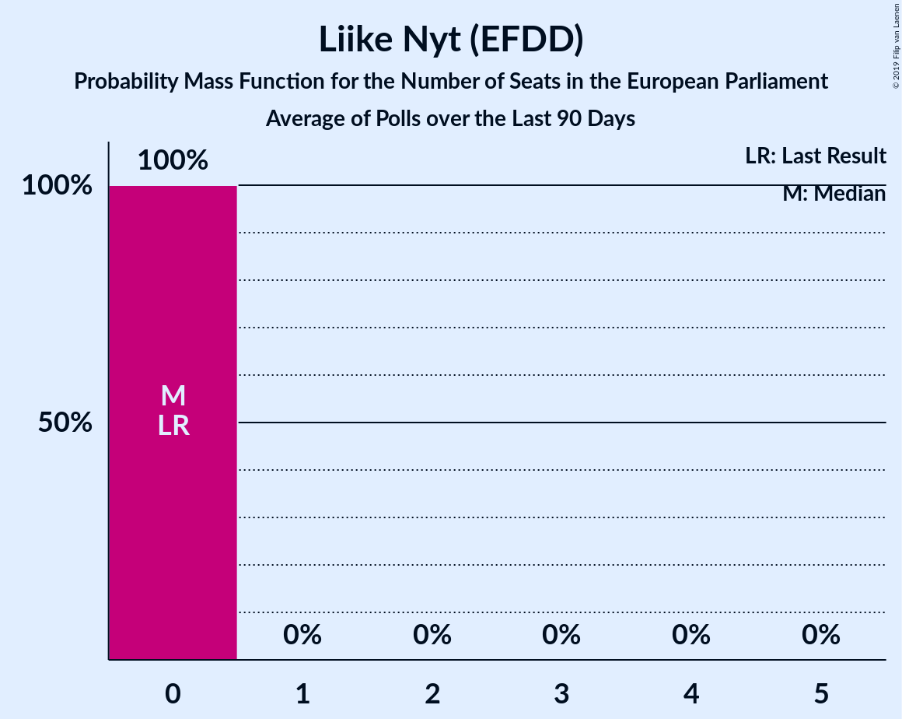

# Liike Nyt (EFDD)

<a href="#voting-intentions">Voting Intentions</a> | <a href="#seats">Seats</a>

## Voting Intentions

Last result: **0.0%** (General Election of 25 May 2014)

### Confidence Intervals

| Period     | Polling firm/Commissioner(s) | Median | 80% Confidence Interval | 90% Confidence Interval | 95% Confidence Interval | 99% Confidence Interval |
|:----------:|:----------------:|:-----------:|:-----------------------:|:-----------------------:|:-----------------------:|:-----------------------:|
| N/A | [Poll Average](average.html) | 1.7% | 1.4–2.1% | 1.3–2.2% | 1.2–2.4% | 1.1–2.6% |
| [6–18 May 2019](2019-05-18-KantarTNS.html) | Kantar TNS   Helsingin Sanomat | 0.0% | N/A | N/A | N/A | N/A |
| [3–14 May 2019](2019-05-14-Tietoykkönen.html) | Tietoykkönen   Iltalehti and Uusi Suomi | 0.0% | N/A | N/A | N/A | N/A |
| [15 April–7 May 2019](2019-05-07-Taloustutkimus.html) | Taloustutkimus   Yle | 1.7% | 1.4–2.1% | 1.3–2.3% | 1.2–2.4% | 1.1–2.6% |
| [16 April–3 May 2019](2019-05-03-KantarTNS.html) | Kantar TNS   Helsingin Sanomat | 2.5% | 2.1–3.1% | 2.0–3.3% | 1.8–3.5% | 1.6–3.8% |
| [1–9 April 2019](2019-04-09-Taloustutkimus.html) | Taloustutkimus   Yle | 0.0% | N/A | N/A | N/A | N/A |
| [3–7 April 2019](2019-04-07-KantarTNS.html) | Kantar TNS   Helsingin Sanomat | 0.0% | N/A | N/A | N/A | N/A |
| [25 March–3 April 2019](2019-04-03-Tietoykkönen.html) | Tietoykkönen   Iltalehti and Uusi Suomi | 0.0% | N/A | N/A | N/A | N/A |
| [6–26 March 2019](2019-03-26-Taloustutkimus.html) | Taloustutkimus   Yle | 0.0% | N/A | N/A | N/A | N/A |
| [18 February–15 March 2019](2019-03-15-KantarTNS.html) | Kantar TNS   Helsingin Sanomat | 0.0% | N/A | N/A | N/A | N/A |
| [6 February–5 March 2019](2019-03-05-Taloustutkimus.html) | Taloustutkimus   Yle | 0.0% | N/A | N/A | N/A | N/A |
| [18 February–3 March 2019](2019-03-03-Tietoykkönen.html) | Tietoykkönen   Iltalehti and Uusi Suomi | 0.0% | N/A | N/A | N/A | N/A |
| [14 January–14 February 2019](2019-02-14-KantarTNS.html) | Kantar TNS   Helsingin Sanomat | 0.0% | N/A | N/A | N/A | N/A |
| [14 January–5 February 2019](2019-02-05-Taloustutkimus.html) | Taloustutkimus   Yle | 0.0% | N/A | N/A | N/A | N/A |
| [14–28 January 2019](2019-01-28-Tietoykkönen.html) | Tietoykkönen   Iltalehti and Uusi Suomi | 0.0% | N/A | N/A | N/A | N/A |
| [13 December 2018–11 January 2019](2019-01-11-KantarTNS.html) | Kantar TNS   Helsingin Sanomat | 0.0% | N/A | N/A | N/A | N/A |
| [10 December 2018–8 January 2019](2019-01-08-Taloustutkimus.html) | Taloustutkimus   Yle | 0.0% | N/A | N/A | N/A | N/A |
| [5–18 December 2018](2018-12-18-Tietoykkönen.html) | Tietoykkönen   Iltalehti and Uusi Suomi | 0.0% | N/A | N/A | N/A | N/A |
| [13 November–12 December 2018](2018-12-12-KantarTNS.html) | Kantar TNS   Helsingin Sanomat | 0.0% | N/A | N/A | N/A | N/A |
| [12 November–4 December 2018](2018-12-04-Taloustutkimus.html) | Taloustutkimus   Yle | 0.0% | N/A | N/A | N/A | N/A |
| [14–23 November 2018](2018-11-23-Tietoykkönen.html) | Tietoykkönen   Iltalehti and Uusi Suomi | 0.0% | N/A | N/A | N/A | N/A |
| [15 October–12 November 2018](2018-11-12-KantarTNS.html) | Kantar TNS   Helsingin Sanomat | 0.0% | N/A | N/A | N/A | N/A |
| [3 October–6 November 2018](2018-11-06-Taloustutkimus.html) | Taloustutkimus   Yle | 0.0% | N/A | N/A | N/A | N/A |
| [12–30 October 2018](2018-10-30-Tietoykkönen.html) | Tietoykkönen   Iltalehti and Uusi Suomi | 0.0% | N/A | N/A | N/A | N/A |
| [17 September–11 October 2018](2018-10-11-KantarTNS.html) | Kantar TNS   Helsingin Sanomat | 0.0% | N/A | N/A | N/A | N/A |
| [10 September–2 October 2018](2018-10-02-Taloustutkimus.html) | Taloustutkimus   Yle | 0.0% | N/A | N/A | N/A | N/A |
| [14–27 September 2018](2018-09-27-Tietoykkönen.html) | Tietoykkönen   Iltalehti and Uusi Suomi | 0.0% | N/A | N/A | N/A | N/A |
| [20 August–14 September 2018](2018-09-14-KantarTNS.html) | Kantar TNS   Helsingin Sanomat | 0.0% | N/A | N/A | N/A | N/A |
| [13 August–4 September 2018](2018-09-04-Taloustutkimus.html) | Taloustutkimus   Yle | 0.0% | N/A | N/A | N/A | N/A |
| [13–25 August 2018](2018-08-25-Tietoykkönen.html) | Tietoykkönen   Iltalehti and Uusi Suomi | 0.0% | N/A | N/A | N/A | N/A |
| [16 July–16 August 2018](2018-08-16-KantarTNS.html) | Kantar TNS   Helsingin Sanomat | 0.0% | N/A | N/A | N/A | N/A |
| [9 July–7 August 2018](2018-08-07-Taloustutkimus.html) | Taloustutkimus   Yle | 0.0% | N/A | N/A | N/A | N/A |
| [11 June–12 July 2018](2018-07-12-KantarTNS.html) | Kantar TNS   Helsingin Sanomat | 0.0% | N/A | N/A | N/A | N/A |
| [6 June–3 July 2018](2018-07-03-Taloustutkimus.html) | Taloustutkimus   Yle | 0.0% | N/A | N/A | N/A | N/A |
| [6–26 June 2018](2018-06-26-Tietoykkönen.html) | Tietoykkönen   Iltalehti and Uusi Suomi | 0.0% | N/A | N/A | N/A | N/A |
| [14 May–10 June 2018](2018-06-10-KantarTNS.html) | Kantar TNS   Helsingin Sanomat | 0.0% | N/A | N/A | N/A | N/A |
| [2 May–5 June 2018](2018-06-05-Taloustutkimus.html) | Taloustutkimus   Yle | 0.0% | N/A | N/A | N/A | N/A |
| [18–31 May 2018](2018-05-31-Tietoykkönen.html) | Tietoykkönen   Iltalehti and Uusi Suomi | 0.0% | N/A | N/A | N/A | N/A |
| [16 April–11 May 2018](2018-05-11-KantarTNS.html) | Kantar TNS   Helsingin Sanomat | 0.0% | N/A | N/A | N/A | N/A |
| [19 April–2 May 2018](2018-05-02-Tietoykkönen.html) | Tietoykkönen   Iltalehti and Uusi Suomi | 0.0% | N/A | N/A | N/A | N/A |
| [3–26 April 2018](2018-04-26-Taloustutkimus.html) | Taloustutkimus   Yle | 0.0% | N/A | N/A | N/A | N/A |
| [19 March–12 April 2018](2018-04-12-KantarTNS.html) | Kantar TNS   Helsingin Sanomat | 0.0% | N/A | N/A | N/A | N/A |
| [1–27 March 2018](2018-03-27-Taloustutkimus.html) | Taloustutkimus   Yle | 0.0% | N/A | N/A | N/A | N/A |
| [16–26 March 2018](2018-03-26-Tietoykkönen.html) | Tietoykkönen   Iltalehti and Uusi Suomi | 0.0% | N/A | N/A | N/A | N/A |
| [19 February–15 March 2018](2018-03-15-KantarTNS.html) | Kantar TNS   Helsingin Sanomat | 0.0% | N/A | N/A | N/A | N/A |
| [7–28 February 2018](2018-02-28-Taloustutkimus.html) | Taloustutkimus   Yle | 0.0% | N/A | N/A | N/A | N/A |
| [14–26 February 2018](2018-02-26-Tietoykkönen.html) | Tietoykkönen   Iltalehti and Uusi Suomi | 0.0% | N/A | N/A | N/A | N/A |
| [22 January–15 February 2018](2018-02-15-KantarTNS.html) | Kantar TNS   Helsingin Sanomat | 0.0% | N/A | N/A | N/A | N/A |
| [28 December 2017–6 February 2018](2018-02-06-Taloustutkimus.html) | Taloustutkimus   Yle | 0.0% | N/A | N/A | N/A | N/A |
| [19–29 January 2018](2018-01-29-Tietoykkönen.html) | Tietoykkönen   Iltalehti and Uusi Suomi | 0.0% | N/A | N/A | N/A | N/A |
| [12 December 2017–18 January 2018](2018-01-18-KantarTNS.html) | Kantar TNS   Helsingin Sanomat | 0.0% | N/A | N/A | N/A | N/A |

### Probability Mass Function

The following table shows the probability mass function per percentage block of voting intentions for the [poll average](average.html) for Liike Nyt (EFDD).

| Voting Intentions | Probability | Accumulated | Special Marks |
|:-----------------:|:-----------:|:-----------:|:-------------:|
| 0.0–0.5% | 0% | 100% | Last Result |
| 0.5–1.5% | 29% | 100% |  |
| 1.5–2.5% | 71% | 71% | Median |
| 2.5–3.5% | 0.7% | 0.7% |  |
| 3.5–4.5% | 0% | 0% |  |

## Seats

Last result: **0** seats (General Election of 25 May 2014)

### Confidence Intervals

| Period     | Polling firm/Commissioner(s) | Median | 80% Confidence Interval | 90% Confidence Interval | 95% Confidence Interval | 99% Confidence Interval |
|:----------:|:----------------:|:------:|:-----------------------:|:-----------------------:|:-----------------------:|:-----------------------:|
| N/A | [Poll Average](average.html) | 0 | 0 | 0 | 0 | 0 |
| [6–18 May 2019](2019-05-18-KantarTNS.html) | Kantar TNS   Helsingin Sanomat |  |  |  |  |  |
| [3–14 May 2019](2019-05-14-Tietoykkönen.html) | Tietoykkönen   Iltalehti and Uusi Suomi |  |  |  |  |  |
| [15 April–7 May 2019](2019-05-07-Taloustutkimus.html) | Taloustutkimus   Yle | 0 | 0 | 0 | 0 | 0 |
| [16 April–3 May 2019](2019-05-03-KantarTNS.html) | Kantar TNS   Helsingin Sanomat | 0 | 0 | 0 | 0 | 0 |
| [1–9 April 2019](2019-04-09-Taloustutkimus.html) | Taloustutkimus   Yle |  |  |  |  |  |
| [3–7 April 2019](2019-04-07-KantarTNS.html) | Kantar TNS   Helsingin Sanomat |  |  |  |  |  |
| [25 March–3 April 2019](2019-04-03-Tietoykkönen.html) | Tietoykkönen   Iltalehti and Uusi Suomi |  |  |  |  |  |
| [6–26 March 2019](2019-03-26-Taloustutkimus.html) | Taloustutkimus   Yle |  |  |  |  |  |
| [18 February–15 March 2019](2019-03-15-KantarTNS.html) | Kantar TNS   Helsingin Sanomat |  |  |  |  |  |
| [6 February–5 March 2019](2019-03-05-Taloustutkimus.html) | Taloustutkimus   Yle |  |  |  |  |  |
| [18 February–3 March 2019](2019-03-03-Tietoykkönen.html) | Tietoykkönen   Iltalehti and Uusi Suomi |  |  |  |  |  |
| [14 January–14 February 2019](2019-02-14-KantarTNS.html) | Kantar TNS   Helsingin Sanomat |  |  |  |  |  |
| [14 January–5 February 2019](2019-02-05-Taloustutkimus.html) | Taloustutkimus   Yle |  |  |  |  |  |
| [14–28 January 2019](2019-01-28-Tietoykkönen.html) | Tietoykkönen   Iltalehti and Uusi Suomi |  |  |  |  |  |
| [13 December 2018–11 January 2019](2019-01-11-KantarTNS.html) | Kantar TNS   Helsingin Sanomat |  |  |  |  |  |
| [10 December 2018–8 January 2019](2019-01-08-Taloustutkimus.html) | Taloustutkimus   Yle |  |  |  |  |  |
| [5–18 December 2018](2018-12-18-Tietoykkönen.html) | Tietoykkönen   Iltalehti and Uusi Suomi |  |  |  |  |  |
| [13 November–12 December 2018](2018-12-12-KantarTNS.html) | Kantar TNS   Helsingin Sanomat |  |  |  |  |  |
| [12 November–4 December 2018](2018-12-04-Taloustutkimus.html) | Taloustutkimus   Yle |  |  |  |  |  |
| [14–23 November 2018](2018-11-23-Tietoykkönen.html) | Tietoykkönen   Iltalehti and Uusi Suomi |  |  |  |  |  |
| [15 October–12 November 2018](2018-11-12-KantarTNS.html) | Kantar TNS   Helsingin Sanomat |  |  |  |  |  |
| [3 October–6 November 2018](2018-11-06-Taloustutkimus.html) | Taloustutkimus   Yle |  |  |  |  |  |
| [12–30 October 2018](2018-10-30-Tietoykkönen.html) | Tietoykkönen   Iltalehti and Uusi Suomi |  |  |  |  |  |
| [17 September–11 October 2018](2018-10-11-KantarTNS.html) | Kantar TNS   Helsingin Sanomat |  |  |  |  |  |
| [10 September–2 October 2018](2018-10-02-Taloustutkimus.html) | Taloustutkimus   Yle |  |  |  |  |  |
| [14–27 September 2018](2018-09-27-Tietoykkönen.html) | Tietoykkönen   Iltalehti and Uusi Suomi |  |  |  |  |  |
| [20 August–14 September 2018](2018-09-14-KantarTNS.html) | Kantar TNS   Helsingin Sanomat |  |  |  |  |  |
| [13 August–4 September 2018](2018-09-04-Taloustutkimus.html) | Taloustutkimus   Yle |  |  |  |  |  |
| [13–25 August 2018](2018-08-25-Tietoykkönen.html) | Tietoykkönen   Iltalehti and Uusi Suomi |  |  |  |  |  |
| [16 July–16 August 2018](2018-08-16-KantarTNS.html) | Kantar TNS   Helsingin Sanomat |  |  |  |  |  |
| [9 July–7 August 2018](2018-08-07-Taloustutkimus.html) | Taloustutkimus   Yle |  |  |  |  |  |
| [11 June–12 July 2018](2018-07-12-KantarTNS.html) | Kantar TNS   Helsingin Sanomat |  |  |  |  |  |
| [6 June–3 July 2018](2018-07-03-Taloustutkimus.html) | Taloustutkimus   Yle |  |  |  |  |  |
| [6–26 June 2018](2018-06-26-Tietoykkönen.html) | Tietoykkönen   Iltalehti and Uusi Suomi |  |  |  |  |  |
| [14 May–10 June 2018](2018-06-10-KantarTNS.html) | Kantar TNS   Helsingin Sanomat |  |  |  |  |  |
| [2 May–5 June 2018](2018-06-05-Taloustutkimus.html) | Taloustutkimus   Yle |  |  |  |  |  |
| [18–31 May 2018](2018-05-31-Tietoykkönen.html) | Tietoykkönen   Iltalehti and Uusi Suomi |  |  |  |  |  |
| [16 April–11 May 2018](2018-05-11-KantarTNS.html) | Kantar TNS   Helsingin Sanomat |  |  |  |  |  |
| [19 April–2 May 2018](2018-05-02-Tietoykkönen.html) | Tietoykkönen   Iltalehti and Uusi Suomi |  |  |  |  |  |
| [3–26 April 2018](2018-04-26-Taloustutkimus.html) | Taloustutkimus   Yle |  |  |  |  |  |
| [19 March–12 April 2018](2018-04-12-KantarTNS.html) | Kantar TNS   Helsingin Sanomat |  |  |  |  |  |
| [1–27 March 2018](2018-03-27-Taloustutkimus.html) | Taloustutkimus   Yle |  |  |  |  |  |
| [16–26 March 2018](2018-03-26-Tietoykkönen.html) | Tietoykkönen   Iltalehti and Uusi Suomi |  |  |  |  |  |
| [19 February–15 March 2018](2018-03-15-KantarTNS.html) | Kantar TNS   Helsingin Sanomat |  |  |  |  |  |
| [7–28 February 2018](2018-02-28-Taloustutkimus.html) | Taloustutkimus   Yle |  |  |  |  |  |
| [14–26 February 2018](2018-02-26-Tietoykkönen.html) | Tietoykkönen   Iltalehti and Uusi Suomi |  |  |  |  |  |
| [22 January–15 February 2018](2018-02-15-KantarTNS.html) | Kantar TNS   Helsingin Sanomat |  |  |  |  |  |
| [28 December 2017–6 February 2018](2018-02-06-Taloustutkimus.html) | Taloustutkimus   Yle |  |  |  |  |  |
| [19–29 January 2018](2018-01-29-Tietoykkönen.html) | Tietoykkönen   Iltalehti and Uusi Suomi |  |  |  |  |  |
| [12 December 2017–18 January 2018](2018-01-18-KantarTNS.html) | Kantar TNS   Helsingin Sanomat |  |  |  |  |  |

### Probability Mass Function

The following table shows the probability mass function per seat for the [poll average](average.html) for Liike Nyt (EFDD).

| Number of Seats | Probability | Accumulated | Special Marks |
|:---------------:|:-----------:|:-----------:|:-------------:|
| 0 | 100% | 100% | Last Result, Median |

