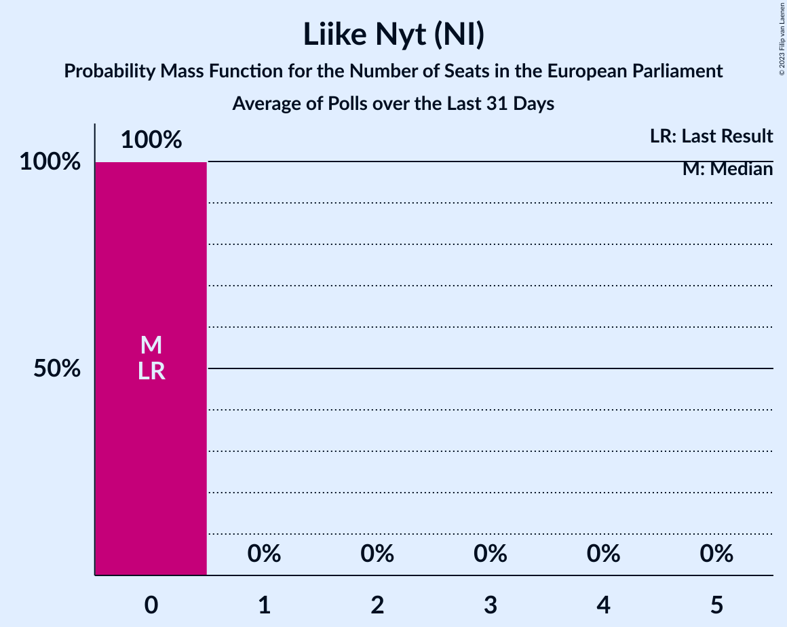

# Liike Nyt (NI)

<a href="#voting-intentions">Voting Intentions</a> | <a href="#seats">Seats</a>

## Voting Intentions

Last result: **0.0%** (General Election of 9 June 2024)

### Confidence Intervals

| Period     | Polling firm/Commissioner(s) | Median | 80% Confidence Interval | 90% Confidence Interval | 95% Confidence Interval | 99% Confidence Interval |
|:----------:|:----------------:|:-----------:|:-----------------------:|:-----------------------:|:-----------------------:|:-----------------------:|
| N/A | [Poll Average](average.html) | 1.9% | 1.3–3.0% | 1.2–3.3% | 1.1–3.5% | 0.9–3.9% |
| [9 December 2024–7 January 2025](2025-01-07-Taloustutkimus.html) | Taloustutkimus   Yle | 1.5% | 1.2–1.9% | 1.1–2.0% | 1.0–2.1% | 0.9–2.4% |
| [1 November–31 December 2024](2024-12-31-Verian.html) | Verian   Helsingin Sanomat | 2.5% | 2.0–3.3% | 1.8–3.5% | 1.7–3.7% | 1.5–4.1% |
| [6 November–3 December 2024](2024-12-03-Taloustutkimus.html) | Taloustutkimus   Yle | 2.3% | 1.9–2.8% | 1.8–3.0% | 1.7–3.1% | 1.5–3.4% |
| [14 October–15 November 2024](2024-11-15-Verian.html) | Verian   Helsingin Sanomat | 2.4% | 2.0–2.9% | 1.9–3.0% | 1.8–3.2% | 1.6–3.4% |
| [7 October–5 November 2024](2024-11-05-Taloustutkimus.html) | Taloustutkimus   Yle | 1.1% | 0.8–1.5% | 0.7–1.6% | 0.7–1.7% | 0.6–1.9% |
| [16 September–11 October 2024](2024-10-11-Verian.html) | Verian   Helsingin Sanomat | 2.2% | 1.8–2.8% | 1.7–2.9% | 1.6–3.0% | 1.5–3.3% |
| [4 September–1 October 2024](2024-10-01-Taloustutkimus.html) | Taloustutkimus   Yle | 1.4% | 1.1–1.8% | 1.0–2.0% | 1.0–2.1% | 0.9–2.3% |
| [19 August–13 September 2024](2024-09-13-Verian.html) | Verian   Helsingin Sanomat | 1.8% | 1.5–2.2% | 1.4–2.3% | 1.3–2.4% | 1.2–2.6% |
| [12 August–3 September 2024](2024-09-03-Taloustutkimus.html) | Taloustutkimus   Yle | 1.6% | 1.3–2.1% | 1.2–2.2% | 1.1–2.3% | 1.0–2.6% |
| [15 July–16 August 2024](2024-08-16-Verian.html) | Verian   Helsingin Sanomat | 2.2% | 1.9–2.6% | 1.8–2.7% | 1.7–2.9% | 1.6–3.1% |
| [8 July–6 August 2024](2024-08-06-Taloustutkimus.html) | Taloustutkimus   Yle | 1.0% | 0.7–1.4% | 0.7–1.5% | 0.6–1.6% | 0.5–1.8% |
| [17 June–12 July 2024](2024-07-12-Verian.html) | Verian   Helsingin Sanomat | 2.2% | 1.9–2.7% | 1.8–2.8% | 1.7–2.9% | 1.5–3.1% |
| [7 June–2 July 2024](2024-07-02-Taloustutkimus.html) | Taloustutkimus   Yle | 1.9% | 1.5–2.4% | 1.4–2.5% | 1.4–2.6% | 1.2–2.9% |
| [20 May–14 June 2024](2024-06-14-Verian.html) | Verian   Helsingin Sanomat | 2.3% | 1.9–2.7% | 1.8–2.9% | 1.8–3.0% | 1.6–3.2% |

### Probability Mass Function

The following table shows the probability mass function per percentage block of voting intentions for the [poll average](average.html) for Liike Nyt (NI).

| Voting Intentions | Probability | Accumulated | Special Marks |
|:-----------------:|:-----------:|:-----------:|:-------------:|
| 0.0–0.5% | 0% | 100% | Last Result |
| 0.5–1.5% | 28% | 100% |  |
| 1.5–2.5% | 46% | 72% | Median |
| 2.5–3.5% | 24% | 26% |  |
| 3.5–4.5% | 2% | 2% |  |
| 4.5–5.5% | 0% | 0% |  |

## Seats

Last result: **0** seats (General Election of 9 June 2024)

### Confidence Intervals

| Period     | Polling firm/Commissioner(s) | Median | 80% Confidence Interval | 90% Confidence Interval | 95% Confidence Interval | 99% Confidence Interval |
|:----------:|:----------------:|:------:|:-----------------------:|:-----------------------:|:-----------------------:|:-----------------------:|
| N/A | [Poll Average](average.html) | 0 | 0 | 0 | 0 | 0 |
| [9 December 2024–7 January 2025](2025-01-07-Taloustutkimus.html) | Taloustutkimus   Yle | 0 | 0 | 0 | 0 | 0 |
| [1 November–31 December 2024](2024-12-31-Verian.html) | Verian   Helsingin Sanomat | 0 | 0 | 0 | 0 | 0 |
| [6 November–3 December 2024](2024-12-03-Taloustutkimus.html) | Taloustutkimus   Yle | 0 | 0 | 0 | 0 | 0 |
| [14 October–15 November 2024](2024-11-15-Verian.html) | Verian   Helsingin Sanomat | 0 | 0 | 0 | 0 | 0 |
| [7 October–5 November 2024](2024-11-05-Taloustutkimus.html) | Taloustutkimus   Yle | 0 | 0 | 0 | 0 | 0 |
| [16 September–11 October 2024](2024-10-11-Verian.html) | Verian   Helsingin Sanomat | 0 | 0 | 0 | 0 | 0 |
| [4 September–1 October 2024](2024-10-01-Taloustutkimus.html) | Taloustutkimus   Yle | 0 | 0 | 0 | 0 | 0 |
| [19 August–13 September 2024](2024-09-13-Verian.html) | Verian   Helsingin Sanomat | 0 | 0 | 0 | 0 | 0 |
| [12 August–3 September 2024](2024-09-03-Taloustutkimus.html) | Taloustutkimus   Yle | 0 | 0 | 0 | 0 | 0 |
| [15 July–16 August 2024](2024-08-16-Verian.html) | Verian   Helsingin Sanomat | 0 | 0 | 0 | 0 | 0 |
| [8 July–6 August 2024](2024-08-06-Taloustutkimus.html) | Taloustutkimus   Yle | 0 | 0 | 0 | 0 | 0 |
| [17 June–12 July 2024](2024-07-12-Verian.html) | Verian   Helsingin Sanomat | 0 | 0 | 0 | 0 | 0 |
| [7 June–2 July 2024](2024-07-02-Taloustutkimus.html) | Taloustutkimus   Yle | 0 | 0 | 0 | 0 | 0 |
| [20 May–14 June 2024](2024-06-14-Verian.html) | Verian   Helsingin Sanomat | 0 | 0 | 0 | 0 | 0 |

### Probability Mass Function

The following table shows the probability mass function per seat for the [poll average](average.html) for Liike Nyt (NI).

| Number of Seats | Probability | Accumulated | Special Marks |
|:---------------:|:-----------:|:-----------:|:-------------:|
| 0 | 100% | 100% | Last Result, Median |

