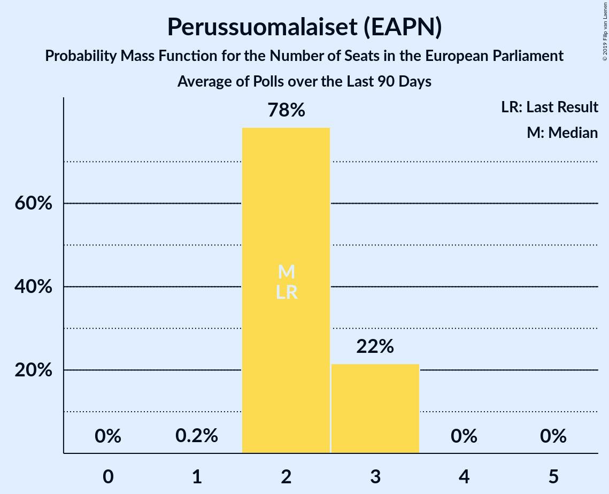

# Perussuomalaiset (EAPN)

<a href="#voting-intentions">Voting Intentions</a> | <a href="#seats">Seats</a>

## Voting Intentions

Last result: **12.9%** (General Election of 25 May 2014)

### Confidence Intervals

| Period     | Polling firm/Commissioner(s) | Median | 80% Confidence Interval | 90% Confidence Interval | 95% Confidence Interval | 99% Confidence Interval |
|:----------:|:----------------:|:-----------:|:-----------------------:|:-----------------------:|:-----------------------:|:-----------------------:|
| N/A | [Poll Average](average.html) | 18.4% | 15.9–20.1% | 15.5–20.5% | 15.1–20.9% | 14.6–21.7% |
| [6–18 May 2019](2019-05-18-KantarTNS.html) | Kantar TNS   Helsingin Sanomat | 16.3% | 15.3–17.4% | 15.0–17.7% | 14.7–18.0% | 14.3–18.5% |
| [3–14 May 2019](2019-05-14-Tietoykkönen.html) | Tietoykkönen   Iltalehti and Uusi Suomi | 19.2% | 17.8–20.7% | 17.5–21.1% | 17.1–21.4% | 16.5–22.2% |
| [15 April–7 May 2019](2019-05-07-Taloustutkimus.html) | Taloustutkimus   Yle | 18.8% | 17.7–20.0% | 17.4–20.3% | 17.1–20.6% | 16.6–21.2% |
| [16 April–3 May 2019](2019-05-03-KantarTNS.html) | Kantar TNS   Helsingin Sanomat | 18.7% | 17.4–20.0% | 17.1–20.4% | 16.8–20.7% | 16.2–21.4% |
| [1–9 April 2019](2019-04-09-Taloustutkimus.html) | Taloustutkimus   Yle | 16.3% | 15.0–17.7% | 14.6–18.1% | 14.3–18.5% | 13.7–19.1% |
| [3–7 April 2019](2019-04-07-KantarTNS.html) | Kantar TNS   Helsingin Sanomat | 15.0% | 14.0–16.1% | 13.7–16.4% | 13.5–16.6% | 13.0–17.2% |
| [25 March–3 April 2019](2019-04-03-Tietoykkönen.html) | Tietoykkönen   Iltalehti and Uusi Suomi | 13.4% | 12.2–14.8% | 11.9–15.1% | 11.6–15.5% | 11.0–16.1% |
| [6–26 March 2019](2019-03-26-Taloustutkimus.html) | Taloustutkimus   Yle | 15.1% | 13.8–16.5% | 13.5–16.9% | 13.2–17.2% | 12.6–17.9% |
| [18 February–15 March 2019](2019-03-15-KantarTNS.html) | Kantar TNS   Helsingin Sanomat | 11.1% | 10.2–12.1% | 9.9–12.4% | 9.7–12.7% | 9.2–13.2% |
| [6 February–5 March 2019](2019-03-05-Taloustutkimus.html) | Taloustutkimus   Yle | 13.3% | N/A | N/A | N/A | N/A |
| [18 February–3 March 2019](2019-03-03-Tietoykkönen.html) | Tietoykkönen   Iltalehti and Uusi Suomi | 11.2% | N/A | N/A | N/A | N/A |
| [14 January–14 February 2019](2019-02-14-KantarTNS.html) | Kantar TNS   Helsingin Sanomat | 11.4% | N/A | N/A | N/A | N/A |
| [14 January–5 February 2019](2019-02-05-Taloustutkimus.html) | Taloustutkimus   Yle | 12.0% | N/A | N/A | N/A | N/A |
| [14–28 January 2019](2019-01-28-Tietoykkönen.html) | Tietoykkönen   Iltalehti and Uusi Suomi | 9.9% | N/A | N/A | N/A | N/A |
| [13 December 2018–11 January 2019](2019-01-11-KantarTNS.html) | Kantar TNS   Helsingin Sanomat | 9.7% | N/A | N/A | N/A | N/A |
| [10 December 2018–8 January 2019](2019-01-08-Taloustutkimus.html) | Taloustutkimus   Yle | 10.2% | 9.4–11.0% | 9.2–11.3% | 9.1–11.5% | 8.7–11.9% |
| [5–18 December 2018](2018-12-18-Tietoykkönen.html) | Tietoykkönen   Iltalehti and Uusi Suomi | 9.7% | 8.7–11.0% | 8.4–11.3% | 8.2–11.6% | 7.7–12.2% |
| [13 November–12 December 2018](2018-12-12-KantarTNS.html) | Kantar TNS   Helsingin Sanomat | 8.6% | N/A | N/A | N/A | N/A |
| [12 November–4 December 2018](2018-12-04-Taloustutkimus.html) | Taloustutkimus   Yle | 8.1% | N/A | N/A | N/A | N/A |
| [14–23 November 2018](2018-11-23-Tietoykkönen.html) | Tietoykkönen   Iltalehti and Uusi Suomi | 8.4% | N/A | N/A | N/A | N/A |
| [15 October–12 November 2018](2018-11-12-KantarTNS.html) | Kantar TNS   Helsingin Sanomat | 8.7% | N/A | N/A | N/A | N/A |
| [3 October–6 November 2018](2018-11-06-Taloustutkimus.html) | Taloustutkimus   Yle | 9.8% | N/A | N/A | N/A | N/A |
| [12–30 October 2018](2018-10-30-Tietoykkönen.html) | Tietoykkönen   Iltalehti and Uusi Suomi | 7.7% | N/A | N/A | N/A | N/A |
| [17 September–11 October 2018](2018-10-11-KantarTNS.html) | Kantar TNS   Helsingin Sanomat | 9.1% | N/A | N/A | N/A | N/A |
| [10 September–2 October 2018](2018-10-02-Taloustutkimus.html) | Taloustutkimus   Yle | 9.3% | N/A | N/A | N/A | N/A |
| [14–27 September 2018](2018-09-27-Tietoykkönen.html) | Tietoykkönen   Iltalehti and Uusi Suomi | 7.9% | N/A | N/A | N/A | N/A |
| [20 August–14 September 2018](2018-09-14-KantarTNS.html) | Kantar TNS   Helsingin Sanomat | 8.7% | N/A | N/A | N/A | N/A |
| [13 August–4 September 2018](2018-09-04-Taloustutkimus.html) | Taloustutkimus   Yle | 9.4% | N/A | N/A | N/A | N/A |
| [13–25 August 2018](2018-08-25-Tietoykkönen.html) | Tietoykkönen   Iltalehti and Uusi Suomi | 8.0% | N/A | N/A | N/A | N/A |
| [16 July–16 August 2018](2018-08-16-KantarTNS.html) | Kantar TNS   Helsingin Sanomat | 7.9% | N/A | N/A | N/A | N/A |
| [9 July–7 August 2018](2018-08-07-Taloustutkimus.html) | Taloustutkimus   Yle | 8.7% | N/A | N/A | N/A | N/A |
| [11 June–12 July 2018](2018-07-12-KantarTNS.html) | Kantar TNS   Helsingin Sanomat | 7.8% | N/A | N/A | N/A | N/A |
| [6 June–3 July 2018](2018-07-03-Taloustutkimus.html) | Taloustutkimus   Yle | 10.3% | N/A | N/A | N/A | N/A |
| [6–26 June 2018](2018-06-26-Tietoykkönen.html) | Tietoykkönen   Iltalehti and Uusi Suomi | 7.8% | N/A | N/A | N/A | N/A |
| [14 May–10 June 2018](2018-06-10-KantarTNS.html) | Kantar TNS   Helsingin Sanomat | 8.0% | N/A | N/A | N/A | N/A |
| [2 May–5 June 2018](2018-06-05-Taloustutkimus.html) | Taloustutkimus   Yle | 8.3% | N/A | N/A | N/A | N/A |
| [18–31 May 2018](2018-05-31-Tietoykkönen.html) | Tietoykkönen   Iltalehti and Uusi Suomi | 7.9% | N/A | N/A | N/A | N/A |
| [16 April–11 May 2018](2018-05-11-KantarTNS.html) | Kantar TNS   Helsingin Sanomat | 7.7% | N/A | N/A | N/A | N/A |
| [19 April–2 May 2018](2018-05-02-Tietoykkönen.html) | Tietoykkönen   Iltalehti and Uusi Suomi | 8.0% | N/A | N/A | N/A | N/A |
| [3–26 April 2018](2018-04-26-Taloustutkimus.html) | Taloustutkimus   Yle | 8.5% | N/A | N/A | N/A | N/A |
| [19 March–12 April 2018](2018-04-12-KantarTNS.html) | Kantar TNS   Helsingin Sanomat | 8.1% | N/A | N/A | N/A | N/A |
| [1–27 March 2018](2018-03-27-Taloustutkimus.html) | Taloustutkimus   Yle | 9.2% | N/A | N/A | N/A | N/A |
| [16–26 March 2018](2018-03-26-Tietoykkönen.html) | Tietoykkönen   Iltalehti and Uusi Suomi | 8.2% | N/A | N/A | N/A | N/A |
| [19 February–15 March 2018](2018-03-15-KantarTNS.html) | Kantar TNS   Helsingin Sanomat | 8.5% | 7.8–9.3% | 7.6–9.5% | 7.4–9.7% | 7.1–10.0% |
| [7–28 February 2018](2018-02-28-Taloustutkimus.html) | Taloustutkimus   Yle | 8.5% | 7.7–9.5% | 7.5–9.7% | 7.3–10.0% | 6.9–10.4% |
| [14–26 February 2018](2018-02-26-Tietoykkönen.html) | Tietoykkönen   Iltalehti and Uusi Suomi | 8.7% | 7.7–9.8% | 7.4–10.2% | 7.2–10.5% | 6.7–11.0% |
| [22 January–15 February 2018](2018-02-15-KantarTNS.html) | Kantar TNS   Helsingin Sanomat | 8.6% | 7.9–9.4% | 7.7–9.6% | 7.5–9.8% | 7.2–10.2% |
| [28 December 2017–6 February 2018](2018-02-06-Taloustutkimus.html) | Taloustutkimus   Yle | 9.6% | 8.9–10.4% | 8.7–10.6% | 8.6–10.8% | 8.2–11.1% |
| [19–29 January 2018](2018-01-29-Tietoykkönen.html) | Tietoykkönen   Iltalehti and Uusi Suomi | 8.2% | 7.3–9.3% | 7.0–9.6% | 6.8–9.9% | 6.4–10.4% |
| [12 December 2017–18 January 2018](2018-01-18-KantarTNS.html) | Kantar TNS   Helsingin Sanomat | 8.1% | 7.4–8.9% | 7.2–9.1% | 7.1–9.3% | 6.8–9.6% |

### Probability Mass Function

The following table shows the probability mass function per percentage block of voting intentions for the [poll average](average.html) for Perussuomalaiset (EAPN).

| Voting Intentions | Probability | Accumulated | Special Marks |
|:-----------------:|:-----------:|:-----------:|:-------------:|
| 12.5–13.5% | 0% | 100% | Last Result |
| 13.5–14.5% | 0.5% | 100% |  |
| 14.5–15.5% | 5% | 99.5% |  |
| 15.5–16.5% | 15% | 94% |  |
| 16.5–17.5% | 14% | 79% |  |
| 17.5–18.5% | 19% | 65% | Median |
| 18.5–19.5% | 26% | 45% |  |
| 19.5–20.5% | 15% | 20% |  |
| 20.5–21.5% | 4% | 5% |  |
| 21.5–22.5% | 0.6% | 0.7% |  |
| 22.5–23.5% | 0.1% | 0.1% |  |
| 23.5–24.5% | 0% | 0% |  |

## Seats

Last result: **2** seats (General Election of 25 May 2014)

### Confidence Intervals

| Period     | Polling firm/Commissioner(s) | Median | 80% Confidence Interval | 90% Confidence Interval | 95% Confidence Interval | 99% Confidence Interval |
|:----------:|:----------------:|:------:|:-----------------------:|:-----------------------:|:-----------------------:|:-----------------------:|
| N/A | [Poll Average](average.html) | 3 | 2–3 | 2–3 | 2–3 | 2–3 |
| [6–18 May 2019](2019-05-18-KantarTNS.html) | Kantar TNS   Helsingin Sanomat | 2 | 2 | 2 | 2–3 | 2–3 |
| [3–14 May 2019](2019-05-14-Tietoykkönen.html) | Tietoykkönen   Iltalehti and Uusi Suomi | 3 | 3 | 3 | 2–3 | 2–3 |
| [15 April–7 May 2019](2019-05-07-Taloustutkimus.html) | Taloustutkimus   Yle | 3 | 3 | 3 | 2–3 | 2–3 |
| [16 April–3 May 2019](2019-05-03-KantarTNS.html) | Kantar TNS   Helsingin Sanomat | 3 | 3 | 3 | 2–3 | 2–3 |
| [1–9 April 2019](2019-04-09-Taloustutkimus.html) | Taloustutkimus   Yle | 3 | 2–3 | 2–3 | 2–3 | 2–3 |
| [3–7 April 2019](2019-04-07-KantarTNS.html) | Kantar TNS   Helsingin Sanomat | 2 | 2 | 2 | 2–3 | 2–3 |
| [25 March–3 April 2019](2019-04-03-Tietoykkönen.html) | Tietoykkönen   Iltalehti and Uusi Suomi | 2 | 2 | 2 | 2 | 1–3 |
| [6–26 March 2019](2019-03-26-Taloustutkimus.html) | Taloustutkimus   Yle | 2 | 2 | 2 | 2 | 2–3 |
| [18 February–15 March 2019](2019-03-15-KantarTNS.html) | Kantar TNS   Helsingin Sanomat | 2 | 2 | 2 | 2 | 1–2 |
| [6 February–5 March 2019](2019-03-05-Taloustutkimus.html) | Taloustutkimus   Yle |  |  |  |  |  |
| [18 February–3 March 2019](2019-03-03-Tietoykkönen.html) | Tietoykkönen   Iltalehti and Uusi Suomi |  |  |  |  |  |
| [14 January–14 February 2019](2019-02-14-KantarTNS.html) | Kantar TNS   Helsingin Sanomat |  |  |  |  |  |
| [14 January–5 February 2019](2019-02-05-Taloustutkimus.html) | Taloustutkimus   Yle |  |  |  |  |  |
| [14–28 January 2019](2019-01-28-Tietoykkönen.html) | Tietoykkönen   Iltalehti and Uusi Suomi |  |  |  |  |  |
| [13 December 2018–11 January 2019](2019-01-11-KantarTNS.html) | Kantar TNS   Helsingin Sanomat |  |  |  |  |  |
| [10 December 2018–8 January 2019](2019-01-08-Taloustutkimus.html) | Taloustutkimus   Yle | 1 | 1 | 1 | 1 | 1 |
| [5–18 December 2018](2018-12-18-Tietoykkönen.html) | Tietoykkönen   Iltalehti and Uusi Suomi | 1 | 1 | 1 | 1 | 1 |
| [13 November–12 December 2018](2018-12-12-KantarTNS.html) | Kantar TNS   Helsingin Sanomat |  |  |  |  |  |
| [12 November–4 December 2018](2018-12-04-Taloustutkimus.html) | Taloustutkimus   Yle |  |  |  |  |  |
| [14–23 November 2018](2018-11-23-Tietoykkönen.html) | Tietoykkönen   Iltalehti and Uusi Suomi |  |  |  |  |  |
| [15 October–12 November 2018](2018-11-12-KantarTNS.html) | Kantar TNS   Helsingin Sanomat |  |  |  |  |  |
| [3 October–6 November 2018](2018-11-06-Taloustutkimus.html) | Taloustutkimus   Yle |  |  |  |  |  |
| [12–30 October 2018](2018-10-30-Tietoykkönen.html) | Tietoykkönen   Iltalehti and Uusi Suomi |  |  |  |  |  |
| [17 September–11 October 2018](2018-10-11-KantarTNS.html) | Kantar TNS   Helsingin Sanomat |  |  |  |  |  |
| [10 September–2 October 2018](2018-10-02-Taloustutkimus.html) | Taloustutkimus   Yle |  |  |  |  |  |
| [14–27 September 2018](2018-09-27-Tietoykkönen.html) | Tietoykkönen   Iltalehti and Uusi Suomi |  |  |  |  |  |
| [20 August–14 September 2018](2018-09-14-KantarTNS.html) | Kantar TNS   Helsingin Sanomat |  |  |  |  |  |
| [13 August–4 September 2018](2018-09-04-Taloustutkimus.html) | Taloustutkimus   Yle |  |  |  |  |  |
| [13–25 August 2018](2018-08-25-Tietoykkönen.html) | Tietoykkönen   Iltalehti and Uusi Suomi |  |  |  |  |  |
| [16 July–16 August 2018](2018-08-16-KantarTNS.html) | Kantar TNS   Helsingin Sanomat |  |  |  |  |  |
| [9 July–7 August 2018](2018-08-07-Taloustutkimus.html) | Taloustutkimus   Yle |  |  |  |  |  |
| [11 June–12 July 2018](2018-07-12-KantarTNS.html) | Kantar TNS   Helsingin Sanomat |  |  |  |  |  |
| [6 June–3 July 2018](2018-07-03-Taloustutkimus.html) | Taloustutkimus   Yle |  |  |  |  |  |
| [6–26 June 2018](2018-06-26-Tietoykkönen.html) | Tietoykkönen   Iltalehti and Uusi Suomi |  |  |  |  |  |
| [14 May–10 June 2018](2018-06-10-KantarTNS.html) | Kantar TNS   Helsingin Sanomat |  |  |  |  |  |
| [2 May–5 June 2018](2018-06-05-Taloustutkimus.html) | Taloustutkimus   Yle |  |  |  |  |  |
| [18–31 May 2018](2018-05-31-Tietoykkönen.html) | Tietoykkönen   Iltalehti and Uusi Suomi |  |  |  |  |  |
| [16 April–11 May 2018](2018-05-11-KantarTNS.html) | Kantar TNS   Helsingin Sanomat |  |  |  |  |  |
| [19 April–2 May 2018](2018-05-02-Tietoykkönen.html) | Tietoykkönen   Iltalehti and Uusi Suomi |  |  |  |  |  |
| [3–26 April 2018](2018-04-26-Taloustutkimus.html) | Taloustutkimus   Yle |  |  |  |  |  |
| [19 March–12 April 2018](2018-04-12-KantarTNS.html) | Kantar TNS   Helsingin Sanomat |  |  |  |  |  |
| [1–27 March 2018](2018-03-27-Taloustutkimus.html) | Taloustutkimus   Yle |  |  |  |  |  |
| [16–26 March 2018](2018-03-26-Tietoykkönen.html) | Tietoykkönen   Iltalehti and Uusi Suomi |  |  |  |  |  |
| [19 February–15 March 2018](2018-03-15-KantarTNS.html) | Kantar TNS   Helsingin Sanomat | 1 | 1 | 1 | 1 | 1 |
| [7–28 February 2018](2018-02-28-Taloustutkimus.html) | Taloustutkimus   Yle | 1 | 1 | 1 | 1 | 1 |
| [14–26 February 2018](2018-02-26-Tietoykkönen.html) | Tietoykkönen   Iltalehti and Uusi Suomi | 1 | 1 | 1 | 1 | 1 |
| [22 January–15 February 2018](2018-02-15-KantarTNS.html) | Kantar TNS   Helsingin Sanomat | 1 | 1 | 1 | 1 | 1 |
| [28 December 2017–6 February 2018](2018-02-06-Taloustutkimus.html) | Taloustutkimus   Yle | 1 | 1 | 1 | 1 | 1 |
| [19–29 January 2018](2018-01-29-Tietoykkönen.html) | Tietoykkönen   Iltalehti and Uusi Suomi | 1 | 1 | 1 | 1 | 1 |
| [12 December 2017–18 January 2018](2018-01-18-KantarTNS.html) | Kantar TNS   Helsingin Sanomat | 1 | 1 | 1 | 1 | 1 |

### Probability Mass Function

The following table shows the probability mass function per seat for the [poll average](average.html) for Perussuomalaiset (EAPN).

| Number of Seats | Probability | Accumulated | Special Marks |
|:---------------:|:-----------:|:-----------:|:-------------:|
| 2 | 34% | 100% | Last Result |
| 3 | 65% | 66% | Median |
| 4 | 0.1% | 0.1% |  |
| 5 | 0% | 0% |  |

