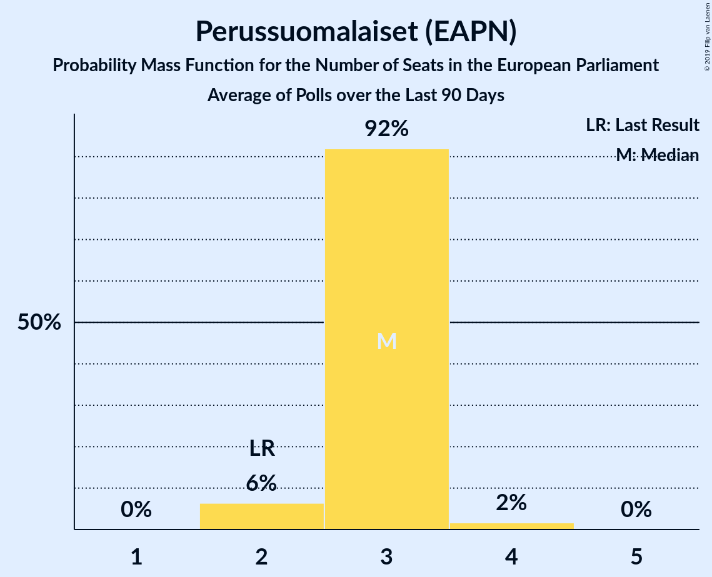

# Perussuomalaiset (EAPN)

<a href="#voting-intentions">Voting Intentions</a> | <a href="#seats">Seats</a>

## Voting Intentions

Last result: **12.9%** (General Election of 26 May 2019)

### Confidence Intervals

| Period     | Polling firm/Commissioner(s) | Median | 80% Confidence Interval | 90% Confidence Interval | 95% Confidence Interval | 99% Confidence Interval |
|:----------:|:----------------:|:-----------:|:-----------------------:|:-----------------------:|:-----------------------:|:-----------------------:|
| N/A | [Poll Average](average.html) | 19.3% | 17.6–21.1% | 17.2–21.6% | 16.9–22.0% | 16.3–22.8% |
| [4–14 June 2019](2019-06-14-Tietoykkönen.html) | Tietoykkönen   Iltalehti and Uusi Suomi | 20.1% | 18.7–21.6% | 18.3–22.0% | 18.0–22.4% | 17.3–23.1% |
| [13 May–4 June 2019](2019-06-04-Taloustutkimus.html) | Taloustutkimus   Yle | 19.5% | 18.0–21.1% | 17.6–21.6% | 17.3–22.0% | 16.6–22.8% |
| [6 May–2 June 2019](2019-06-02-KantarTNS.html) | Kantar TNS   Helsingin Sanomat | 18.2% | 17.1–19.4% | 16.8–19.8% | 16.5–20.1% | 16.0–20.7% |

### Probability Mass Function

The following table shows the probability mass function per percentage block of voting intentions for the [poll average](average.html) for Perussuomalaiset (EAPN).

| Voting Intentions | Probability | Accumulated | Special Marks |
|:-----------------:|:-----------:|:-----------:|:-------------:|
| 12.5–13.5% | 0% | 100% | Last Result |
| 13.5–14.5% | 0% | 100% |  |
| 14.5–15.5% | 0% | 100% |  |
| 15.5–16.5% | 1.0% | 100% |  |
| 16.5–17.5% | 8% | 98.9% |  |
| 17.5–18.5% | 21% | 91% |  |
| 18.5–19.5% | 27% | 70% | Median |
| 19.5–20.5% | 23% | 42% |  |
| 20.5–21.5% | 14% | 19% |  |
| 21.5–22.5% | 4% | 5% |  |
| 22.5–23.5% | 0.7% | 0.8% |  |
| 23.5–24.5% | 0.1% | 0.1% |  |
| 24.5–25.5% | 0% | 0% |  |

## Seats

Last result: **2** seats (General Election of 26 May 2019)

### Confidence Intervals

| Period     | Polling firm/Commissioner(s) | Median | 80% Confidence Interval | 90% Confidence Interval | 95% Confidence Interval | 99% Confidence Interval |
|:----------:|:----------------:|:------:|:-----------------------:|:-----------------------:|:-----------------------:|:-----------------------:|
| N/A | [Poll Average](average.html) | 3 | 3 | 2–3 | 2–3 | 2–4 |
| [4–14 June 2019](2019-06-14-Tietoykkönen.html) | Tietoykkönen   Iltalehti and Uusi Suomi | 3 | 3 | 3 | 3 | 3–4 |
| [13 May–4 June 2019](2019-06-04-Taloustutkimus.html) | Taloustutkimus   Yle | 3 | 3 | 3 | 3 | 2–4 |
| [6 May–2 June 2019](2019-06-02-KantarTNS.html) | Kantar TNS   Helsingin Sanomat | 3 | 2–3 | 2–3 | 2–3 | 2–3 |

### Probability Mass Function

The following table shows the probability mass function per seat for the [poll average](average.html) for Perussuomalaiset (EAPN).

| Number of Seats | Probability | Accumulated | Special Marks |
|:---------------:|:-----------:|:-----------:|:-------------:|
| 2 | 6% | 100% | Last Result |
| 3 | 92% | 94% | Median |
| 4 | 1.2% | 1.2% |  |
| 5 | 0% | 0% |  |

