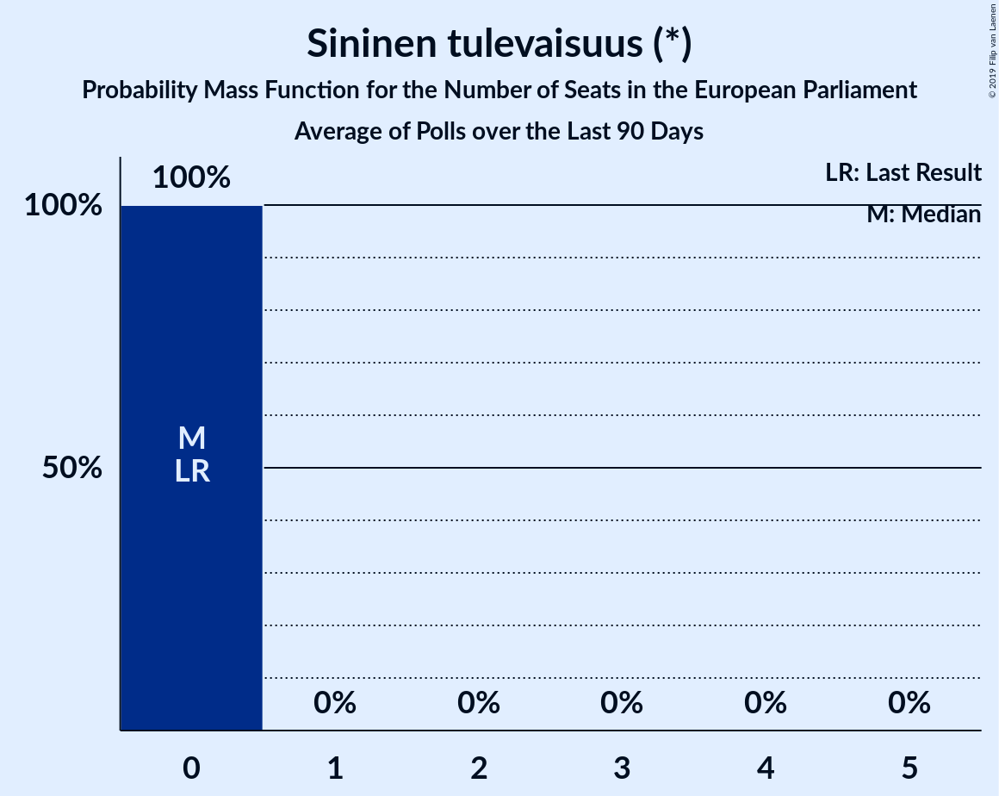

# Sininen tulevaisuus (*)

<a href="#voting-intentions">Voting Intentions</a> | <a href="#seats">Seats</a>

## Voting Intentions

Last result: **0.0%** (General Election of 25 May 2014)

### Confidence Intervals

| Period     | Polling firm/Commissioner(s) | Median | 80% Confidence Interval | 90% Confidence Interval | 95% Confidence Interval | 99% Confidence Interval |
|:----------:|:----------------:|:-----------:|:-----------------------:|:-----------------------:|:-----------------------:|:-----------------------:|
| N/A | [Poll Average](average.html) | 1.7% | 1.3–2.3% | 1.2–2.5% | 1.1–2.7% | 1.0–3.1% |
| [19 April–2 May 2018](2018-05-02-Tietoykkönen.html) | Tietoykkönen   Iltalehti and Uusi Suomi | 2.1% | 1.6–2.8% | 1.5–3.0% | 1.4–3.1% | 1.2–3.5% |
| [3–26 April 2018](2018-04-26-Taloustutkimus.html) | Taloustutkimus   Yle | 1.5% | 1.2–2.0% | 1.1–2.1% | 1.0–2.2% | 0.9–2.5% |
| [19 March–12 April 2018](2018-04-12-KantarTNS.html) | Kantar TNS   Helsingin Sanomat | 1.6% | 1.3–2.0% | 1.2–2.1% | 1.2–2.2% | 1.1–2.4% |
| [1–27 March 2018](2018-03-27-Taloustutkimus.html) | Taloustutkimus   Yle | 1.5% | 1.2–2.0% | 1.1–2.1% | 1.0–2.2% | 0.9–2.5% |
| [16–26 March 2018](2018-03-26-Tietoykkönen.html) | Tietoykkönen   Iltalehti and Uusi Suomi | 2.0% | 1.6–2.7% | 1.4–2.8% | 1.3–3.0% | 1.2–3.3% |
| [19 February–15 March 2018](2018-03-15-KantarTNS.html) | Kantar TNS   Helsingin Sanomat | 1.4% | 1.1–1.8% | 1.1–1.9% | 1.0–2.0% | 0.9–2.1% |
| [7–28 February 2018](2018-02-28-Taloustutkimus.html) | Taloustutkimus   Yle | 1.6% | 1.2–2.0% | 1.1–2.2% | 1.1–2.3% | 0.9–2.5% |
| [14–26 February 2018](2018-02-26-Tietoykkönen.html) | Tietoykkönen   Iltalehti and Uusi Suomi | 2.3% | 1.8–3.0% | 1.7–3.2% | 1.6–3.3% | 1.4–3.7% |
| [22 January–15 February 2018](2018-02-15-KantarTNS.html) | Kantar TNS   Helsingin Sanomat | 1.3% | 1.0–1.7% | 1.0–1.8% | 0.9–1.8% | 0.8–2.0% |
| [28 December 2017–6 February 2018](2018-02-06-Taloustutkimus.html) | Taloustutkimus   Yle | 1.6% | 1.3–2.0% | 1.2–2.1% | 1.2–2.1% | 1.1–2.3% |
| [19–29 January 2018](2018-01-29-Tietoykkönen.html) | Tietoykkönen   Iltalehti and Uusi Suomi | 2.7% | 2.2–3.4% | 2.1–3.6% | 2.0–3.8% | 1.7–4.2% |
| [12 December 2017–18 January 2018](2018-01-18-KantarTNS.html) | Kantar TNS   Helsingin Sanomat | 1.5% | 1.2–1.9% | 1.1–2.0% | 1.1–2.1% | 1.0–2.3% |

### Probability Mass Function

The following table shows the probability mass function per percentage block of voting intentions for the [poll average](average.html) for Sininen tulevaisuus (*).

| Voting Intentions | Probability | Accumulated | Special Marks |
|:-----------------:|:-----------:|:-----------:|:-------------:|
| 0.0–0.5% | 0% | 100% | Last Result |
| 0.5–1.5% | 33% | 100% |  |
| 1.5–2.5% | 62% | 67% | Median |
| 2.5–3.5% | 5% | 5% |  |
| 3.5–4.5% | 0.1% | 0.1% |  |
| 4.5–5.5% | 0% | 0% |  |

## Seats

Last result: **0** seats (General Election of 25 May 2014)

### Confidence Intervals

| Period     | Polling firm/Commissioner(s) | Median | 80% Confidence Interval | 90% Confidence Interval | 95% Confidence Interval | 99% Confidence Interval |
|:----------:|:----------------:|:------:|:-----------------------:|:-----------------------:|:-----------------------:|:-----------------------:|
| N/A | [Poll Average](average.html) | 0 | 0 | 0 | 0 | 0 |
| [19 April–2 May 2018](2018-05-02-Tietoykkönen.html) | Tietoykkönen   Iltalehti and Uusi Suomi | 0 | 0 | 0 | 0 | 0 |
| [3–26 April 2018](2018-04-26-Taloustutkimus.html) | Taloustutkimus   Yle | 0 | 0 | 0 | 0 | 0 |
| [19 March–12 April 2018](2018-04-12-KantarTNS.html) | Kantar TNS   Helsingin Sanomat | 0 | 0 | 0 | 0 | 0 |
| [1–27 March 2018](2018-03-27-Taloustutkimus.html) | Taloustutkimus   Yle | 0 | 0 | 0 | 0 | 0 |
| [16–26 March 2018](2018-03-26-Tietoykkönen.html) | Tietoykkönen   Iltalehti and Uusi Suomi | 0 | 0 | 0 | 0 | 0 |
| [19 February–15 March 2018](2018-03-15-KantarTNS.html) | Kantar TNS   Helsingin Sanomat | 0 | 0 | 0 | 0 | 0 |
| [7–28 February 2018](2018-02-28-Taloustutkimus.html) | Taloustutkimus   Yle | 0 | 0 | 0 | 0 | 0 |
| [14–26 February 2018](2018-02-26-Tietoykkönen.html) | Tietoykkönen   Iltalehti and Uusi Suomi | 0 | 0 | 0 | 0 | 0 |
| [22 January–15 February 2018](2018-02-15-KantarTNS.html) | Kantar TNS   Helsingin Sanomat | 0 | 0 | 0 | 0 | 0 |
| [28 December 2017–6 February 2018](2018-02-06-Taloustutkimus.html) | Taloustutkimus   Yle | 0 | 0 | 0 | 0 | 0 |
| [19–29 January 2018](2018-01-29-Tietoykkönen.html) | Tietoykkönen   Iltalehti and Uusi Suomi | 0 | 0 | 0 | 0 | 0 |
| [12 December 2017–18 January 2018](2018-01-18-KantarTNS.html) | Kantar TNS   Helsingin Sanomat | 0 | 0 | 0 | 0 | 0 |

### Probability Mass Function

The following table shows the probability mass function per seat for the [poll average](average.html) for Sininen tulevaisuus (*).

| Number of Seats | Probability | Accumulated | Special Marks |
|:---------------:|:-----------:|:-----------:|:-------------:|
| 0 | 100% | 100% | Last Result, Median |

