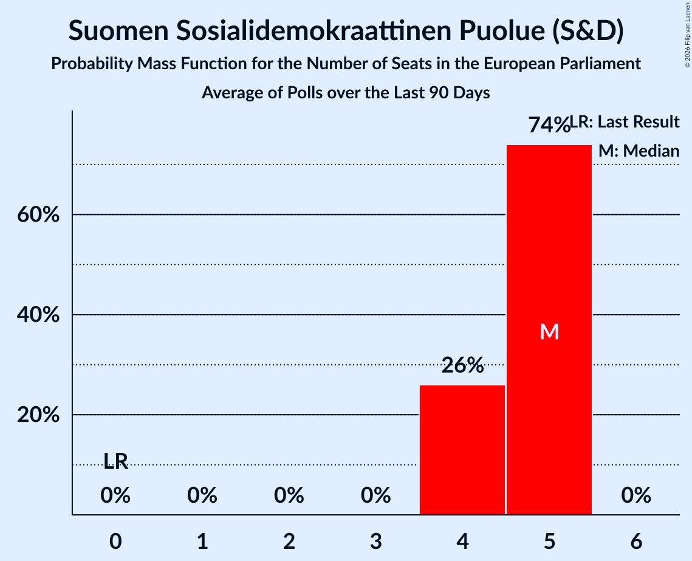

# Suomen Sosialidemokraattinen Puolue (S&D)

<a href="#voting-intentions">Voting Intentions</a> | <a href="#seats">Seats</a>

## Voting Intentions

Last result: **12.3%** (General Election of 26 May 2019)

### Confidence Intervals

| Period     | Polling firm/Commissioner(s) | Median | 80% Confidence Interval | 90% Confidence Interval | 95% Confidence Interval | 99% Confidence Interval |
|:----------:|:----------------:|:-----------:|:-----------------------:|:-----------------------:|:-----------------------:|:-----------------------:|
| N/A | [Poll Average](average.html) | 16.6% | 15.2–18.1% | 14.9–18.6% | 14.6–18.9% | 14.0–19.6% |
| [5 June–2 July 2019](2019-07-02-Taloustutkimus.html) | Taloustutkimus   Yle | 16.1% | 15.1–17.3% | 14.8–17.6% | 14.5–17.8% | 14.1–18.4% |
| [3–28 June 2019](2019-06-28-KantarTNS.html) | Kantar TNS   Helsingin Sanomat | 17.5% | 16.4–18.7% | 16.0–19.1% | 15.8–19.4% | 15.2–20.0% |
| [4–14 June 2019](2019-06-14-Tietoykkönen.html) | Tietoykkönen   Iltalehti and Uusi Suomi | 16.2% | 14.9–17.6% | 14.6–18.0% | 14.3–18.3% | 13.7–19.0% |
| [13 May–4 June 2019](2019-06-04-Taloustutkimus.html) | Taloustutkimus   Yle | 17.4% | 16.0–19.0% | 15.6–19.4% | 15.3–19.8% | 14.6–20.5% |
| [6 May–2 June 2019](2019-06-02-KantarTNS.html) | Kantar TNS   Helsingin Sanomat | 17.5% | 16.4–18.7% | 16.1–19.0% | 15.8–19.3% | 15.3–19.9% |

### Probability Mass Function

The following table shows the probability mass function per percentage block of voting intentions for the [poll average](average.html) for Suomen Sosialidemokraattinen Puolue (S&D).

| Voting Intentions | Probability | Accumulated | Special Marks |
|:-----------------:|:-----------:|:-----------:|:-------------:|
| 11.5–12.5% | 0% | 100% | Last Result |
| 12.5–13.5% | 0.1% | 100% |  |
| 13.5–14.5% | 2% | 99.9% |  |
| 14.5–15.5% | 14% | 98% |  |
| 15.5–16.5% | 32% | 83% |  |
| 16.5–17.5% | 30% | 52% | Median |
| 17.5–18.5% | 16% | 22% |  |
| 18.5–19.5% | 5% | 5% |  |
| 19.5–20.5% | 0.5% | 0.6% |  |
| 20.5–21.5% | 0% | 0% |  |

## Seats

Last result: **2** seats (General Election of 26 May 2019)

### Confidence Intervals

| Period     | Polling firm/Commissioner(s) | Median | 80% Confidence Interval | 90% Confidence Interval | 95% Confidence Interval | 99% Confidence Interval |
|:----------:|:----------------:|:------:|:-----------------------:|:-----------------------:|:-----------------------:|:-----------------------:|
| N/A | [Poll Average](average.html) | 2 | 2–3 | 2–3 | 2–3 | 2–3 |
| [5 June–2 July 2019](2019-07-02-Taloustutkimus.html) | Taloustutkimus   Yle | 2 | 2–3 | 2–3 | 2–3 | 2–3 |
| [3–28 June 2019](2019-06-28-KantarTNS.html) | Kantar TNS   Helsingin Sanomat | 3 | 2–3 | 2–3 | 2–3 | 2–3 |
| [4–14 June 2019](2019-06-14-Tietoykkönen.html) | Tietoykkönen   Iltalehti and Uusi Suomi | 2 | 2–3 | 2–3 | 2–3 | 2–3 |
| [13 May–4 June 2019](2019-06-04-Taloustutkimus.html) | Taloustutkimus   Yle | 3 | 2–3 | 2–3 | 2–3 | 2–3 |
| [6 May–2 June 2019](2019-06-02-KantarTNS.html) | Kantar TNS   Helsingin Sanomat | 3 | 2–3 | 2–3 | 2–3 | 2–3 |

### Probability Mass Function

The following table shows the probability mass function per seat for the [poll average](average.html) for Suomen Sosialidemokraattinen Puolue (S&D).

| Number of Seats | Probability | Accumulated | Special Marks |
|:---------------:|:-----------:|:-----------:|:-------------:|
| 2 | 60% | 100% | Last Result, Median |
| 3 | 40% | 40% |  |
| 4 | 0% | 0% |  |

