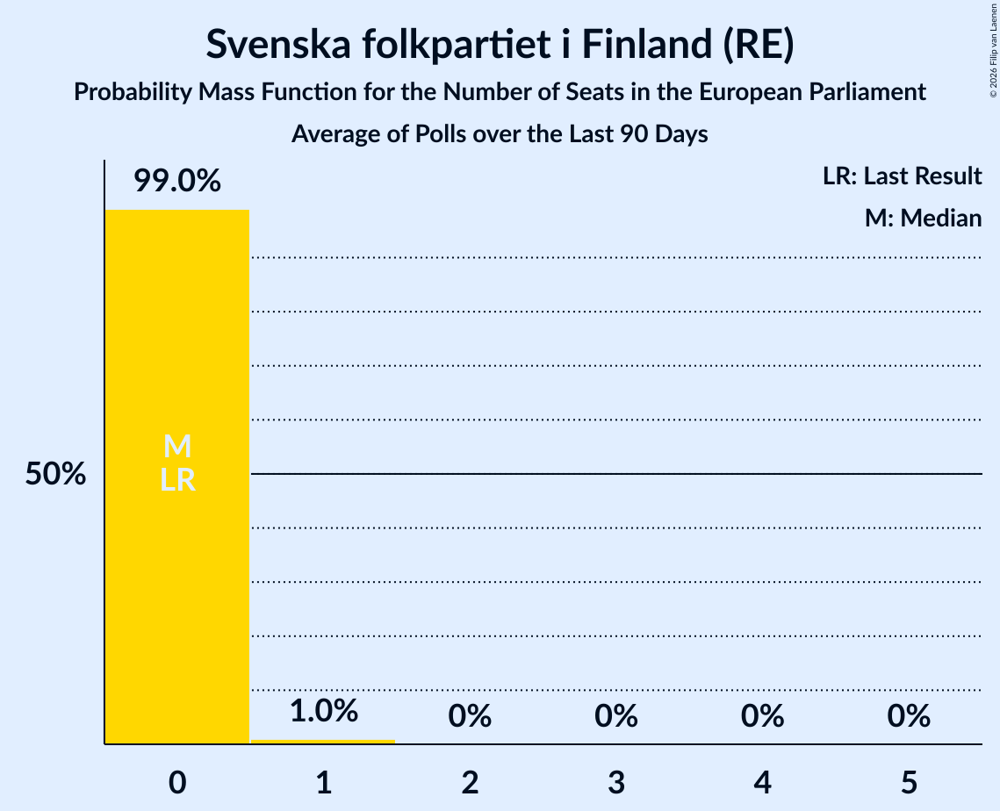

# Svenska folkpartiet i Finland (RE)

<a href="#voting-intentions">Voting Intentions</a> | <a href="#seats">Seats</a>

## Voting Intentions

Last result: **6.8%** (General Election of 26 May 2019)

### Confidence Intervals

| Period     | Polling firm/Commissioner(s) | Median | 80% Confidence Interval | 90% Confidence Interval | 95% Confidence Interval | 99% Confidence Interval |
|:----------:|:----------------:|:-----------:|:-----------------------:|:-----------------------:|:-----------------------:|:-----------------------:|
| N/A | [Poll Average](average.html) | 4.5% | 3.9–5.1% | 3.8–5.3% | 3.7–5.4% | 3.4–5.8% |
| [14 June–6 July 2021](2021-07-06-Taloustutkimus.html) | Taloustutkimus   Yle | 4.5% | 3.9–5.2% | 3.8–5.4% | 3.6–5.5% | 3.4–5.9% |
| [12 April–7 May 2021](2021-05-07-KantarTNS.html) | Kantar TNS   Helsingin Sanomat | 4.4% | 3.9–5.0% | 3.8–5.2% | 3.6–5.3% | 3.4–5.6% |
| [15 March–9 April 2021](2021-04-09-KantarTNS.html) | Kantar TNS   Helsingin Sanomat | 4.3% | 3.8–4.9% | 3.7–5.0% | 3.6–5.2% | 3.4–5.5% |
| [15 February–12 March 2021](2021-03-12-KantarTNS.html) | Kantar TNS   Helsingin Sanomat | 4.4% | 3.9–5.0% | 3.7–5.1% | 3.6–5.3% | 3.4–5.6% |
| [18 January–12 February 2021](2021-02-12-KantarTNS.html) | Kantar TNS   Helsingin Sanomat | 4.2% | 3.7–4.8% | 3.6–4.9% | 3.5–5.1% | 3.2–5.3% |
| [21 December 2020–15 January 2021](2021-01-15-KantarTNS.html) | Kantar TNS   Helsingin Sanomat | 4.3% | 3.8–5.0% | 3.6–5.2% | 3.5–5.4% | 3.2–5.7% |
| [2 December 2020–5 January 2021](2021-01-05-Taloustutkimus.html) | Taloustutkimus   Yle | 4.3% | 3.7–5.1% | 3.5–5.3% | 3.4–5.5% | 3.1–5.9% |
| [23 November–18 December 2020](2020-12-18-KantarTNS.html) | Kantar TNS   Helsingin Sanomat | 4.3% | 3.7–5.0% | 3.6–5.2% | 3.5–5.3% | 3.2–5.6% |
| [9 November–1 December 2020](2020-12-01-Taloustutkimus.html) | Taloustutkimus   Yle | 4.4% | 3.9–5.1% | 3.7–5.3% | 3.6–5.4% | 3.3–5.8% |
| [19 October–20 November 2020](2020-11-20-KantarTNS.html) | Kantar TNS   Helsingin Sanomat | 4.4% | 3.8–5.0% | 3.7–5.2% | 3.6–5.4% | 3.3–5.7% |
| [12 October–3 November 2020](2020-11-03-Taloustutkimus.html) | Taloustutkimus   Yle | 4.3% | 3.7–5.0% | 3.5–5.2% | 3.4–5.4% | 3.1–5.7% |
| [14 September–16 October 2020](2020-10-16-KantarTNS.html) | Kantar TNS   Helsingin Sanomat | 4.4% | 3.9–5.1% | 3.7–5.3% | 3.6–5.5% | 3.3–5.8% |
| [7 September–6 October 2020](2020-10-06-Taloustutkimus.html) | Taloustutkimus | 4.5% | 3.9–5.3% | 3.7–5.5% | 3.6–5.7% | 3.3–6.1% |
| [17 August–12 September 2020](2020-09-12-KantarTNS.html) | Kantar TNS   Helsingin Sanomat | 4.3% | 3.7–5.0% | 3.6–5.2% | 3.4–5.4% | 3.2–5.7% |
| [10 August–1 September 2020](2020-09-01-Taloustutkimus.html) | Taloustutkimus   Yle | 4.1% | 3.5–4.8% | 3.4–5.0% | 3.2–5.2% | 3.0–5.5% |
| [13 July–14 August 2020](2020-08-14-KantarTNS.html) | Kantar TNS   Helsingin Sanomat | 4.4% | 3.8–5.1% | 3.7–5.3% | 3.5–5.4% | 3.3–5.8% |
| [6 July–4 August 2020](2020-08-04-Taloustutkimus.html) | Taloustutkimus   Yle | 4.0% | 3.4–4.7% | 3.3–4.9% | 3.1–5.1% | 2.9–5.4% |
| [15 June–10 July 2020](2020-07-10-KantarTNS.html) | Kantar TNS   Helsingin Sanomat | 4.4% | 3.8–5.2% | 3.6–5.4% | 3.5–5.6% | 3.2–5.9% |
| [3–30 June 2020](2020-06-30-Taloustutkimus.html) | Taloustutkimus   Yle | 4.3% | 3.7–5.0% | 3.5–5.2% | 3.4–5.4% | 3.1–5.8% |
| [18 May–14 June 2020](2020-06-14-KantarTNS.html) | Kantar TNS   Helsingin Sanomat | 4.4% | 3.9–5.0% | 3.7–5.2% | 3.6–5.3% | 3.4–5.7% |
| [11 May–2 June 2020](2020-06-02-Taloustutkimus.html) | Taloustutkimus   Yle | 3.9% | 3.3–4.6% | 3.2–4.8% | 3.0–4.9% | 2.8–5.3% |
| [20 April–14 May 2020](2020-05-14-KantarTNS.html) | Kantar TNS   Helsingin Sanomat | 4.3% | 3.7–5.0% | 3.5–5.2% | 3.4–5.4% | 3.1–5.7% |
| [14 April–5 May 2020](2020-05-05-Taloustutkimus.html) | Taloustutkimus   Yle | 4.1% | 3.5–4.8% | 3.4–5.0% | 3.2–5.2% | 3.0–5.6% |
| [14–29 April 2020](2020-04-29-Tietoykkönen.html) | Tietoykkönen   Iltalehti and Uusi Suomi | 4.0% | 3.4–4.8% | 3.2–5.1% | 3.0–5.3% | 2.8–5.7% |
| [16 March–15 April 2020](2020-04-15-KantarTNS.html) | Kantar TNS   Helsingin Sanomat | 4.2% | 3.6–4.9% | 3.5–5.1% | 3.3–5.2% | 3.1–5.6% |
| [4 March–7 April 2020](2020-04-07-Taloustutkimus.html) | Taloustutkimus   Yle | 4.1% | 3.6–4.6% | 3.5–4.8% | 3.4–4.9% | 3.2–5.2% |
| [20–27 March 2020](2020-03-27-Tietoykkönen.html) | Tietoykkönen   Iltalehti and Uusi Suomi | 4.6% | 3.8–5.6% | 3.6–5.9% | 3.4–6.1% | 3.1–6.6% |
| [15 February–13 March 2020](2020-03-13-KantarTNS.html) | Kantar TNS   Helsingin Sanomat | 4.4% | 3.9–5.0% | 3.7–5.2% | 3.6–5.3% | 3.4–5.6% |
| [5 February–3 March 2020](2020-03-03-Taloustutkimus.html) | Taloustutkimus   Yle | 4.1% | 3.6–4.7% | 3.5–4.8% | 3.4–5.0% | 3.2–5.3% |
| [19 January–14 February 2020](2020-02-14-KantarTNS.html) | Kantar TNS   Helsingin Sanomat | 4.2% | 3.7–4.8% | 3.6–5.0% | 3.4–5.2% | 3.2–5.5% |
| [21 January–10 February 2020](2020-02-10-Tietoykkönen.html) | Tietoykkönen   Iltalehti and Uusi Suomi | 4.3% | 3.6–5.2% | 3.5–5.4% | 3.3–5.6% | 3.0–6.1% |
| [13 January–4 February 2020](2020-02-04-Taloustutkimus.html) | Taloustutkimus   Yle | 4.4% | 3.9–5.1% | 3.7–5.2% | 3.6–5.4% | 3.4–5.7% |
| [23 December 2019–17 January 2020](2020-01-17-KantarTNS.html) | Kantar TNS   Helsingin Sanomat | 4.3% | 3.8–4.9% | 3.6–5.1% | 3.5–5.2% | 3.3–5.5% |
| [9 December 2019–8 January 2020](2020-01-08-Taloustutkimus.html) | Taloustutkimus   Yle | 3.9% | 3.2–4.8% | 3.0–5.0% | 2.8–5.2% | 2.5–5.7% |
| [25 November–20 December 2019](2019-12-20-KantarTNS.html) | Kantar TNS   Helsingin Sanomat | 4.5% | 3.9–5.2% | 3.7–5.4% | 3.6–5.6% | 3.3–6.0% |
| [11 November–3 December 2019](2019-12-03-Taloustutkimus.html) | Taloustutkimus   Yle | 3.9% | 3.4–4.5% | 3.2–4.6% | 3.1–4.8% | 2.9–5.1% |
| [24 October–21 November 2019](2019-11-21-KantarTNS.html) | Kantar TNS   Helsingin Sanomat | 4.3% | 3.7–5.0% | 3.6–5.2% | 3.4–5.4% | 3.2–5.8% |
| [2 October–5 November 2019](2019-11-05-Taloustutkimus.html) | Taloustutkimus   Yle | 4.3% | 3.8–4.9% | 3.7–5.0% | 3.6–5.2% | 3.3–5.5% |
| [23 September–21 October 2019](2019-10-21-KantarTNS.html) | Kantar TNS   Helsingin Sanomat | 4.3% | 3.7–5.1% | 3.6–5.3% | 3.4–5.4% | 3.2–5.8% |
| [17 September–8 October 2019](2019-10-08-Tietoykkönen.html) | Tietoykkönen   Iltalehti and Uusi Suomi | 4.2% | 3.5–5.0% | 3.4–5.3% | 3.2–5.5% | 2.9–5.9% |
| [9 September–1 October 2019](2019-10-01-Taloustutkimus.html) | Taloustutkimus   Yle | 3.9% | 3.3–4.5% | 3.2–4.7% | 3.1–4.9% | 2.8–5.2% |
| [26 August–22 September 2019](2019-09-22-KantarTNS.html) | Kantar TNS   Helsingin Sanomat | 4.4% | 3.8–5.1% | 3.7–5.3% | 3.5–5.5% | 3.3–5.9% |
| [12 August–3 September 2019](2019-09-03-Taloustutkimus.html) | Taloustutkimus   Yle | 3.8% | 3.3–4.5% | 3.1–4.7% | 3.0–4.8% | 2.7–5.2% |
| [29 July–23 August 2019](2019-08-23-KantarTNS.html) | Kantar TNS   Helsingin Sanomat | 4.4% | 3.8–5.1% | 3.7–5.3% | 3.5–5.5% | 3.2–5.9% |
| [8 July–6 August 2019](2019-08-06-Taloustutkimus.html) | Taloustutkimus   Yle | 4.3% | 3.7–5.0% | 3.6–5.2% | 3.4–5.3% | 3.2–5.7% |
| [1–27 July 2019](2019-07-27-KantarTNS.html) | Kantar TNS   Helsingin Sanomat | 4.5% | 3.9–5.2% | 3.7–5.5% | 3.6–5.6% | 3.3–6.0% |
| [5 June–2 July 2019](2019-07-02-Taloustutkimus.html) | Taloustutkimus   Yle | 4.6% | 4.0–5.3% | 3.9–5.5% | 3.7–5.7% | 3.5–6.0% |
| [3–28 June 2019](2019-06-28-KantarTNS.html) | Kantar TNS   Helsingin Sanomat | 4.4% | 3.8–5.1% | 3.7–5.3% | 3.5–5.5% | 3.3–5.9% |
| [4–14 June 2019](2019-06-14-Tietoykkönen.html) | Tietoykkönen   Iltalehti and Uusi Suomi | 4.8% | 4.1–5.7% | 3.9–5.9% | 3.8–6.2% | 3.5–6.6% |
| [13 May–4 June 2019](2019-06-04-Taloustutkimus.html) | Taloustutkimus   Yle | 4.5% | 3.7–5.4% | 3.6–5.6% | 3.4–5.9% | 3.1–6.3% |
| [6 May–2 June 2019](2019-06-02-KantarTNS.html) | Kantar TNS   Helsingin Sanomat | 4.5% | 3.9–5.2% | 3.8–5.4% | 3.6–5.5% | 3.4–5.9% |

### Probability Mass Function

The following table shows the probability mass function per percentage block of voting intentions for the [poll average](average.html) for Svenska folkpartiet i Finland (RE).

| Voting Intentions | Probability | Accumulated | Special Marks |
|:-----------------:|:-----------:|:-----------:|:-------------:|
| 1.5–2.5% | 0% | 100% |  |
| 2.5–3.5% | 1.3% | 100% |  |
| 3.5–4.5% | 56% | 98.7% | Median |
| 4.5–5.5% | 41% | 43% |  |
| 5.5–6.5% | 1.5% | 1.5% |  |
| 6.5–7.5% | 0% | 0% | Last Result |

## Seats

Last result: **1** seats (General Election of 26 May 2019)

### Confidence Intervals

| Period     | Polling firm/Commissioner(s) | Median | 80% Confidence Interval | 90% Confidence Interval | 95% Confidence Interval | 99% Confidence Interval |
|:----------:|:----------------:|:------:|:-----------------------:|:-----------------------:|:-----------------------:|:-----------------------:|
| N/A | [Poll Average](average.html) | 0 | 0 | 0–1 | 0–1 | 0–1 |
| [14 June–6 July 2021](2021-07-06-Taloustutkimus.html) | Taloustutkimus   Yle | 0 | 0 | 0–1 | 0–1 | 0–1 |
| [12 April–7 May 2021](2021-05-07-KantarTNS.html) | Kantar TNS   Helsingin Sanomat | 0 | 0 | 0 | 0–1 | 0–1 |
| [15 March–9 April 2021](2021-04-09-KantarTNS.html) | Kantar TNS   Helsingin Sanomat | 0 | 0 | 0 | 0 | 0–1 |
| [15 February–12 March 2021](2021-03-12-KantarTNS.html) | Kantar TNS   Helsingin Sanomat | 0 | 0 | 0 | 0–1 | 0–1 |
| [18 January–12 February 2021](2021-02-12-KantarTNS.html) | Kantar TNS   Helsingin Sanomat | 0 | 0 | 0 | 0 | 0–1 |
| [21 December 2020–15 January 2021](2021-01-15-KantarTNS.html) | Kantar TNS   Helsingin Sanomat | 0 | 0 | 0 | 0–1 | 0–1 |
| [2 December 2020–5 January 2021](2021-01-05-Taloustutkimus.html) | Taloustutkimus   Yle | 0 | 0 | 0 | 0–1 | 0–1 |
| [23 November–18 December 2020](2020-12-18-KantarTNS.html) | Kantar TNS   Helsingin Sanomat | 0 | 0 | 0 | 0–1 | 0–1 |
| [9 November–1 December 2020](2020-12-01-Taloustutkimus.html) | Taloustutkimus   Yle | 0 | 0 | 0 | 0–1 | 0–1 |
| [19 October–20 November 2020](2020-11-20-KantarTNS.html) | Kantar TNS   Helsingin Sanomat | 0 | 0 | 0–1 | 0–1 | 0–1 |
| [12 October–3 November 2020](2020-11-03-Taloustutkimus.html) | Taloustutkimus   Yle | 0 | 0 | 0 | 0–1 | 0–1 |
| [14 September–16 October 2020](2020-10-16-KantarTNS.html) | Kantar TNS   Helsingin Sanomat | 0 | 0 | 0 | 0–1 | 0–1 |
| [7 September–6 October 2020](2020-10-06-Taloustutkimus.html) | Taloustutkimus | 0 | 0 | 0 | 0–1 | 0–1 |
| [17 August–12 September 2020](2020-09-12-KantarTNS.html) | Kantar TNS   Helsingin Sanomat | 0 | 0 | 0 | 0–1 | 0–1 |
| [10 August–1 September 2020](2020-09-01-Taloustutkimus.html) | Taloustutkimus   Yle | 0 | 0 | 0 | 0 | 0–1 |
| [13 July–14 August 2020](2020-08-14-KantarTNS.html) | Kantar TNS   Helsingin Sanomat | 0 | 0 | 0 | 0–1 | 0–1 |
| [6 July–4 August 2020](2020-08-04-Taloustutkimus.html) | Taloustutkimus   Yle | 0 | 0 | 0 | 0 | 0 |
| [15 June–10 July 2020](2020-07-10-KantarTNS.html) | Kantar TNS   Helsingin Sanomat | 0 | 0 | 0 | 0–1 | 0–1 |
| [3–30 June 2020](2020-06-30-Taloustutkimus.html) | Taloustutkimus   Yle | 0 | 0 | 0 | 0 | 0–1 |
| [18 May–14 June 2020](2020-06-14-KantarTNS.html) | Kantar TNS   Helsingin Sanomat | 0 | 0 | 0 | 0 | 0–1 |
| [11 May–2 June 2020](2020-06-02-Taloustutkimus.html) | Taloustutkimus   Yle | 0 | 0 | 0 | 0 | 0 |
| [20 April–14 May 2020](2020-05-14-KantarTNS.html) | Kantar TNS   Helsingin Sanomat | 0 | 0 | 0 | 0 | 0–1 |
| [14 April–5 May 2020](2020-05-05-Taloustutkimus.html) | Taloustutkimus   Yle | 0 | 0 | 0 | 0 | 0–1 |
| [14–29 April 2020](2020-04-29-Tietoykkönen.html) | Tietoykkönen   Iltalehti and Uusi Suomi | 0 | 0 | 0 | 0 | 0–1 |
| [16 March–15 April 2020](2020-04-15-KantarTNS.html) | Kantar TNS   Helsingin Sanomat | 0 | 0 | 0 | 0–1 | 0–1 |
| [4 March–7 April 2020](2020-04-07-Taloustutkimus.html) | Taloustutkimus   Yle | 0 | 0 | 0 | 0 | 0 |
| [20–27 March 2020](2020-03-27-Tietoykkönen.html) | Tietoykkönen   Iltalehti and Uusi Suomi | 0 | 0–1 | 0–1 | 0–1 | 0–1 |
| [15 February–13 March 2020](2020-03-13-KantarTNS.html) | Kantar TNS   Helsingin Sanomat | 0 | 0 | 0 | 0 | 0–1 |
| [5 February–3 March 2020](2020-03-03-Taloustutkimus.html) | Taloustutkimus   Yle | 0 | 0 | 0 | 0 | 0 |
| [19 January–14 February 2020](2020-02-14-KantarTNS.html) | Kantar TNS   Helsingin Sanomat | 0 | 0 | 0 | 0 | 0–1 |
| [21 January–10 February 2020](2020-02-10-Tietoykkönen.html) | Tietoykkönen   Iltalehti and Uusi Suomi | 0 | 0 | 0–1 | 0–1 | 0–1 |
| [13 January–4 February 2020](2020-02-04-Taloustutkimus.html) | Taloustutkimus   Yle | 0 | 0 | 0 | 0–1 | 0–1 |
| [23 December 2019–17 January 2020](2020-01-17-KantarTNS.html) | Kantar TNS   Helsingin Sanomat | 0 | 0 | 0 | 0 | 0–1 |
| [9 December 2019–8 January 2020](2020-01-08-Taloustutkimus.html) | Taloustutkimus   Yle | 0 | 0 | 0 | 0 | 0–1 |
| [25 November–20 December 2019](2019-12-20-KantarTNS.html) | Kantar TNS   Helsingin Sanomat | 0 | 0 | 0–1 | 0–1 | 0–1 |
| [11 November–3 December 2019](2019-12-03-Taloustutkimus.html) | Taloustutkimus   Yle | 0 | 0 | 0 | 0 | 0 |
| [24 October–21 November 2019](2019-11-21-KantarTNS.html) | Kantar TNS   Helsingin Sanomat | 0 | 0 | 0 | 0–1 | 0–1 |
| [2 October–5 November 2019](2019-11-05-Taloustutkimus.html) | Taloustutkimus   Yle | 0 | 0 | 0 | 0 | 0–1 |
| [23 September–21 October 2019](2019-10-21-KantarTNS.html) | Kantar TNS   Helsingin Sanomat | 0 | 0 | 0 | 0–1 | 0–1 |
| [17 September–8 October 2019](2019-10-08-Tietoykkönen.html) | Tietoykkönen   Iltalehti and Uusi Suomi | 0 | 0 | 0 | 0–1 | 0–1 |
| [9 September–1 October 2019](2019-10-01-Taloustutkimus.html) | Taloustutkimus   Yle | 0 | 0 | 0 | 0 | 0–1 |
| [26 August–22 September 2019](2019-09-22-KantarTNS.html) | Kantar TNS   Helsingin Sanomat | 0 | 0 | 0 | 0–1 | 0–1 |
| [12 August–3 September 2019](2019-09-03-Taloustutkimus.html) | Taloustutkimus   Yle | 0 | 0 | 0 | 0 | 0 |
| [29 July–23 August 2019](2019-08-23-KantarTNS.html) | Kantar TNS   Helsingin Sanomat | 0 | 0 | 0 | 0 | 0–1 |
| [8 July–6 August 2019](2019-08-06-Taloustutkimus.html) | Taloustutkimus   Yle | 0 | 0 | 0 | 0–1 | 0–1 |
| [1–27 July 2019](2019-07-27-KantarTNS.html) | Kantar TNS   Helsingin Sanomat | 0 | 0 | 0 | 0–1 | 0–1 |
| [5 June–2 July 2019](2019-07-02-Taloustutkimus.html) | Taloustutkimus   Yle | 0 | 0 | 0–1 | 0–1 | 0–1 |
| [3–28 June 2019](2019-06-28-KantarTNS.html) | Kantar TNS   Helsingin Sanomat | 0 | 0 | 0 | 0–1 | 0–1 |
| [4–14 June 2019](2019-06-14-Tietoykkönen.html) | Tietoykkönen   Iltalehti and Uusi Suomi | 0 | 0–1 | 0–1 | 0–1 | 0–1 |
| [13 May–4 June 2019](2019-06-04-Taloustutkimus.html) | Taloustutkimus   Yle | 0 | 0 | 0–1 | 0–1 | 0–1 |
| [6 May–2 June 2019](2019-06-02-KantarTNS.html) | Kantar TNS   Helsingin Sanomat | 0 | 0 | 0–1 | 0–1 | 0–1 |

### Probability Mass Function

The following table shows the probability mass function per seat for the [poll average](average.html) for Svenska folkpartiet i Finland (RE).

| Number of Seats | Probability | Accumulated | Special Marks |
|:---------------:|:-----------:|:-----------:|:-------------:|
| 0 | 94% | 100% | Median |
| 1 | 6% | 6% | Last Result |
| 2 | 0% | 0% |  |

