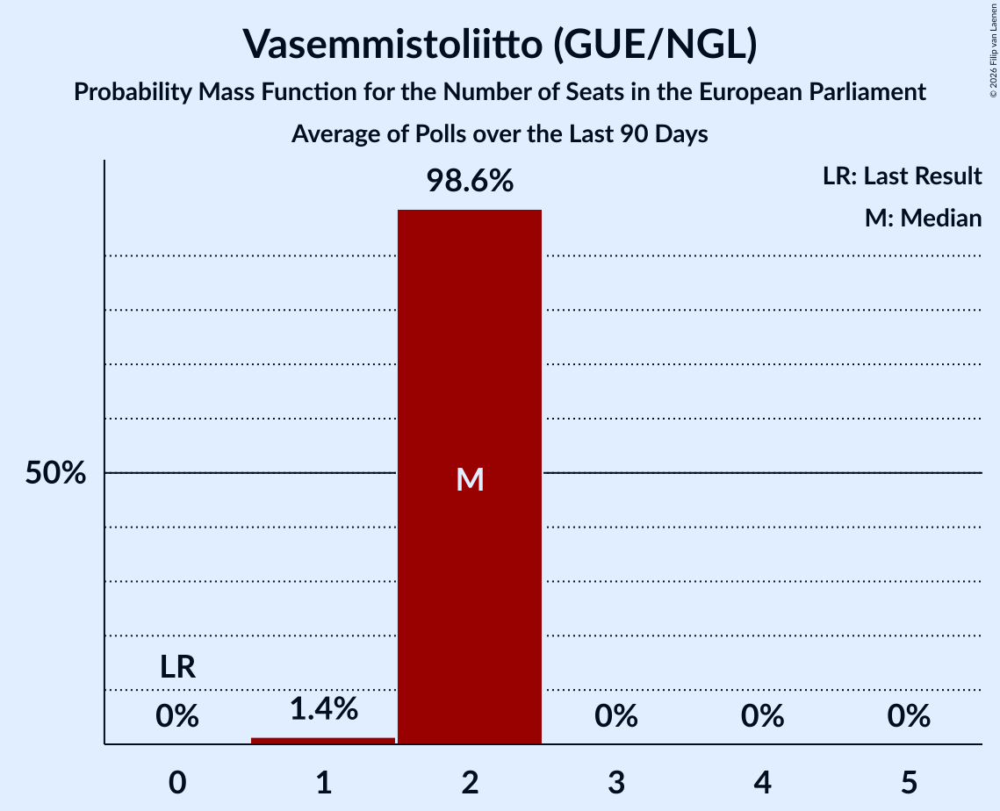

# Vasemmistoliitto (GUE/NGL)

<a href="#voting-intentions">Voting Intentions</a> | <a href="#seats">Seats</a>

## Voting Intentions

Last result: **0.0%** (General Election of 9 June 2024)

### Confidence Intervals

| Period     | Polling firm/Commissioner(s) | Median | 80% Confidence Interval | 90% Confidence Interval | 95% Confidence Interval | 99% Confidence Interval |
|:----------:|:----------------:|:-----------:|:-----------------------:|:-----------------------:|:-----------------------:|:-----------------------:|
| N/A | [Poll Average](average.html) | 9.5% | 8.7–10.2% | 8.5–10.5% | 8.4–10.7% | 8.0–11.2% |
| [6 October–4 November 2025](2025-11-04-Taloustutkimus.html) | Taloustutkimus   Yle | 9.5% | 8.7–10.4% | 8.4–10.7% | 8.2–10.9% | 7.9–11.4% |
| [15 September–12 October 2025](2025-10-12-Verian.html) | Verian   Helsingin Sanomat | 9.4% | 8.8–10.1% | 8.6–10.2% | 8.5–10.4% | 8.2–10.7% |
| [3–30 September 2025](2025-09-30-Taloustutkimus.html) | Taloustutkimus   Yle | 9.6% | 8.8–10.6% | 8.5–10.9% | 8.3–11.1% | 7.9–11.6% |
| [18 August–14 September 2025](2025-09-14-Verian.html) | Verian   Helsingin Sanomat | 9.7% | 9.1–10.3% | 8.9–10.5% | 8.8–10.7% | 8.5–11.0% |
| [11 August–2 September 2025](2025-09-02-Taloustutkimus.html) | Taloustutkimus   Yle | 9.5% | 8.6–10.5% | 8.4–10.8% | 8.2–11.0% | 7.8–11.5% |
| [15 July–17 August 2025](2025-08-17-Verian.html) | Verian   Helsingin Sanomat | 10.0% | 9.3–10.8% | 9.0–11.1% | 8.9–11.3% | 8.5–11.7% |
| [7 July–5 August 2025](2025-08-05-Taloustutkimus.html) | Taloustutkimus   Yle | 10.1% | 9.3–11.0% | 9.1–11.3% | 8.9–11.5% | 8.5–11.9% |
| [16 June–14 July 2025](2025-07-14-Verian.html) | Verian   Helsingin Sanomat | 9.8% | 9.1–10.6% | 8.8–10.8% | 8.7–11.0% | 8.3–11.4% |
| [9–30 June 2025](2025-06-30-Taloustutkimus.html) | Taloustutkimus   Yle | 9.8% | 8.9–10.7% | 8.7–11.0% | 8.5–11.2% | 8.1–11.7% |
| [19 May–16 June 2025](2025-06-16-Verian.html) | Verian   Helsingin Sanomat | 10.0% | 9.4–10.7% | 9.2–10.9% | 9.0–11.1% | 8.7–11.4% |
| [12 May–2 June 2025](2025-06-02-Taloustutkimus.html) | Taloustutkimus   Yle | 9.5% | 8.7–10.5% | 8.5–10.7% | 8.2–10.9% | 7.9–11.4% |
| [16 April–18 May 2025](2025-05-18-Verian.html) | Verian   Helsingin Sanomat | 10.1% | 9.4–10.8% | 9.2–11.0% | 9.1–11.2% | 8.8–11.6% |
| [14 April–6 May 2025](2025-05-06-Taloustutkimus.html) | Taloustutkimus   Yle | 9.4% | 8.6–10.3% | 8.3–10.6% | 8.1–10.8% | 7.8–11.3% |
| [10 March–7 April 2025](2025-04-07-Taloustutkimus.html) | Taloustutkimus   Yle | 9.0% | 8.2–9.9% | 7.9–10.2% | 7.7–10.4% | 7.4–10.9% |
| [18 February–16 March 2025](2025-03-16-Verian.html) | Verian   Helsingin Sanomat | 9.4% | 8.7–10.2% | 8.5–10.4% | 8.3–10.6% | 8.0–11.0% |
| [10 February–4 March 2025](2025-03-04-Taloustutkimus.html) | Taloustutkimus   Yle | 8.5% | 7.7–9.4% | 7.5–9.6% | 7.3–9.8% | 7.0–10.3% |
| [21 January–16 February 2025](2025-02-16-Verian.html) | Verian   Helsingin Sanomat | 9.1% | 8.4–9.8% | 8.3–10.0% | 8.1–10.2% | 7.8–10.6% |
| [13 January–3 February 2025](2025-02-03-Taloustutkimus.html) | Taloustutkimus   Yle | 9.2% | 8.4–10.1% | 8.2–10.4% | 8.0–10.6% | 7.7–11.0% |
| [16 December 2024–17 January 2025](2025-01-17-Verian.html) | Verian   Helsingin Sanomat | 8.7% | 7.9–9.6% | 7.7–9.8% | 7.5–10.1% | 7.1–10.5% |
| [9 December 2024–7 January 2025](2025-01-07-Taloustutkimus.html) | Taloustutkimus   Yle | 8.9% | 8.1–9.8% | 7.8–10.1% | 7.7–10.3% | 7.3–10.7% |
| [18 November–13 December 2024](2024-12-13-Verian.html) | Verian   Helsingin Sanomat | 8.5% | 7.7–9.4% | 7.5–9.7% | 7.3–9.9% | 6.9–10.3% |
| [6 November–3 December 2024](2024-12-03-Taloustutkimus.html) | Taloustutkimus   Yle | 8.8% | 8.0–9.7% | 7.8–10.0% | 7.6–10.2% | 7.2–10.7% |
| [14 October–15 November 2024](2024-11-15-Verian.html) | Verian   Helsingin Sanomat | 9.1% | 8.3–10.0% | 8.1–10.2% | 7.9–10.5% | 7.5–10.9% |
| [7 October–5 November 2024](2024-11-05-Taloustutkimus.html) | Taloustutkimus   Yle | 9.3% | 8.5–10.3% | 8.2–10.6% | 8.0–10.8% | 7.6–11.3% |
| [16 September–11 October 2024](2024-10-11-Verian.html) | Verian   Helsingin Sanomat | 8.6% | 7.8–9.5% | 7.6–9.8% | 7.4–10.0% | 7.0–10.5% |
| [4 September–1 October 2024](2024-10-01-Taloustutkimus.html) | Taloustutkimus   Yle | 9.3% | 8.5–10.2% | 8.3–10.5% | 8.1–10.7% | 7.7–11.1% |
| [19 August–13 September 2024](2024-09-13-Verian.html) | Verian   Helsingin Sanomat | 8.9% | 8.2–9.7% | 8.0–9.9% | 7.8–10.1% | 7.5–10.5% |
| [12 August–3 September 2024](2024-09-03-Taloustutkimus.html) | Taloustutkimus   Yle | 9.3% | 8.5–10.3% | 8.2–10.6% | 8.0–10.8% | 7.6–11.3% |
| [15 July–16 August 2024](2024-08-16-Verian.html) | Verian   Helsingin Sanomat | 10.1% | 9.4–10.9% | 9.2–11.2% | 9.0–11.4% | 8.7–11.8% |
| [8 July–6 August 2024](2024-08-06-Taloustutkimus.html) | Taloustutkimus   Yle | 10.9% | 10.0–11.9% | 9.8–12.2% | 9.5–12.4% | 9.1–12.9% |
| [17 June–12 July 2024](2024-07-12-Verian.html) | Verian   Helsingin Sanomat | 10.0% | 9.3–10.8% | 9.0–11.1% | 8.9–11.3% | 8.5–11.7% |
| [7 June–2 July 2024](2024-07-02-Taloustutkimus.html) | Taloustutkimus   Yle | 11.6% | 10.7–12.6% | 10.5–12.9% | 10.3–13.1% | 9.8–13.6% |
| [20 May–14 June 2024](2024-06-14-Verian.html) | Verian   Helsingin Sanomat | 9.9% | 9.2–10.7% | 8.9–11.0% | 8.8–11.2% | 8.4–11.6% |

### Probability Mass Function

The following table shows the probability mass function per percentage block of voting intentions for the [poll average](average.html) for Vasemmistoliitto (GUE/NGL).

| Voting Intentions | Probability | Accumulated | Special Marks |
|:-----------------:|:-----------:|:-----------:|:-------------:|
| 0.0–0.5% | 0% | 100% | Last Result |
| 0.5–1.5% | 0% | 100% |  |
| 1.5–2.5% | 0% | 100% |  |
| 2.5–3.5% | 0% | 100% |  |
| 3.5–4.5% | 0% | 100% |  |
| 4.5–5.5% | 0% | 100% |  |
| 5.5–6.5% | 0% | 100% |  |
| 6.5–7.5% | 0% | 100% |  |
| 7.5–8.5% | 5% | 100% |  |
| 8.5–9.5% | 52% | 95% | Median |
| 9.5–10.5% | 39% | 43% |  |
| 10.5–11.5% | 4% | 4% |  |
| 11.5–12.5% | 0.1% | 0.1% |  |
| 12.5–13.5% | 0% | 0% |  |

## Seats

Last result: **0** seats (General Election of 9 June 2024)

### Confidence Intervals

| Period     | Polling firm/Commissioner(s) | Median | 80% Confidence Interval | 90% Confidence Interval | 95% Confidence Interval | 99% Confidence Interval |
|:----------:|:----------------:|:------:|:-----------------------:|:-----------------------:|:-----------------------:|:-----------------------:|
| N/A | [Poll Average](average.html) | 1 | 1–2 | 1–2 | 1–2 | 1–2 |
| [6 October–4 November 2025](2025-11-04-Taloustutkimus.html) | Taloustutkimus   Yle | 1 | 1–2 | 1–2 | 1–2 | 1–2 |
| [15 September–12 October 2025](2025-10-12-Verian.html) | Verian   Helsingin Sanomat | 1 | 1–2 | 1–2 | 1–2 | 1–2 |
| [3–30 September 2025](2025-09-30-Taloustutkimus.html) | Taloustutkimus   Yle | 1 | 1–2 | 1–2 | 1–2 | 1–2 |
| [18 August–14 September 2025](2025-09-14-Verian.html) | Verian   Helsingin Sanomat | 1 | 1–2 | 1–2 | 1–2 | 1–2 |
| [11 August–2 September 2025](2025-09-02-Taloustutkimus.html) | Taloustutkimus   Yle | 1 | 1–2 | 1–2 | 1–2 | 1–2 |
| [15 July–17 August 2025](2025-08-17-Verian.html) | Verian   Helsingin Sanomat | 1 | 1–2 | 1–2 | 1–2 | 1–2 |
| [7 July–5 August 2025](2025-08-05-Taloustutkimus.html) | Taloustutkimus   Yle | 2 | 1–2 | 1–2 | 1–2 | 1–2 |
| [16 June–14 July 2025](2025-07-14-Verian.html) | Verian   Helsingin Sanomat | 1 | 1–2 | 1–2 | 1–2 | 1–2 |
| [9–30 June 2025](2025-06-30-Taloustutkimus.html) | Taloustutkimus   Yle | 1 | 1–2 | 1–2 | 1–2 | 1–2 |
| [19 May–16 June 2025](2025-06-16-Verian.html) | Verian   Helsingin Sanomat | 1 | 1–2 | 1–2 | 1–2 | 1–2 |
| [12 May–2 June 2025](2025-06-02-Taloustutkimus.html) | Taloustutkimus   Yle | 1 | 1–2 | 1–2 | 1–2 | 1–2 |
| [16 April–18 May 2025](2025-05-18-Verian.html) | Verian   Helsingin Sanomat | 1 | 1–2 | 1–2 | 1–2 | 1–2 |
| [14 April–6 May 2025](2025-05-06-Taloustutkimus.html) | Taloustutkimus   Yle | 1 | 1–2 | 1–2 | 1–2 | 1–2 |
| [10 March–7 April 2025](2025-04-07-Taloustutkimus.html) | Taloustutkimus   Yle | 1 | 1 | 1–2 | 1–2 | 1–2 |
| [18 February–16 March 2025](2025-03-16-Verian.html) | Verian   Helsingin Sanomat | 1 | 1–2 | 1–2 | 1–2 | 1–2 |
| [10 February–4 March 2025](2025-03-04-Taloustutkimus.html) | Taloustutkimus   Yle | 1 | 1 | 1 | 1 | 1–2 |
| [21 January–16 February 2025](2025-02-16-Verian.html) | Verian   Helsingin Sanomat | 1 | 1–2 | 1–2 | 1–2 | 1–2 |
| [13 January–3 February 2025](2025-02-03-Taloustutkimus.html) | Taloustutkimus   Yle | 1 | 1–2 | 1–2 | 1–2 | 1–2 |
| [16 December 2024–17 January 2025](2025-01-17-Verian.html) | Verian   Helsingin Sanomat | 1 | 1 | 1–2 | 1–2 | 1–2 |
| [9 December 2024–7 January 2025](2025-01-07-Taloustutkimus.html) | Taloustutkimus   Yle | 1 | 1 | 1–2 | 1–2 | 1–2 |
| [18 November–13 December 2024](2024-12-13-Verian.html) | Verian   Helsingin Sanomat | 1 | 1 | 1–2 | 1–2 | 1–2 |
| [6 November–3 December 2024](2024-12-03-Taloustutkimus.html) | Taloustutkimus   Yle | 1 | 1–2 | 1–2 | 1–2 | 1–2 |
| [14 October–15 November 2024](2024-11-15-Verian.html) | Verian   Helsingin Sanomat | 1 | 1–2 | 1–2 | 1–2 | 1–2 |
| [7 October–5 November 2024](2024-11-05-Taloustutkimus.html) | Taloustutkimus   Yle | 1 | 1–2 | 1–2 | 1–2 | 1–2 |
| [16 September–11 October 2024](2024-10-11-Verian.html) | Verian   Helsingin Sanomat | 1 | 1 | 1–2 | 1–2 | 1–2 |
| [4 September–1 October 2024](2024-10-01-Taloustutkimus.html) | Taloustutkimus   Yle | 1 | 1–2 | 1–2 | 1–2 | 1–2 |
| [19 August–13 September 2024](2024-09-13-Verian.html) | Verian   Helsingin Sanomat | 1 | 1 | 1–2 | 1–2 | 1–2 |
| [12 August–3 September 2024](2024-09-03-Taloustutkimus.html) | Taloustutkimus   Yle | 1 | 1–2 | 1–2 | 1–2 | 1–2 |
| [15 July–16 August 2024](2024-08-16-Verian.html) | Verian   Helsingin Sanomat | 2 | 1–2 | 1–2 | 1–2 | 1–2 |
| [8 July–6 August 2024](2024-08-06-Taloustutkimus.html) | Taloustutkimus   Yle | 2 | 1–2 | 1–2 | 1–2 | 1–2 |
| [17 June–12 July 2024](2024-07-12-Verian.html) | Verian   Helsingin Sanomat | 2 | 1–2 | 1–2 | 1–2 | 1–2 |
| [7 June–2 July 2024](2024-07-02-Taloustutkimus.html) | Taloustutkimus   Yle | 2 | 2 | 2 | 2 | 1–2 |
| [20 May–14 June 2024](2024-06-14-Verian.html) | Verian   Helsingin Sanomat | 2 | 1–2 | 1–2 | 1–2 | 1–2 |

### Probability Mass Function

The following table shows the probability mass function per seat for the [poll average](average.html) for Vasemmistoliitto (GUE/NGL).

| Number of Seats | Probability | Accumulated | Special Marks |
|:---------------:|:-----------:|:-----------:|:-------------:|
| 0 | 0% | 100% | Last Result |
| 1 | 74% | 100% | Median |
| 2 | 26% | 26% |  |
| 3 | 0% | 0% |  |

