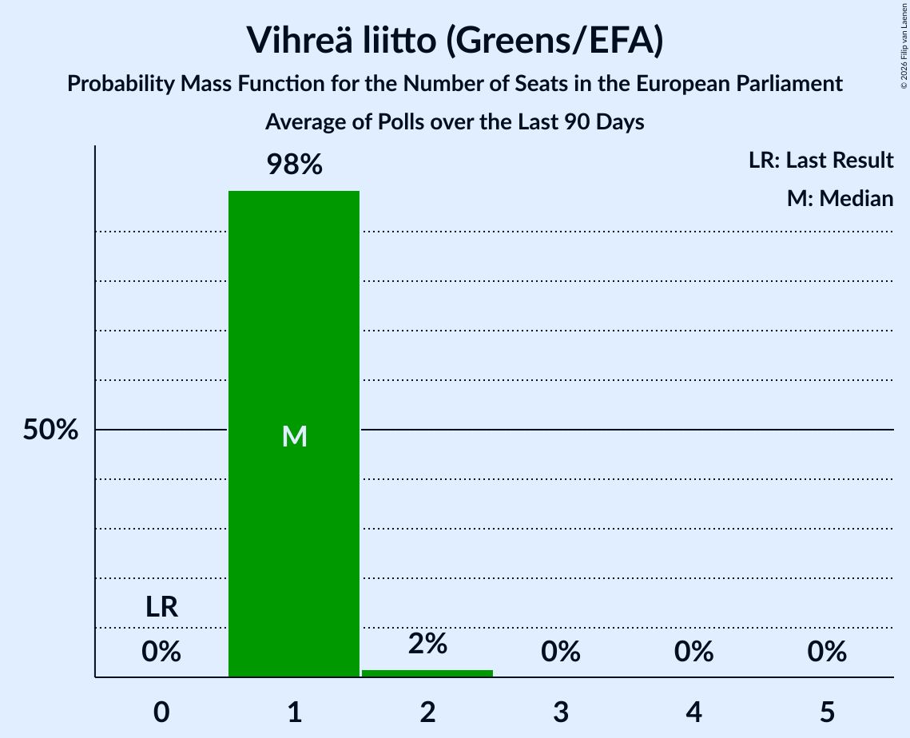

# Vihreä liitto (Greens/EFA)

<a href="#voting-intentions">Voting Intentions</a> | <a href="#seats">Seats</a>

## Voting Intentions

Last result: **0.0%** (General Election of 9 June 2024)

### Confidence Intervals

| Period     | Polling firm/Commissioner(s) | Median | 80% Confidence Interval | 90% Confidence Interval | 95% Confidence Interval | 99% Confidence Interval |
|:----------:|:----------------:|:-----------:|:-----------------------:|:-----------------------:|:-----------------------:|:-----------------------:|
| N/A | [Poll Average](average.html) | 7.8% | 7.1–8.6% | 6.9–8.8% | 6.7–9.0% | 6.4–9.4% |
| [18 February–16 March 2025](2025-03-16-Verian.html) | Verian   Helsingin Sanomat | 7.8% | 7.1–8.5% | 7.0–8.7% | 6.8–8.9% | 6.5–9.3% |
| [10 February–4 March 2025](2025-03-04-Taloustutkimus.html) | Taloustutkimus | 7.8% | 7.1–8.7% | 6.9–8.9% | 6.7–9.1% | 6.3–9.5% |
| [21 January–16 February 2025](2025-02-16-Verian.html) | Verian   Helsingin Sanomat | 8.1% | 7.5–8.8% | 7.3–9.0% | 7.2–9.2% | 6.9–9.5% |
| [13 January–3 February 2025](2025-02-03-Taloustutkimus.html) | Taloustutkimus   Yle | 8.5% | 7.7–9.4% | 7.5–9.6% | 7.3–9.8% | 7.0–10.3% |
| [16 December 2024–17 January 2025](2025-01-17-Verian.html) | Verian   Helsingin Sanomat | 7.8% | 7.0–8.6% | 6.8–8.9% | 6.6–9.1% | 6.3–9.5% |
| [9 December 2024–7 January 2025](2025-01-07-Taloustutkimus.html) | Taloustutkimus   Yle | 8.3% | 7.5–9.2% | 7.3–9.4% | 7.1–9.6% | 6.7–10.1% |
| [18 November–13 December 2024](2024-12-13-Verian.html) | Verian   Helsingin Sanomat | 7.8% | 7.1–8.7% | 6.8–8.9% | 6.6–9.2% | 6.3–9.6% |
| [6 November–3 December 2024](2024-12-03-Taloustutkimus.html) | Taloustutkimus   Yle | 8.2% | 7.4–9.1% | 7.2–9.4% | 7.0–9.6% | 6.7–10.0% |
| [14 October–15 November 2024](2024-11-15-Verian.html) | Verian   Helsingin Sanomat | 7.8% | 7.0–8.6% | 6.8–8.8% | 6.7–9.1% | 6.3–9.5% |
| [7 October–5 November 2024](2024-11-05-Taloustutkimus.html) | Taloustutkimus   Yle | 8.0% | 7.2–8.9% | 7.0–9.2% | 6.8–9.4% | 6.4–9.9% |
| [16 September–11 October 2024](2024-10-11-Verian.html) | Verian   Helsingin Sanomat | 8.0% | 7.2–8.9% | 7.0–9.1% | 6.8–9.4% | 6.4–9.8% |
| [4 September–1 October 2024](2024-10-01-Taloustutkimus.html) | Taloustutkimus   Yle | 7.6% | 6.9–8.5% | 6.7–8.7% | 6.5–8.9% | 6.2–9.3% |
| [19 August–13 September 2024](2024-09-13-Verian.html) | Verian   Helsingin Sanomat | 8.3% | 7.6–9.1% | 7.4–9.3% | 7.3–9.5% | 7.0–9.9% |
| [12 August–3 September 2024](2024-09-03-Taloustutkimus.html) | Taloustutkimus   Yle | 8.2% | 7.4–9.1% | 7.2–9.4% | 7.0–9.6% | 6.6–10.1% |
| [15 July–16 August 2024](2024-08-16-Verian.html) | Verian   Helsingin Sanomat | 8.0% | 7.3–8.7% | 7.1–8.9% | 7.0–9.1% | 6.7–9.5% |
| [8 July–6 August 2024](2024-08-06-Taloustutkimus.html) | Taloustutkimus   Yle | 8.9% | 8.1–9.8% | 7.9–10.1% | 7.7–10.3% | 7.3–10.8% |
| [17 June–12 July 2024](2024-07-12-Verian.html) | Verian   Helsingin Sanomat | 8.2% | 7.5–9.0% | 7.3–9.2% | 7.2–9.4% | 6.9–9.8% |
| [7 June–2 July 2024](2024-07-02-Taloustutkimus.html) | Taloustutkimus   Yle | 8.3% | 7.6–9.2% | 7.3–9.4% | 7.2–9.7% | 6.8–10.1% |
| [20 May–14 June 2024](2024-06-14-Verian.html) | Verian   Helsingin Sanomat | 8.4% | 7.7–9.2% | 7.5–9.4% | 7.4–9.6% | 7.1–10.0% |

### Probability Mass Function

The following table shows the probability mass function per percentage block of voting intentions for the [poll average](average.html) for Vihreä liitto (Greens/EFA).

| Voting Intentions | Probability | Accumulated | Special Marks |
|:-----------------:|:-----------:|:-----------:|:-------------:|
| 0.0–0.5% | 0% | 100% | Last Result |
| 0.5–1.5% | 0% | 100% |  |
| 1.5–2.5% | 0% | 100% |  |
| 2.5–3.5% | 0% | 100% |  |
| 3.5–4.5% | 0% | 100% |  |
| 4.5–5.5% | 0% | 100% |  |
| 5.5–6.5% | 1.0% | 100% |  |
| 6.5–7.5% | 30% | 99.0% |  |
| 7.5–8.5% | 58% | 69% | Median |
| 8.5–9.5% | 11% | 11% |  |
| 9.5–10.5% | 0.3% | 0.3% |  |
| 10.5–11.5% | 0% | 0% |  |

## Seats

Last result: **0** seats (General Election of 9 June 2024)

### Confidence Intervals

| Period     | Polling firm/Commissioner(s) | Median | 80% Confidence Interval | 90% Confidence Interval | 95% Confidence Interval | 99% Confidence Interval |
|:----------:|:----------------:|:------:|:-----------------------:|:-----------------------:|:-----------------------:|:-----------------------:|
| N/A | [Poll Average](average.html) | 1 | 1 | 1 | 1 | 1 |
| [18 February–16 March 2025](2025-03-16-Verian.html) | Verian   Helsingin Sanomat | 1 | 1 | 1 | 1 | 1 |
| [10 February–4 March 2025](2025-03-04-Taloustutkimus.html) | Taloustutkimus | 1 | 1 | 1 | 1 | 1 |
| [21 January–16 February 2025](2025-02-16-Verian.html) | Verian   Helsingin Sanomat | 1 | 1 | 1 | 1 | 1–2 |
| [13 January–3 February 2025](2025-02-03-Taloustutkimus.html) | Taloustutkimus   Yle | 1 | 1 | 1 | 1 | 1–2 |
| [16 December 2024–17 January 2025](2025-01-17-Verian.html) | Verian   Helsingin Sanomat | 1 | 1 | 1 | 1 | 1 |
| [9 December 2024–7 January 2025](2025-01-07-Taloustutkimus.html) | Taloustutkimus   Yle | 1 | 1 | 1 | 1 | 1–2 |
| [18 November–13 December 2024](2024-12-13-Verian.html) | Verian   Helsingin Sanomat | 1 | 1 | 1 | 1 | 1–2 |
| [6 November–3 December 2024](2024-12-03-Taloustutkimus.html) | Taloustutkimus   Yle | 1 | 1 | 1 | 1–2 | 1–2 |
| [14 October–15 November 2024](2024-11-15-Verian.html) | Verian   Helsingin Sanomat | 1 | 1 | 1 | 1 | 1 |
| [7 October–5 November 2024](2024-11-05-Taloustutkimus.html) | Taloustutkimus   Yle | 1 | 1 | 1 | 1 | 1–2 |
| [16 September–11 October 2024](2024-10-11-Verian.html) | Verian   Helsingin Sanomat | 1 | 1 | 1 | 1 | 1–2 |
| [4 September–1 October 2024](2024-10-01-Taloustutkimus.html) | Taloustutkimus   Yle | 1 | 1 | 1 | 1 | 1 |
| [19 August–13 September 2024](2024-09-13-Verian.html) | Verian   Helsingin Sanomat | 1 | 1 | 1 | 1 | 1–2 |
| [12 August–3 September 2024](2024-09-03-Taloustutkimus.html) | Taloustutkimus   Yle | 1 | 1 | 1 | 1 | 1–2 |
| [15 July–16 August 2024](2024-08-16-Verian.html) | Verian   Helsingin Sanomat | 1 | 1 | 1 | 1 | 1 |
| [8 July–6 August 2024](2024-08-06-Taloustutkimus.html) | Taloustutkimus   Yle | 1 | 1 | 1 | 1–2 | 1–2 |
| [17 June–12 July 2024](2024-07-12-Verian.html) | Verian   Helsingin Sanomat | 1 | 1 | 1 | 1 | 1 |
| [7 June–2 July 2024](2024-07-02-Taloustutkimus.html) | Taloustutkimus   Yle | 1 | 1 | 1 | 1 | 1–2 |
| [20 May–14 June 2024](2024-06-14-Verian.html) | Verian   Helsingin Sanomat | 1 | 1 | 1 | 1 | 1–2 |

### Probability Mass Function

The following table shows the probability mass function per seat for the [poll average](average.html) for Vihreä liitto (Greens/EFA).

| Number of Seats | Probability | Accumulated | Special Marks |
|:---------------:|:-----------:|:-----------:|:-------------:|
| 0 | 0% | 100% | Last Result |
| 1 | 99.8% | 100% | Median |
| 2 | 0.2% | 0.2% |  |
| 3 | 0% | 0% |  |

